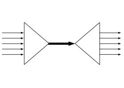

# 概述

linux IO多路复用有epoll， poll, select，epoll性能比其他几者要好。

名词比较绕口，理解涵义就好。一个epoll场景：一个酒吧服务员（一个线程），前面趴了一群醉汉，突然一个吼一声“倒酒”（事件），你小跑过去给他倒一杯，然后随他去吧，突然又一个要倒酒，你又过去倒上，就这样一个服务员服务好多人，有时没人喝酒，服务员处于空闲状态，可以干点别的玩玩手机。

至于epoll与select，poll的区别在于后两者的场景中醉汉不说话，你要挨个问要不要酒，没时间玩手机了。io多路复用大概就是指这几个醉汉共用一个服务员。

其实“I/O多路复用”这个坑爹翻译可能是这个概念在中文里面如此难理解的原因。所谓的I/O多路复用在英文中其实叫 I/O multiplexing. 如果你搜索multiplexing啥意思，基本上都会出这个图：

于是大部分人都直接联想到"一根网线，多个sock复用" 这个概念，包括上面的几个回答， 其实不管你用多进程还是I/O多路复用， 网线都只有一根好伐。**多个Sock复用一根网线这个功能是在内核＋驱动层实现的**。

**重要的事情再说一遍： I/O multiplexing 这里面的 multiplexing 指的其实是在单个线程通过记录跟踪每一个Sock(I/O流)的状态(对应空管塔里面的Fight progress strip槽)来同时管理多个I/O流**. 发明它的原因，是尽量多的提高服务器的吞吐能力。

# 发展

先看三个故事

- *小张找基友小鹏*

小张第一次来到小鹏的宿舍楼，发现这个宿舍楼有一大堆的楼妈，为啥？因为学校竟然请了一堆楼妈来管理宿舍楼里的每一个宿舍，结果搞得一大堆楼妈唧唧咋咋的，乌烟瘴气。重要的就是学校会给每个楼妈都发工资。小张顿时觉得，这个学校没药救了。

没错，现实中已经没有这种傻逼现象了，学校也不会傻到这种程度为每一个宿舍都请一个楼妈来管理。

- *过了几十年，小张的儿子来找小鹏的儿子*

不巧，过了一二十年，小张的儿子和小鹏的儿子也上了同一所学校，小张张要来找小鹏鹏。小张张听了父亲说，这个学校的舍管特别傻逼，会有一堆，能烦死你。

结果小张张来到了宿舍楼，发现现在只有一个楼妈了，哎哟，不错嘛，学校终于没那么傻逼了。但是，这个楼妈比较傻，小张张去问她：小鹏鹏在哪个寝室啊？

她说，我也不知道啊。我带你上去找吧？

于是乎，小张张和楼妈挨个挨个的找宿舍，最终花了半天时间找到了小鹏鹏....（小张张尿了。

- *又过去了差不多20年*

此时，学校已经不是那个学校，张和鹏都挂得差不多了。新生代小春来找小丽，小春来到了这个宿舍，找到了楼妈。

这个楼妈就比较聪明了，每当一个学生入住新宿舍的时候，她就记录下这个人的名字，学号，电话，以及宿舍房号。当小春找小丽的时候，楼妈掏出眼镜，查表，马上就能知道小丽在哪里了，小春几分钟就到达了小丽的宿舍....

------

