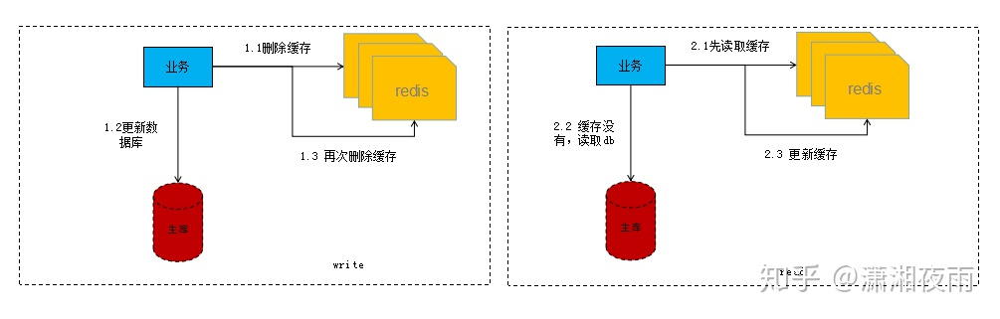
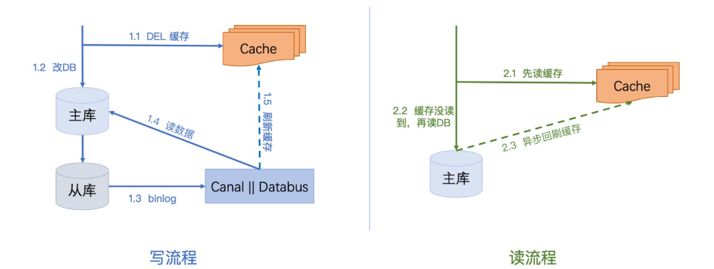
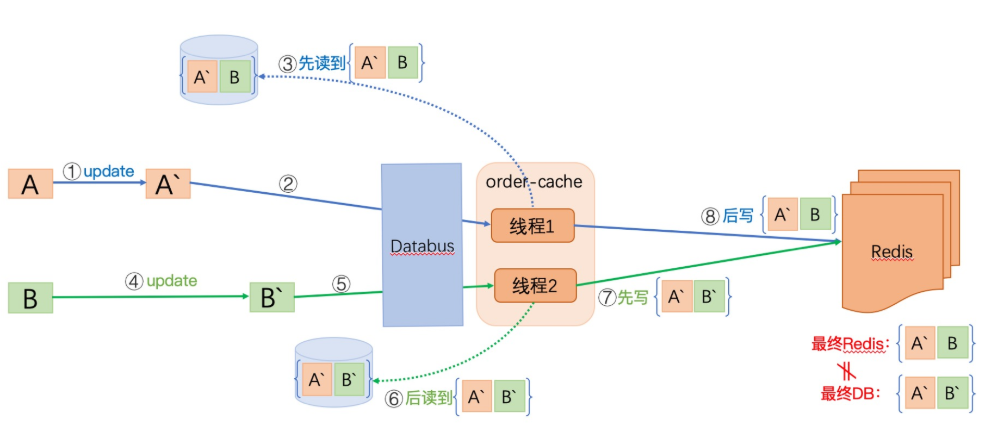
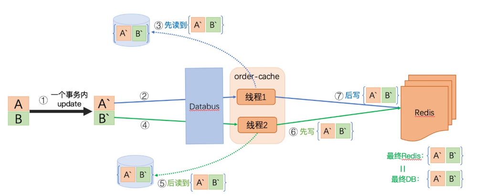
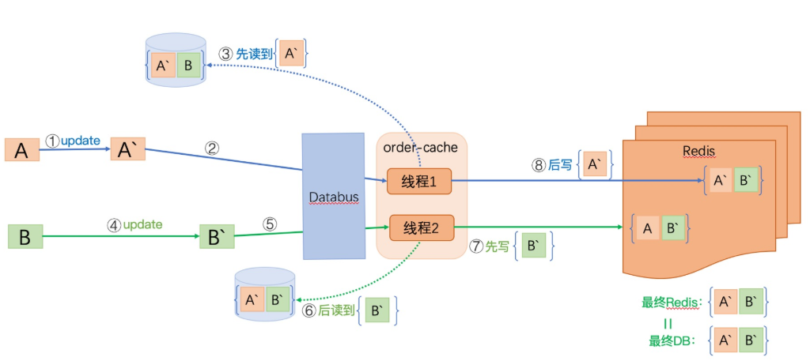
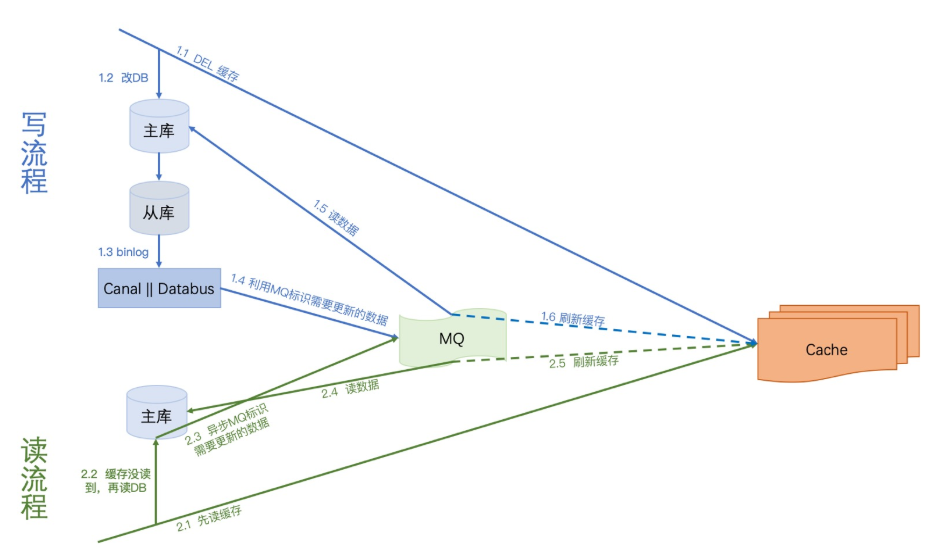
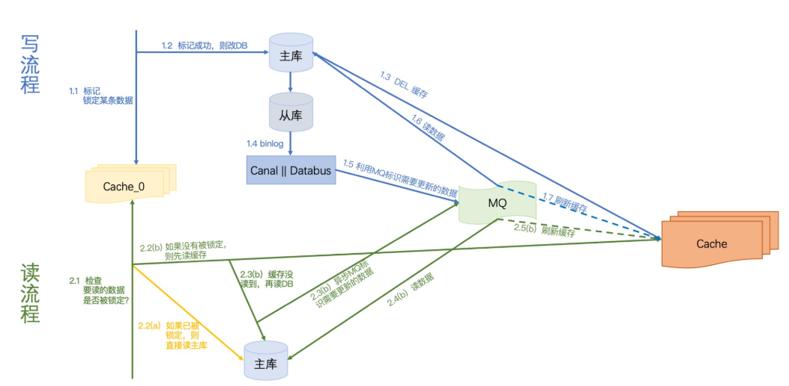

## ***方案一***：延迟双删

### **写流程**：

先删除缓存，删除之后再更新DB，触发异步写入串行化mq（也可以采取一种key+version的分布式锁），mq接受再次删除缓存。

### **读流程**：

先读缓存，如果缓存没读到，则去读DB，之后再异步将数据刷回缓存。

异步删除对线上业务无影响，串行化处理保障并发情况下正确删除。

**为什么要双删？**

- db更新分为两个阶段，更新前及更新后，更新前的删除很容易理解。第二步双删：在db更新的过程中由于读取的操作存在并发可能，会出现缓存重新写入数据，这时就需要更新后的删除。

**缺点**：

**容灾不足**

第一步DEL缓存失败’，如果继续执行，那么从’更新完DB’到异步’刷新缓存’缓存期间，数据处于滞后状态。而且如果缓存处于不可写状态，那么异步刷新那步也可能会失败，那缓存就会长期处于旧数据。

**并发问题**

**写写并发**：如果同时有多个服务器的多个线程进行’步骤1.2更新DB’，更新DB完成之后，它们就要进行异步刷缓存，多服务器的异步操作是无法保证顺序的，所以后面的刷新操作存在相互覆盖的并发问题，也就是说，存在先更新的DB操作，反而很晚才去刷新缓存，那这个时候，数据也是错的

**读写并发**：服务器A在进行’读操作’，在A服务器刚完成2.2时，服务器B在进行’写操作’，假设B服务器1.3完成之后，服务器A的1.3才被执行，这个时候就相当于更新前的老数据写入缓存，最终数据还是错的。

## **方案二**：利用binlog日志回放

方案一 一个比较大的缺陷在于刷新缓存有可能会失败，而失败之后缓存中数据就一直会处于错误状态，所以它并不能保证数据的最终一致性”为了保证“数据最终一致性”，我们引入binlog，通过解析binlog来刷新缓存，这样即使刷新失败，依然可以进行日志回放，再次刷新缓存。

### 写流程：

第一步先删除缓存，删除之后再更新DB，我们监听从库(资源少的话主库也ok)的binlog，通过分析binlog我们解析出需要需要刷新的数据，然后读主库把最新的数据写入缓存。

> 这里需要提一下：最后刷新前的读主库或者读从库，甚至不读库直接通过binlog解析出需要的数据都是ok的，这由业务决定，比如刷新的数据只是表的一行，那直接通过binlog就完全能解析出来；然而如果需要刷新的数据来自多行，多张表，甚至多个库的话，那就需要读主库或是从库才行

### 读流程：

第一步先读缓存，如果缓存没读到，则去读DB，之后再异步将数据刷回缓存

**优点：**

**容灾**: 写步骤1.4或1.5 如果失败，可以进行日志回放，再次重试。无论步骤1.1是否删除成功，后续的刷新操作是有保证的。

**缺点：**

只适合简单业务（每次需要刷新的数据，都来自单表单行），复杂业务容易发生并发问题。

为什么复杂业务就不行呢？我举个例子
我们假设 一个订单 = A表信息 + B表信息

由于A表先变化，经过1，2，3步后，线程1获取了A’B （A表是新数据，B表的老数据），当线程1还没来得及刷新缓存时，并发发生了：

此时，B表发生了更新，经过4，5，6，7将最新的数据A’B’写入缓存，此时此刻缓存数据是符合要求的。

但是，后来线程1进行了第8步，将A’B写入数据，使得缓存最终结果 与 DB 不一致。

**缺点1的改进**

- 针对单库多表单次更新的改进：利用事务

 

当AB表的更新发生在一个事务内时，不管线程1、线程2如何读取，他们都能获取两张表的最新数据，所以刷新缓存的数据都是符合要求的。

> 但是这种方案具有局限性：那就是只对单次更新有效，或者说更新频率低的情况下才适应，比如我们并发的单独更新C表，并发问题依然会发生。

所以这种方案只针对多表单次更新的情况。

**针对多表多次更新的改进：增量更新**

 

每张表的更新，在同步缓存时，只获取该表的字段覆盖缓存。

这样，线程1，线程2总能获取对应表最新的字段，而且Databus对于同表同行会以串行的形式通知下游，所以能保证缓存的最终一致性。

> 这里有一点需要提一下：更新“某张表多行记录“时，这个操作要在一个事务内，不然并发问题依然存在，正如前面分析的

 依然是并发问题

即使对于缺点1我们提出了改进方案，虽然它解决了部分问题，但在极端场景下依然存在并发问题。
这个场景，就是缓存中没有数据的情况：

- 读的时候，缓存中的数据已失效，此时又发生了更新
- 数据更新的时候，缓存中的数据已失效，此时又发生了更新

这个时候，我们在上面提到的“增量更新”就不起作用了，我们需要读取所有的表来拼凑出初始数据，那这个时候又涉及到读所有表的操作了，那我们在缺点1中提到的并发问题会再次发生

 

适合使用的场景：业务简单，读写QPS比较低的情况。
这个方案优缺点都比较明显，binlog用来刷新缓存是一个很棒的选择，它天然的顺序性用来做同步操作很具有优势；其实它的并发问题来自于Canal 或 Databus。拿Databus来说，由于不同行、表、库的binlog的消费并不是时间串行的，那怎么解决这个问题呢。

## *方案三*：利用binlog和mq串行化

问题就来自于“读数据库” + “写缓存” 之间的交错并发，那怎么来避免呢？
有一个方法就是：串行化，我们利用MQ将所有“读数据库” + “写缓存”的步骤串行化

### 写流程：

第一步先删除缓存，删除之后再更新DB，我们监听从库(资源少的话主库也ok)的binlog，通过分析binlog我们解析出需要需要刷新的数据标识，然后将数据标识写入MQ，接下来就消费MQ，解析MQ消息来读库获取相应的数据刷新缓存。

> 关于MQ串行化，大家可以去了解一下[ Kafka partition 机制 ](http://kafka.apache.org/documentation/#intro_topics)，这里就不详述了

### 读流程：

第一步先读缓存，如果缓存没读到，则去读DB，之后再异步将数据标识写入MQ（这里MQ与写流程的MQ是同一个），接下来就消费MQ，解析MQ消息来读库获取相应的数据刷新缓存。

**优点**

**容灾完善**

**写流程容灾分析**

- 写1.1 DEL缓存失败：没关系，后面会覆盖
- 写1.4 写MQ失败：没关系，Databus或Canal都会重试
- 消费MQ的：1.5 || 1.6 失败：没关系，重新消费即可

**读流程容灾分析**

- 读2.3 异步写MQ失败：没关系，缓存为空，是OK的，下次还读库就好了

**无并发问题**

这个方案让“读库 + 刷缓存”的操作串行化，这就不存在老数据覆盖新数据的并发问题了。

##  *方案四*：时间差实现强一致性

在前一个方案的基础上实现“强一致性”

> 强一致性，包含两种含义：
>
> - 缓存和DB数据一致
> - 缓存中没有数据（或者说：不会去读缓存中的老版本数据）

首先我们来分析一下，既然已经实现了“最终一致性”，那它和“强一致性”的区别是什么呢？没错，就是“时间差”，所以：

> “最终一致性方案” + “时间差” = “强一致性方案”

那我们的工作呢，就是加上时间差，实现方式：我们加一个缓存，将近期被修改的数据进行标记锁定。读的时候，标记锁定的数据强行走DB，没锁定的数据，先走缓存

 

### **写流程：**

我们把修改的数据通过Cache_0标记“正在被修改”，如果标记成功，则继续往下走，后面的步骤与上一篇是一致的[《缓存与数据库一致性系列-03》](https://blog.kido.site/2018/12/08/db-and-cache-03/)；那如果标记失败，则要放弃这次修改。

> 何为标记锁定呢？比如你可以设定一个有效期为10S的key，Key存在即为锁定。一般来说10S对于后面的同步操作来说基本是够了~

如果说，还想更严谨一点，怕DB主从延迟太久、MQ延迟太久，或Databus监听的从库挂机之类的情况，我们可以考虑增加一个监控定时任务。
比如我们增加一个时间间隔2S的worker的去对比以下两个数据：

- 时间1： 最后修改数据库的时间
  VS
- 时间2： 最后由更新引起的’MQ刷新缓存对应数据的实际更新数据库’的时间

> 数据1： 可由步骤1.1获得，并存储
> 数据2： 需要由binlog中解析获得，需要透传到MQ，这样后面就能存储了
> 这里提一下：如果多库的情况的话，存储这两个key需要与库一一对应

如果 时间1 VS 时间2 相差超过5S，那我们就自动把相应的缓存分片读降级。

### **读流程：**

先读Cache_0，看看要读的数据是否被标记，如果被标记，则直接读主库；如果没有被标记，后面的步骤与上一篇是一致的([《缓存与数据库一致性系列-03》](https://blog.kido.site/2018/12/08/db-and-cache-03/))。

**方案分析**

**优点剖析**

**1. 容灾完善**

我们一步一步来分析：

**写流程容灾分析**

- 写1.1 标记失败：没关系，放弃整个更新操作
- 写1.3 DEL缓存失败：没关系，后面会覆盖
- 写1.5 写MQ失败：没关系，Databus或Canal都会重试
- 消费MQ的：1.6 || 1.7 失败：没关系，重新消费即可

**读流程容灾分析**

- 读2.1 读Cache_0失败：没关系，直接读主库
- 读2.3 异步写MQ失败：没关系，缓存为空，是OK的，下次还读库就好了

**2. 无并发问题**

这个方案让“读库 + 刷缓存”的操作串行化，这就不存在老数据覆盖新数据的并发问题了

**缺点剖析**

**1. 增加Cache_0强依赖**

这个其实有点没办法，你要强一致性，必然要牺牲一些的。
但是呢，你这个可以吧Cache_0设计成多机器多分片，这样的话，即使部分分片挂了，也只有小部分流量透过Cache直接打到DB上，这是完全是可接受的

**2. 复杂度是比较高的**

涉及到Databus、MQ、定时任务等等组件，实现起来复杂度还是有的