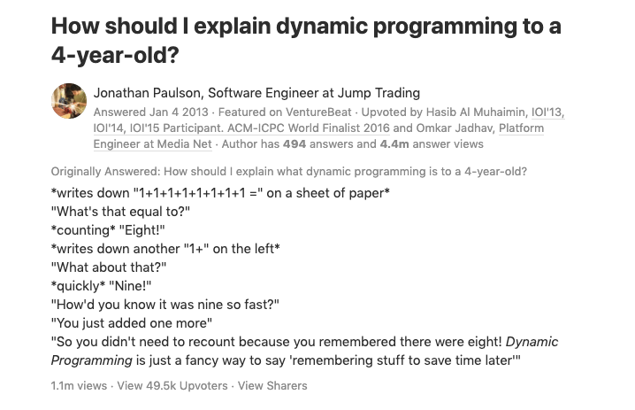

## 导言

动态规划问题一直是算法面试当中的重点和难点，并且动态规划这种通过空间换取时间的算法思想在实际的工作中也会被频繁用到，这篇文章的目的主要是解释清楚 **什么是动态规划**，还有就是面对一道动态规划问题，一般的 **思考步骤** 以及其中的注意事项等等，最后通过几道题目将理论和实践结合。

## 什么是动态规划



用一句话解释动态规划就是 “**记住你之前做过的事**”，如果更准确些，其实是 “**记住你之前得到的答案**”。

我举个大家工作中经常遇到的例子。

在软件开发中，大家经常会遇到一些系统配置的问题，配置不对，系统就会报错，这个时候一般都会去 Google 或者是查阅相关的文档，花了一定的时间将配置修改好。

过了一段时间，去到另一个系统，遇到类似的问题，这个时候已经记不清之前修改过的配置文件长什么样，这个时候有两种方案，一种方案还是去 Google 或者查阅文档，另一种方案是借鉴之前修改过的配置，第一种做法其实是万金油，因为你遇到的任何问题其实都可以去 Google，去查阅相关文件找答案，但是这会花费一定的时间，相比之下，第二种方案肯定会更加地节约时间，但是这个方案是有条件的，条件如下：

- 之前的问题和当前的问题有着关联性，换句话说，之前问题得到的答案可以帮助解决当前问题
- 需要记录之前问题的答案

当然在这个例子中，可以看到的是，上面这两个条件均满足，大可去到之前配置过的文件中，将配置拷贝过来，然后做些细微的调整即可解决当前问题，节约了大量的时间。

不知道你是否从这些描述中发现，对于一个动态规划问题，我们只需要从两个方面考虑，那就是 **找出问题之间的联系**，以及 **记录答案**，这里的难点其实是找出问题之间的联系，记录答案只是顺带的事情，利用一些简单的数据结构就可以做到。

## 思考动态规划问题的四个步骤

一般解决动态规划问题，分为四个步骤，分别是

- 问题拆解，找到问题之间的具体联系
- 状态定义
- 递推方程推导
- 实现

这里面的重点其实是前两个，如果前两个步骤顺利完成，后面的递推方程推导和代码实现会变得非常简单。

这里还是拿 `Quora` 上面的例子来讲解，“1+1+1+1+1+1+1+1” 得出答案是 8，那么如何快速计算 “1+ 1+1+1+1+1+1+1+1”，我们首先可以对这个大的问题进行拆解，这里我说的大问题是 9 个 1 相加，这个问题可以拆解成 1 + “8 个 1 相加的答案”，8 个 1 相加继续拆，可以拆解成 1 + “7 个 1 相加的答案”，… 1 + “0 个 1 相加的答案”，到这里，**第一个步骤** 已经完成。

**状态定义** 其实是需要思考在解决一个问题的时候我们做了什么事情，然后得出了什么样的答案，对于这个问题，当前问题的答案就是当前的状态，基于上面的问题拆解，你可以发现两个相邻的问题的联系其实是 `后一个问题的答案 = 前一个问题的答案 + 1`，这里，状态的每次变化就是 +1。

定义好了状态，递推方程就变得非常简单，就是 `dp[i] = dp[i - 1] + 1`，这里的 `dp[i]` 记录的是当前问题的答案，也就是当前的状态，`dp[i - 1]` 记录的是之前相邻的问题的答案，也就是之前的状态，它们之间通过 +1 来实现状态的变更。

最后一步就是实现了，有了状态表示和递推方程，实现这一步上需要重点考虑的其实是初始化，就是用什么样的数据结构，根据问题的要求需要做那些初始值的设定。

```java
public int dpExample(int n) {
    int[] dp = new int[n + 1];  // 多开一位用来存放 0 个 1 相加的结果

    dp[0] = 0;      // 0 个 1 相加等于 0

    for (int i = 1; i <= n; ++i) {
        dp[i] = dp[i - 1] + 1;
    }

    return dp[n];
}
```

你可以看到，动态规划这四个步骤其实是相互递进的，状态的定义离不开问题的拆解，递推方程的推导离不开状态的定义，最后的实现代码的核心其实就是递推方程，这中间如果有一个步骤卡壳了则会导致问题无法解决，当问题的复杂程度增加的时候，这里面的思维复杂程度会上升。

接下来我们再来看看 LeetCode 上面的几道题目，通过题目再来走一下这些个分析步骤。

## 题目实战

### 爬楼梯

但凡涉及到动态规划的题目都离不开一道例题：爬楼梯（LeetCode 第 70 号问题）。

#### 题目描述

假设你正在爬楼梯。需要 *n* 阶你才能到达楼顶。

每次你可以爬 1 或 2 个台阶。你有多少种不同的方法可以爬到楼顶呢？

注意：给定 *n* 是一个正整数。

**示例 1：**

```basic
输入：2
输出：2
解释： 有两种方法可以爬到楼顶。

1. 1 阶 + 1 阶
2. 2 阶
```

**示例 2：**

```basic
输入：3
输出：3
解释： 有三种方法可以爬到楼顶。

1. 1 阶 + 1 阶 + 1 阶
2. 1 阶 + 2 阶
3. 2 阶 + 1 阶
```

#### 题目解析

爬楼梯，可以爬一步也可以爬两步，问有多少种不同的方式到达终点，我们按照上面提到的四个步骤进行分析：

+ **问题拆解**：

我们到达第 n 个楼梯可以从第 n – 1 个楼梯和第 n – 2 个楼梯到达，因此第 n 个问题可以拆解成第 n – 1 个问题和第 n – 2 个问题，第 n – 1 个问题和第 n – 2 个问题又可以继续往下拆，直到第 0 个问题，也就是第 0 个楼梯 (起点)

+ **状态定义**

“问题拆解” 中已经提到了，第 n 个楼梯会和第 n – 1 和第 n – 2 个楼梯有关联，那么具体的联系是什么呢？你可以这样思考，第 n – 1 个问题里面的答案其实是从起点到达第 n – 1 个楼梯的路径总数，n – 2 同理，从第 n – 1 个楼梯可以到达第 n 个楼梯，从第 n – 2 也可以，并且路径没有重复，因此我们可以把第 i 个状态定义为 “**从起点到达第 i 个楼梯的路径总数**”，状态之间的联系其实是相加的关系。

+ **递推方程**

“状态定义” 中我们已经定义好了状态，也知道第 i 个状态可以由第 i – 1 个状态和第 i – 2 个状态通过相加得到，因此递推方程就出来了 `dp[i] = dp[i - 1] + dp[i - 2]`

+ **实现**

你其实可以从递推方程看到，我们需要有一个初始值来方便我们计算，起始位置不需要移动 `dp[0] = 0`，第 1 层楼梯只能从起始位置到达，因此 `dp[1] = 1`，第 2 层楼梯可以从起始位置和第 1 层楼梯到达，因此 `dp[2] = 2`，有了这些初始值，后面就可以通过这几个初始值进行递推得到。

#### 参考代码

```java
public int climbStairs(int n) {
    if (n == 1) {
        return 1;
    }

    int[] dp = new int[n + 1];  // 多开一位，考虑起始位置

    dp[0] = 0; dp[1] = 1; dp[2] = 2;
    for (int i = 3; i <= n; ++i) {
        dp[i] = dp[i - 1] + dp[i - 2];
    }

    return dp[n];
}
```

### 三角形最小路径和

#### 题目描述

给定一个三角形，找出自顶向下的最小路径和。每一步只能移动到下一行中相邻的结点上。

例如，给定三角形：

```basic
[
     [2],
    [3,4],
   [6,5,7],
  [4,1,8,3]
]
```

自顶向下的最小路径和为 11（即，2 + 3 + 5 + 1 = 11）。

**说明：**

如果你可以只使用 O(n) 的额外空间（n 为三角形的总行数）来解决这个问题，那么你的算法会很加分。

#### 题目解析

给定一个三角形数组，需要求出从上到下的最小路径和，也和之前一样，按照四个步骤来分析：

- 问题拆解：

  这里的总问题是求出最小的路径和，路径是这里的分析重点，路径是由一个个元素组成的，和之前爬楼梯那道题目类似，`[i][j]` 位置的元素，经过这个元素的路径肯定也会经过 `[i - 1][j]` 或者 `[i - 1][j - 1]`，因此经过一个元素的路径和可以通过这个元素上面的一个或者两个元素的路径和得到。

- 状态定义

  状态的定义一般会和问题需要求解的答案联系在一起，这里其实有两种方式，一种是考虑路径从上到下，另外一种是考虑路径从下到上，因为元素的值是不变的，所以路径的方向不同也不会影响最后求得的路径和，如果是从上到下，你会发现，在考虑下面元素的时候，起始元素的路径只会从`[i - 1][j]` 获得，每行当中的最后一个元素的路径只会从 `[i - 1][j - 1]` 获得，中间二者都可，这样不太好实现，因此这里考虑从下到上的方式，状态的定义就变成了 “**最后一行元素到当前元素的最小路径和**”，对于 `[0][0]` 这个元素来说，最后状态表示的就是我们的最终答案。

- 递推方程

  “状态定义” 中我们已经定义好了状态，递推方程就出来了

  ```java
  dp[i][j] = Math.min(dp[i + 1][j], dp[i + 1][j + 1]) + triangle[i][j]
  ```

- 实现

  这里初始化时，我们需要将最后一行的元素填入状态数组中，然后就是按照前面分析的策略，从下到上计算即可

#### 参考代码

```java
public int minimumTotal(List<List<Integer>> triangle) {
    int n = triangle.size();

    int[][] dp = new int[n][n];

    List<Integer> lastRow = triangle.get(n - 1);

    for (int i = 0; i < n; ++i) {
        dp[n - 1][i] = lastRow.get(i);
    }

    for (int i = n - 2; i >= 0; --i) {
        List<Integer> row = triangle.get(i);
        for (int j = 0; j < i + 1; ++j) {
            dp[i][j] = Math.min(dp[i + 1][j], dp[i + 1][j + 1]) + row.get(j);
        }
    }

    return dp[0][0];
}
```

### 最大子序和

#### 题目描述

给定一个整数数组 `nums` ，找到一个具有最大和的连续子数组（子数组最少包含一个元素），返回其最大和。

**示例:**

```
输入: [-2,1,-3,4,-1,2,1,-5,4],输出: 6解释: 连续子数组 [4,-1,2,1] 的和最大，为 6。
```

**进阶:**

如果你已经实现复杂度为 O(n) 的解法，尝试使用更为精妙的分治法求解。

#### 题目解析

求最大子数组和，非常经典的一道题目，这道题目有很多种不同的做法，而且很多算法思想都可以在这道题目上面体现出来，比如动态规划、贪心、分治，还有一些技巧性的东西，比如前缀和数组，这里还是使用动态规划的思想来解题，套路还是之前的四步骤：

- 问题拆解：

  问题的核心是子数组，子数组可以看作是一段区间，因此可以由起始点和终止点确定一个子数组，两个点中，我们先确定一个点，然后去找另一个点，比如说，如果我们确定一个子数组的截止元素在 i 这个位置，这个时候我们需要思考的问题是 “**以 i 结尾的所有子数组中，和最大的是多少？**”，然后我们去试着拆解，这里其实只有两种情况：

     i 这个位置的元素自成一个子数组;

     i 位置的元素的值 + **以 i – 1 结尾的所有子数组中的子数组和最大的值**

  你可以看到，我们把第 i 个问题拆成了第 i – 1 个问题，之间的联系也变得清晰

- 状态定义

  通过上面的分析，其实状态已经有了，`dp[i]` 就是 “**以 i 结尾的所有子数组的最大值**”

- 递推方程

  拆解问题的时候也提到了，有两种情况，即当前元素自成一个子数组，另外可以考虑前一个状态的答案，于是就有了

  ```java
  dp[i] = Math.max(dp[i - 1] + array[i], array[i])
  ```

  化简一下就成了：

  ```java
  dp[i] = Math.max(dp[i - 1], 0) + array[i]
  ```

- 实现

  题目要求子数组不能为空，因此一开始需要初始化，也就是 `dp[0] = array[0]`，保证最后答案的可靠性，另外我们需要用一个变量记录最后的答案，因为子数组有可能以数组中任意一个元素结尾

#### 参考代码

```java
public int maxSubArray(int[] nums) {
    if (nums == null || nums.length == 0) {
        return 0;
    }

    int n = nums.length;

    int[] dp = new int[n];

    dp[0] = nums[0];

    int result = dp[0];

    for (int i = 1; i < n; ++i) {
        dp[i] = Math.max(dp[i - 1], 0) + nums[i];
        result = Math.max(result, dp[i]);
    }

    return result;
}
```

## 总结

通过这几个简单的例子，相信你不难发现，解动态规划题目其实就是拆解问题，定义状态的过程，严格说来，动态规划并不是一个具体的算法，而是凌驾于算法之上的一种 **思想** 。

这种思想强调的是从局部最优解通过一定的策略推得全局最优解，从子问题的答案一步步推出整个问题的答案，并且利用空间换取时间。从很多算法之中你都可以看到动态规划的影子，所以，还是那句话 **技术都是相通的，找到背后的本质思想是关键**。