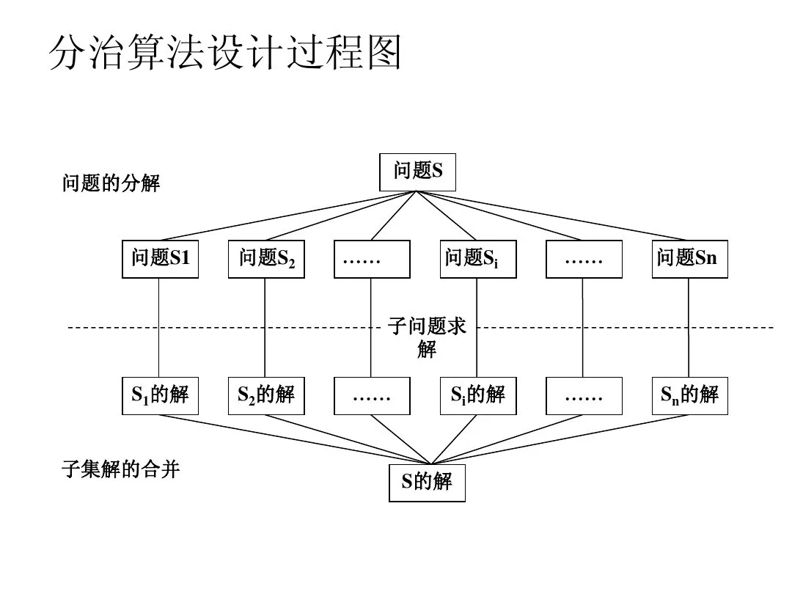
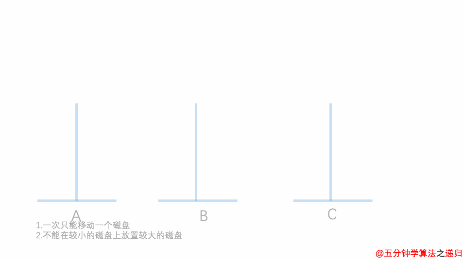
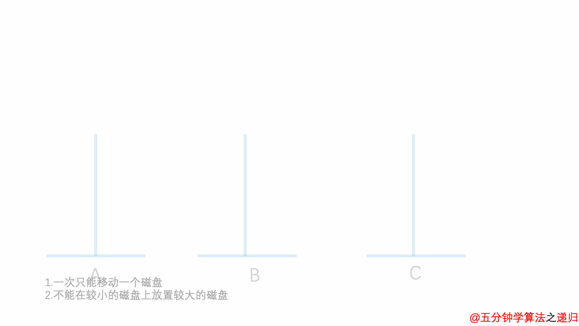

# 一、 概念

  分治算法，根据字面意思解释是“分而治之”，就是把一个复杂的问题分成两个或更多的相同或相似的子问题，再把子问题分成更小的子问题……直到最后子问题可以简单的直接求解，原问题的解即子问题的解的合并。

# 二、算法策略

  分治策略：对于一个规模为 n 的问题，若该问题可以容易地解决（比如说规模 n 较小）则直接解决，否则将其分解为 k 个规模较小的子问题，这些子问题互相独立且与原问题形式相同，递归地解这些子问题，然后将各子问题的解合并得到原问题的解。
  在平时日常生活中，分治思想也是随处可见的。例如：当我们打牌时，在进行洗牌时，若牌的数目较多，一个人洗不过来，则会将牌进行分堆，单独洗一小堆牌是相对容易的，每一堆牌都洗完之后再放到一起，则完成洗牌过程。

# 三、使用场景

  （1）该问题的规模缩小到一定的程度就可以容易地解决。
  （2）该问题可以分解为若干个规模较小的相同问题，即该问题具有最优子结构性质。
  （3）利用该问题分解出的子问题的解可以合并为该问题的解。
  （4）该问题所分解出的各个子问题是相互独立的，即子问题之间不包含公共的子问题。

# 四、基本步骤

分治法在每一层递归上都有三个步骤：
  （1）分解：将原问题分解为若干个规模较小，相互独立，与原问题形式相同的子问题。
  （2）求解：若子问题规模较小而容易被解决则直接解，否则递归地解各个子问题。
  （3）合并：将各个子问题的解合并为原问题的解。

分治思想

# 五、伪代码

```java
Divide-and-Conquer(P)
    if |P| ≤ n0
        then return(ADHOC(P))
    将P分解为较小的子问题 P1 ,P2 ,...,Pk
        for i←1 to k
            do yi ← Divide-and-Conquer(Pi) △ 递归解决Pi
        T ← MERGE(y1,y2,...,yk) △ 合并子问题
    return(T)
```

  其中，|P| 表示问题 P 的规模，`n0` 为一阈值，表示当问题 P 的规模不超过 `n0` 时，问题已容易直接解出，不必再继续分解。`ADHOC(P)` 是该分治法中的基本子算法，用于直接解小规模的问题 P。因此，当 P 的规模不超过`n0` 时直接用算法 `ADHOC(P)` 求解。算法 `MERGE(y1,y2,…,yk)` 是该分治法中的合并子算法，用于将 P 的子问题 `P1` ,`P2` ,…,~的相应的解 `y1` , `y2` ,…, `yk` 合并为 P 的解。

# 六、典型案例

## 6.1 二分查找

  二分查找是典型的分治算法的应用。需要注意的是，二分查找的前提是查找的数列是有序的。

**算法流程：**
  （1）选择一个标志 i 将集合分为二个子集合。
  （2）判断标志 L(i) 是否能与要查找的值 `des` 相等，相等则直接返回。
  （3）否则判断 L(i) 与 `des` 的大小。
  （4）基于判断的结果决定下步是向左查找还是向右查找。
  （5）递归继续上面的步骤。

  通过二分查找的流程可以看出，二分查找是将原有序数列划分为左右两个子序列，然后在对两个子序列中的其中一个在进行划分，直至查找成功。

**代码实现：**

```java
int k;
int binarysearch(int a[],int x,int low,int high)//a表示需要二分的有序数组（升序），x表示需要查找的数字，low，high表示高低位
{
    if(low>high)
    {
        return -1;//没有找到
    }
    int mid=(low+high)/2;
    if(x==a[mid])//找到x
    {
        k=mid;
        return x;
    }
    else if(x>a[mid]) //x在后半部分
    {
        binarysearch(a,x,mid+1,high);//在后半部分继续二分查找
    }
    else//x在前半部分
    {
        binarysearch(a,x,low,mid-1);
    }
}

int main()
{
    int a[10]={1,2,3,4,5,6,7,8,9,10};
    printf("请输入需要查找的正数字：\n");
    int x;
    scanf("%d",&x);
    int r=binarysearch(a,x,0,9);
    if(r==-1)
    {
        printf("没有查到\n");
    }
    else
    {
        printf("查到了,在数列的第%d个位置上\n",k+1);
    }
    return 0;
}
```

## 6.2 全排列问题

**问题描述：**
  有1，2，3，4个数，问你有多少种排列方法，并输出排列。
**问题分析：**
  若采用分治思想进行求解，首先需要把大问题分解成很多的子问题，大问题是所有的排列方法。那么我们分解得到的小问题就是以 1 开头的排列，以 2 开头的排列，以 3 开头的排列，以 4 开头的排列。现在这些问题有能继续分解，比如以 1 开头的排列中，只确定了 1 的位置，没有确定 2 ，3 ，4 的位置，把 2，3，4 三个又看成大问题继续分解，2 做第二个，3 做第二个，或者 4 做第二个。一直分解下去，直到分解成的子问题只有一个数字的时候，不能再分解。只有一个数的序列只有一种排列方式，则子问题求解容易的多。
**代码实现：**

```java
public class Test {
    public static void main(String[] args) {
        int[] arr = { 1, 2, 3, 4 };
        fullSort(arr, 0, arr.length - 1);
    }
    public static void fullSort(int[] arr, int start, int end) {
        // 递归终止条件
        if (start == end) {
            for (int i : arr) {
                System.out.print(i);
            }
            System.out.println();
            return;
        }
        for (int i = start; i <= end; i++) {
            swap(arr, i, start);//为什么要换位置？
            fullSort(arr, start + 1, end);
            swap(arr, i, start);
        }
    }

    private static void swap(int[] arr, int i, int j) {
        int tmp = arr[i];
        arr[i] = arr[j];
        arr[j] = tmp;
    }
}
```

## 6.3 归并排序

**归并排序：**归并（Merge）排序法是将两个（或两个以上）有序表合并成一个新的有序表，即把待排序序列分为若干个子序列，每个子序列是有序的。然后再把有序子序列合并为整体有序序列。即先划分为两个部分，最后进行合并。


**伪代码：**

```java
算法 MergeSort(A, p, r)
输入：数组A[p...r]
输出：有序数组A
if(p < r)
    then q <- (p+r)/2//折半划分
        MergeSort(A, p ,q)//子问题1
        MergeSort(A, p ,q)//子问题2
        Merge(A, p ,q, r)//合并求解
```

**代码实现：**

```java
public class MergeSort {
    //两路归并算法，两个排好序的子序列合并为一个子序列
    public void merge(int []a,int left,int mid,int right){
        int []tmp=new int[a.length];//辅助数组
        int p1=left,p2=mid+1,k=left;//p1、p2是检测指针，k是存放指针
        while(p1<=mid && p2<=right){
            if(a[p1]<=a[p2])
                tmp[k++]=a[p1++];
            else
                tmp[k++]=a[p2++];
        }

        while(p1<=mid) tmp[k++]=a[p1++];//如果第一个序列未检测完，直接将后面所有元素加到合并的序列中
        while(p2<=right) tmp[k++]=a[p2++];//同上

        //复制回原素组
        for (int i = left; i <=right; i++) 
            a[i]=tmp[i];
    }

    public void mergeSort(int [] a,int start,int end){
        if(start<end){//当子序列中只有一个元素时结束递归
            int mid=(start+end)/2;//划分子序列
            mergeSort(a, start, mid);//对左侧子序列进行递归排序
            mergeSort(a, mid+1, end);//对右侧子序列进行递归排序
            merge(a, start, mid, end);//合并
        }
    }
}
```

## 6.4 快速排序

  快速排序的基本思想：当前待排序的无序区为 A[low..high] ，利用分治法可将快速排序的基本思想描述为：

1. 分解：
     在A[low..high]中任选一个记录作为基准(pivot)，以此基准将当前无序区划分为左、右两个较小的子区间R[low..pivotpos-1) 和 R[pivotpos+1..high] ，并使左边子区间中所有记录的关键字均小于等于基准记录(不妨记为pivot)的关键字 pivot.key，右边的子区间中所有记录的关键字均大于等于pivot.key，而基准记录pivot则位于正确的位置( pivotpos )上，它无须参加后续的排序。

2. 求解：
     通过递归调用快速排序对左、右子区间R[low..pivotpos-1]和R[pivotpos+1..high]快速排序。
3. 合并：
     因为当"求解"步骤中的两个递归调用结束时，其左、右两个子区间已有序。对快速排序而言，"组合"步骤无须做什么，可看作是空操作。


**代码实现：**

```java
void QuickSort(int arr[], int low, int high){
    if (high <= low) return;
    int i = low;
    int j = high + 1;
    int key = arr[low];
    while (true)
    {
        /*从左向右找比key大的值*/
        while (arr[++i] < key)
        {
            if (i == high){
                break;
            }
        }
        /*从右向左找比key小的值*/
        while (arr[--j] > key)
        {
            if (j == low){
                break;
            }
        }
        if (i >= j) break;
        /*交换i,j对应的值*/
        int temp = arr[i];
        arr[i] = arr[j];
        arr[j] = temp;
    }
    /*中枢值与j对应值交换*/
    int temp = arr[low];
    arr[low] = arr[j];
    arr[j] = temp;
    QuickSort(arr, low, j - 1);
    QuickSort(arr, j + 1, high);
}
```

## 6.5 汉诺塔

汉诺塔（Hanoi Tower）问题也是一个经典的递归问题，该问题描述如下：

> 汉诺塔问题：古代有一个梵塔，塔内有三个座A、B、C，A座上有64个盘子，盘子大小不等，大的在下，小的在上。有一个和尚想把这个盘子从A座移到B座，但每次只能允许移动一个盘子，并且在移动过程中，3个座上的盘子始终保持大盘在下，小盘在上。

两个盘子

三个盘子

- ①  如果只有 1 个盘子，则不需要利用 B 塔，直接将盘子从 A 移动到 C 。
- ② 如果有 2 个盘子，可以先将盘子 2 上的盘子 1 移动到 B ；将盘子 2 移动到 C ；将盘子 1 移动到 C 。这说明了：可以借助 B 将 2 个盘子从 A 移动到 C ，当然，也可以借助 C 将 2 个盘子从 A 移动到 B 。
- ③ 如果有 3 个盘子，那么根据 2 个盘子的结论，可以借助 C 将盘子 3 上的两个盘子从 A 移动到 B ；将盘子 3 从 A 移动到 C ，A 变成空座；借助 A 座，将 B 上的两个盘子移动到 C 。
- ④ 以此类推，上述的思路可以一直扩展到 n 个盘子的情况，将将较小的 n-1个盘子看做一个整体，也就是我们要求的子问题，以借助 B 塔为例，可以借助空塔 B 将盘子A上面的 n-1 个盘子从 A 移动到 B ；将A 最大的盘子移动到 C ， A 变成空塔；借助空塔 A ，将 B 塔上的 n-2 个盘子移动到 A，将 C 最大的盘子移动到 C， B 变成空塔。。。

**代码实现：**

```java
 public static void hanoi(int n, String sourceTower, String tempTower, String targetTower) {
        if (n == 1) {
            //如果只有一个盘子1，那么直接将其从sourceTower移动到targetTower
            move(n, sourceTower, targetTower);
        } else {
            //将（盘子n-1~盘子1）由sourceTower经过targetTower移动到tempTower
            hanoi(n - 1, sourceTower, targetTower, tempTower);
            //移动盘子n由sourceTower移动到targetTower
            move(n, sourceTower, targetTower);
            //把之前移动到tempTower的（盘子n-1~盘子1），由tempTower经过sourceTower移动到targetTower
            hanoi(n - 1, tempTower, sourceTower, targetTower);
        }
    }

    //盘子n的从sourceTower->targetTower的移动
    private static void move(int n, String sourceTower, String targetTower) {
        System.out.println("第" + n + "号盘子 move:" + sourceTower + "--->" + targetTower);
    }

```

# 七、总结分析

  分治法将规模为 n 的问题分成 k 个规模为 n／m 的子问题去解。设分解阀值 n0 = 1 ，且 adhoc 解规模为 1 的问题耗费 1 个单位时间。再设将原问题分解为 k 个子问题以及用 merge 将 k 个子问题的解合并为原问题的解需用 f(n) 个单位时间。用T(n)表示该分治法解规模为 |P| = n 的问题所需的计算时间，则有：
$$
T（n）= k  T(n/m) + f(n)
$$
