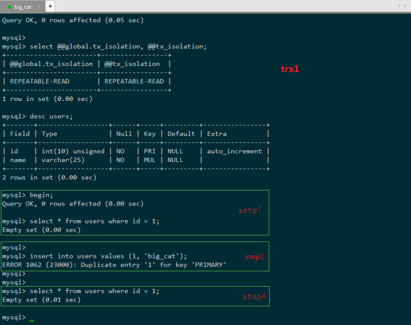
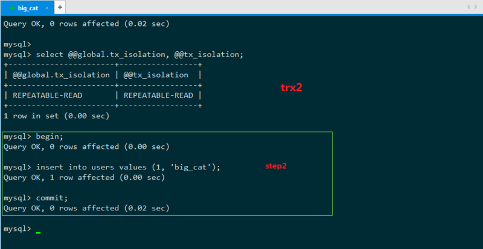
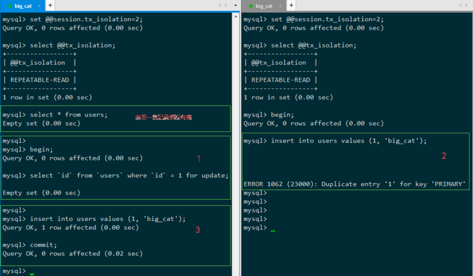

# 一、数据库的隔离等级

## 1. 事务并发问题会发生的问题

- 脏读：是指在一个事务处理过程里读取了另一个未提交的事务中的数据。
- 不可重复读：不可重复读是指在对于数据库中的某个数据，一个事务范围内多次查询却返回了不同的数据值，这是由于在查询间隔，被另一个事务修改并提交了。
- 幻读：是事务非独立执行时发生的一种现象。例如事务T1对一个表中所有的行的某个数据项做了从“1”修改为“2”的操作，这时事务T2又对这个表中插入了一行数据项，而这个数据项的数值还是为“1”并且提交给数据库。而操作事务T1的用户如果再查看刚刚修改的数据，会发现还有一行没有修改，其实这行是从事务T2中添加的，就好像产生幻觉一样，这就是发生了幻读。

区别：

> - 不可重复读和脏读的区别是，脏读是某一事务读取了另一个事务未提交的脏数据，而不可重复读则是读取了前一事务提交的数据。
> - 幻读和不可重复读都是读取了另一条已经提交的事务（这点就脏读不同），所不同的是不可重复读查询的都是同一个数据项，而幻读针对的是一批数据整体（比如数据的个数）。

## 2. 隔离等级

- Serializable (串行化)：可避免脏读、不可重复读、幻读的发生，但完全串行执行，性能最低。
- Repeatable read (可重复读)：可避免脏读、不可重复读的发生。
- Read committed (读已提交)：可避免脏读的发生。
- Read uncommitted (读未提交)：最低级别，任何情况都无法保证。

以上四种隔离级别最高的是Serializable级别，最低的是Read uncommitted级别，当然级别越高，执行效率就越低。像Serializable这样的级别，就是以锁表的方式(类似于Java多线程中的锁)使得其他的线程只能在锁外等待，所以平时选用何种隔离级别应该根据实际情况。在MySQL数据库中默认的隔离级别为Repeatable read (可重复读)。

在MySQL数据库中，支持上面四种隔离级别，默认的为Repeatable read (可重复读)；而在Oracle数据库中，只支持Serializable (串行化)级别和Read committed (读已提交)这两种级别，其中默认的为Read committed级别。

我们可以通过以下命令 查看/设置 全局/会话 的事务隔离级别

```mysql
mysql> SELECT @@global.tx_isolation, @@tx_isolation;
+-----------------------+------------------+
| @@global.tx_isolation | @@tx_isolation   |
+-----------------------+------------------+
| REPEATABLE-READ       | READ-UNCOMMITTED |
+-----------------------+------------------+
1 row in set (0.00 sec)

# 设定全局的隔离级别 设定会话 global 替换为 session 即可 把set语法温习一下
# SET [GLOABL] config_name = 'foobar';
# SET @@[session|global].config_name = 'foobar';
# SELECT @@[global.]config_name;

SET @@gloabl.tx_isolation = 0;
SET @@gloabl.tx_isolation = 'READ-UNCOMMITTED';

SET @@gloabl.tx_isolation = 1;
SET @@gloabl.tx_isolation = 'READ-COMMITTED';

SET @@gloabl.tx_isolation = 2;
SET @@gloabl.tx_isolation = 'REPEATABLE-READ';

SET @@gloabl.tx_isolation = 3;
SET @@gloabl.tx_isolation = 'SERIALIZABLE';
```

# 二、幻读

## 1. 详解

首先我们要搞明白何谓幻读，幻读会在 RU / RC / RR 级别下出现，Serializable 则杜绝了幻读，但 RU / RC 下还会存在脏读，不可重复读，故我们就以 RR 级别来研究幻读，排除其他干扰。

注意：RR 级别下存在幻读的可能，但也是可以使用对记录手动加 X锁 的方法消除幻读。Serializable 正是对所有事务都加 X锁 才杜绝了幻读，但很多场景下我们的业务sql并不会存在幻读的风险。Serializable 的一刀切虽然事务绝对安全，但性能会有很多不必要的损失。故可以在 RR 下根据业务需求决定是否加锁，存在幻读风险我们加锁，不存在就不加锁，事务安全与性能兼备，这也是 RR 作为mysql默认隔是个事务离级别的原因，所以需要正确的理解幻读。

> 幻读错误的理解：说幻读是 事务A 执行两次 select 操作得到不同的数据集，即 select 1 得到 10 条记录，select 2 得到 11 条记录。这其实并不是幻读，这是不可重复读的一种，只会在 R-U R-C 级别下出现，而在 mysql 默认的 RR 隔离级别是不会出现的。

这里给出我对幻读的比较白话的理解：

> 幻读，并不是说两次读取获取的结果集不同，幻读侧重的方面是某一次的 select 操作得到的结果所表征的数据状态无法支撑后续的业务操作。更为具体一些：select 某记录是否存在，不存在，准备插入此记录，但执行 insert 时发现此记录已存在，无法插入，此时就发生了幻读。

------

## 2. 实例

这里给出 mysql 幻读的比较形象的场景：

> table users: id primary key

+ **事务T1**



+ **事务T2**



> step1 T1: SELECT * FROM `users` WHERE `id` = 1;
> step2 T2: INSERT INTO `users` VALUES (1, 'big cat');
> step3 T1: INSERT INTO `users` VALUES (1, 'big cat');
> step4 T1: SELECT * FROM `users` WHERE `id` = 1;

T1 ：主事务，检测表中是否有 id 为 1 的记录，没有则插入，这是我们期望的正常业务逻辑。

T2 ：干扰事务，目的在于扰乱 T1 的正常的事务执行。

在 RR 隔离级别下，step1、step2 是会正常执行的，step3 则会报错主键冲突，对于 T1 的业务来说是执行失败的，这里 T1 就是发生了**幻读**，因为 T1 在 step1 中读取的数据状态并不能支撑后续的业务操作，T1：“见鬼了，我刚才读到的结果应该可以支持我这样操作才对啊，为什么现在不可以”。T1 不敢相信的又执行了 step4，发现和 setp1 读取的结果是一样的（RR下的 MMVC机制）。此时，幻读无疑已经发生，T1 无论读取多少次，都查不到 id = 1 的记录，但它的确无法插入这条他通过读取来认定不存在的记录（此数据已被T2插入），对于 T1 来说，它幻读了。

其实 RR 也是可以避免幻读的，通过对 select 操作手动加 行X锁（SELECT ... FOR UPDATE 这也正是 Serializable 隔离级别下会隐式为你做的事情），同时还需要知道，即便当前记录不存在，比如 id = 1 是不存在的，当前事务也会获得一把记录锁（因为InnoDB的行锁锁定的是索引，故记录实体存在与否没关系，存在就加 行X锁，不存在就加 next-key lock间隙X锁），其他事务则无法插入此索引的记录，故杜绝了幻读。

在 Serializable 隔离级别下，step1 执行时是会隐式的添加 行(X)锁 / gap(X)锁的，从而 step2 会被阻塞，step3 会正常执行，待 T1 提交后，T2 才能继续执行（主键冲突执行失败），对于 T1 来说业务是正确的，成功的阻塞扼杀了扰乱业务的T2，对于T1来说他前期读取的结果是可以支撑其后续业务的。

所以 mysql 的幻读并非什么读取两次返回结果集不同，而是事务在插入事先检测不存在的记录时，惊奇的发现这些数据已经存在了，之前的检测读获取到的数据如同鬼影一般。

这里要灵活的理解读取的意思，第一次select是读取，第二次的 insert 其实也属于隐式的读取，只不过是在 mysql 的机制中读取的，插入数据也是要先读取一下有没有主键冲突才能决定是否执行插入。

不可重复读侧重表达 读-读，幻读则是说 读-写，用写来证实读的是鬼影。

## 3. 解决办法

### 3.1 悲观锁方式

RR级别下只要对 SELECT 操作也手动加行（X）锁即可类似 Serializable 级别（它会对 SELECT 隐式加锁），即大家熟知的：

```mysql
# 这里需要用 X锁， 用 LOCK IN SHARE MODE 拿到 S锁 后我们没办法做 写操作
SELECT `id` FROM `users` WHERE `id` = 1 FOR UPDATE;
```

如果 id = 1 的记录存在则会被加行（X）锁，如果不存在，则会加 next-lock key / gap 锁（范围行锁），即记录存在与否，mysql 都会对记录应该对应的索引加锁，其他事务是无法再获得做操作的。

这里我们就展示下 id = 1 的记录不存在的场景，FOR UPDATE 也会对此 “记录” 加锁，要明白，InnoDB 的行锁（gap锁是范围行锁，一样的）锁定的是记录所对应的索引，且聚簇索引同记录是直接关系在一起的。



> id = 1 的记录不存在，开始执行事务：
> step1: T1 查询 id = 1 的记录并对其加 X锁
> step2: T2 插入 id = 1 的记录，被阻塞
> step3: T1 插入 id = 1 的记录，成功执行（T2 依然被阻塞中），T1 提交（T2 唤醒但主键冲突执行错误）

> T1事务符合业务需求成功执行，T2干扰T1失败。

### 3.2 乐观锁方式

使用版本号时，可以在数据初始化时指定一个版本号，每次对数据的更新操作都对版本号执行+1操作。并判断当前版本号是不是该数据的最新的版本号。

```mysql
-- 1.查询出商品信息
select (status,version) from t_goods where id=#{id}
-- 2.根据商品信息生成订单
-- 3.修改商品status为2
update t_goods 
set status=2,version=version+1
where id=#{id} and version=#{version};
```

乐观并发控制相信事务之间的数据竞争(data race)的概率是比较小的，因此尽可能直接做下去，直到提交的时候才去锁定，所以不会产生任何锁和死锁。

# 三、总结

RR 级别作为 mysql 事务默认隔离级别，是事务安全与性能的折中，可能也符合二八定律（20%的事务存在幻读的可能，80%的事务没有幻读的风险），我们在正确认识幻读后，便可以根据场景灵活的防止幻读的发生。

SERIALIZABLE 级别则是悲观的认为幻读时刻都会发生，故会自动的隐式的对事务所需资源加排它锁，其他事务访问此资源会被阻塞等待，故事务是安全的，但需要认真考虑性能。

InnoDB的行锁锁定的是索引，而不是记录本身，这一点也需要有清晰的认识，故某索引相同的记录都会被加锁，会造成索引竞争，这就需要我们严格设计业务sql，尽可能的使用主键或唯一索引对记录加锁。索引映射的记录如果存在，加行锁，如果不存在，则会加 next-key lock / gap 锁 / 间隙锁，故InnoDB可以实现事务对某记录的预先占用，如果记录存在，它就是本事务的，如果记录不存在，那它也将是本是无的，只要本是无还在，其他事务就别想占有它。