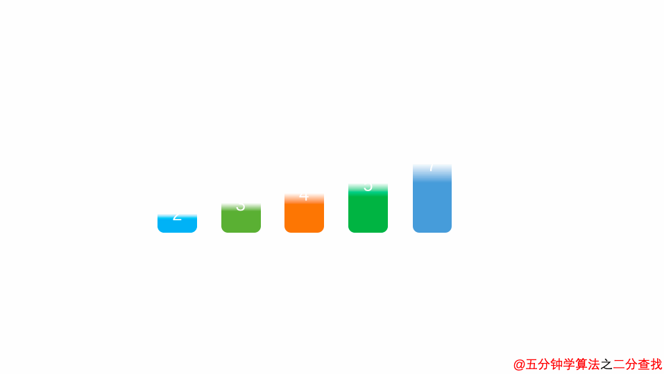
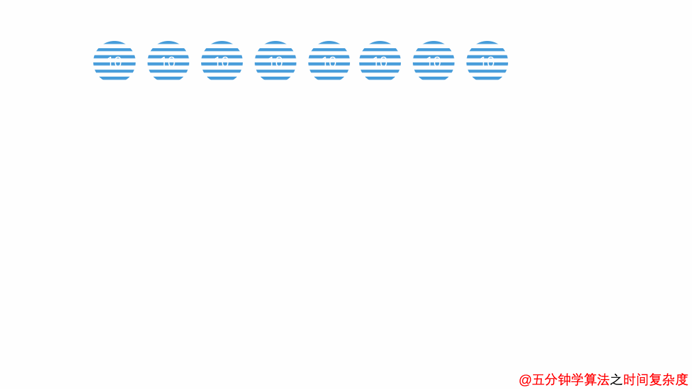
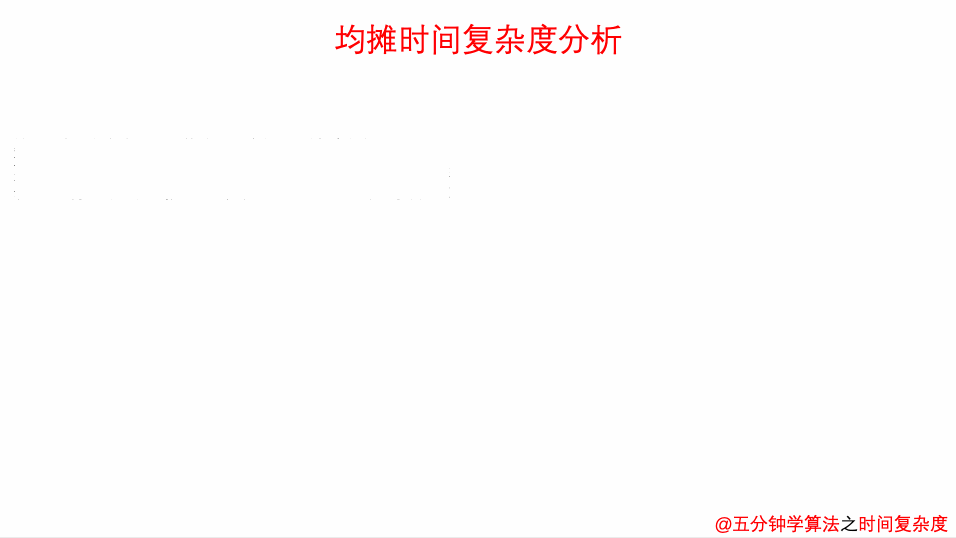

上篇文章讲述了与复杂度有关的大 O 表示法和常见的时间复杂度量级，这篇文章来讲讲另外几种复杂度： 递归算法的时间复杂度（recursive algorithm time complexity），最好情况时间复杂度（best case time complexity）、最坏情况时间复杂度（worst case time complexity）、平均时间复杂度（average case time complexity）和均摊时间复杂度（amortized time complexity）。

## 递归算法的时间复杂度

如果递归函数中，只进行一次递归调用，递归深度为depth；

在每个递归的函数中，时间复杂度为T；

**则总体的时间复杂度为O(T \* depth)**。

在前面的学习中，归并排序 与 快速排序 都带有递归的思想，并且时间复杂度都是O(nlogn) ，但并不是有递归的函数就一定是 O(nlogn) 级别的。从以下两种情况进行分析。

### 递归中进行一次递归调用的复杂度分析

+ 二分查找法



```java
 int binarySearch(int arr[], int l, int r, int target){
     if( l > r ) return -1; 
     
     int mid = l + (r-l)/2;  
     if( arr[mid] == target ) return mid;   
     else if( arr[mid] > target )  
         return binarySearch(arr, l, mid-1, target);    // 左边  
     else 
         return binarySearch(arr, mid+1, r, target);   // 右边
 }
```

比如在这段二分查找法的代码中，每次在 [ l ,  r  ] 范围中去查找目标的位置，如果中间的元素 `arr[mid]` 不是 `target`，那么判断 `arr[mid]`是比 `target` 大 还是 小 ，进而再次调用 `binarySearch`这个函数。

在这个递归函数中，每一次没有找到`target`时，要么调用 左边 的 `binarySearch`函数，要么调用 右边 的 `binarySearch`函数。也就是说在此次递归中，最多调用了一次递归调用而已。根据数学知识，需要log2n次才能递归到底。因此，二分查找法的时间复杂度为 O(logn)。

+ 求和


```java
int sum (int n) {
    if (n == 0) return 0;
    return n + sum( n - 1 )
}
```

在这段代码中比较容易理解递归深度随输入 n 的增加而线性递增，因此时间复杂度为 O (n)。

+ 求幂



```java
//递归深度：logn
//时间复杂度：O(logn)
double pow( double x, int n){
    if (n == 0) return 1.0;
    double t = pow(x,n/2);
    if (n % 2) return x*t*t;
    return t * t;
}
```

递归深度为 `logn`，因为是求需要除以 2 多少次才能到底。

### 递归中进行多次递归调用的复杂度分析

递归算法中比较难计算的是多次递归调用。

先看下面这段代码，有两次递归调用。

```java
// O(2^n) 指数级别的数量级，后续动态规划的优化点
int f(int n){
    if (n == 0) return 1;
    return f(n-1) + f(n - 1);
}
```


递归树中节点数就是代码计算的调用次数。

比如 当 `n = 3` 时，调用次数计算公式为

> 1 + 2 + 4 + 8 = 15

一般的，调用次数计算公式为

> 2^0 + 2^1 + 2^2 + …… + 2^n
> = 2^(n+1) – 1
> = O(2^n)


与之有所类似的是 归并排序 的递归树，区别点在于

1. 上述例子中树的深度为 `n`，而 归并排序 的递归树深度为`logn`。

2. 上述例子中每次处理的数据规模是一样的，而在 归并排序 中每个节点处理的数据规模是逐渐缩小的

因此，在如 归并排序 等排序算法中，每一层处理的数据量为 O(n) 级别，同时有 `logn` 层，时间复杂度便是 O(nlogn)。

## 最好、最坏情况时间复杂度


最好、最坏情况时间复杂度指的是特殊情况下的时间复杂度。

动图表明的是在数组 array 中寻找变量 x 第一次出现的位置，若没有找到，则返回 -1；否则返回位置下标。

```java
int find(int[] array, int n, int x) {
    for (  int i = 0 ; i < n; i++) {
        if (array[i] == x) {
            return i;
            break;
        }
    }
    return -1;
}
```

在这里当数组中第一个元素就是要找的 x 时，时间复杂度是 O(1)；而当最后一个元素才是 x 时，时间复杂度则是 O(n)。

最好情况时间复杂度就是在最理想情况下执行代码的时间复杂度，它的时间是最短的；最坏情况时间复杂度就是在最糟糕情况下执行代码的时间复杂度，它的时间是最长的。

## 平均情况时间复杂度

最好、最坏时间复杂度反应的是极端条件下的复杂度，发生的概率不大，不能代表平均水平。那么为了更好的表示平均情况下的算法复杂度，就需要引入平均时间复杂度。

平均情况时间复杂度可用代码在所有可能情况下执行次数的加权平均值表示。

还是以 `find` 函数为例，从概率的角度看， x 在数组中每一个位置的可能性是相同的，为 1 / n。那么，那么平均情况时间复杂度就可以用下面的方式计算：
$$
((1 + 2 + … + n) / n + n)  /  2 = (3n + 1) / 4
$$
`find` 函数的平均时间复杂度为 O(n)

## 均摊复杂度分析

我们通过一个动态数组的 `push_back` 操作来理解 **均摊复杂度**。



```java
 template <typename T> 
     class MyVector{ 
         private: 
         T* data; 
         int size;       // 存储数组中的元素个数 
         int capacity;   // 存储数组中可以容纳的最大的元素个数 
         // 复杂度为 O(n) 
         void resize(int newCapacity){ 
             T *newData = new T[newCapacity];
             for( int i = 0 ; i < size ; i ++ ){
                 newData[i] = data[i];
             }
             javadata = newData;
             capacity = newCapacity;
         }
         public:
         MyVector(){
             data = new T[100];
             size = 0;
             capacity = 100;
         }
         // 平均复杂度为 O(1)
         void push_back(T e){
             if(size == capacity)
                 resize(2 * capacity);
             data[size++] = e;
         }
         // 平均复杂度为 O(1)
         T pop_back(){
             size --;
             return data[size];
         } 
     };
```

`push_back`实现的功能是往数组的末尾增加一个元素，如果数组没有满，直接往后面插入元素；如果数组满了，即 `size == capacity` ，则将数组扩容一倍，然后再插入元素。

例如，数组长度为 n，则前 n 次调用 `push_back` 复杂度都为 O(1) 级别；在第 n + 1 次则需要先进行 n 次元素转移操作，然后再进行 1 次插入操作，复杂度为 O(n)。

因此，平均来看：对于容量为 n 的动态数组，前面添加元素需要消耗了 1 * n 的时间，扩容操作消耗  n 时间 ，总共就是 2 * n 的时间，因此均摊时间复杂度为 O(2n / n) = O(2)，也就是 O(1) 级别了。

可以得出一个比较有意思的结论：一个相对比较耗时的操作，如果能保证它不会每次都被触发，那么这个相对比较耗时的操作，它所相应的时间是可以分摊到其它的操作中来的。