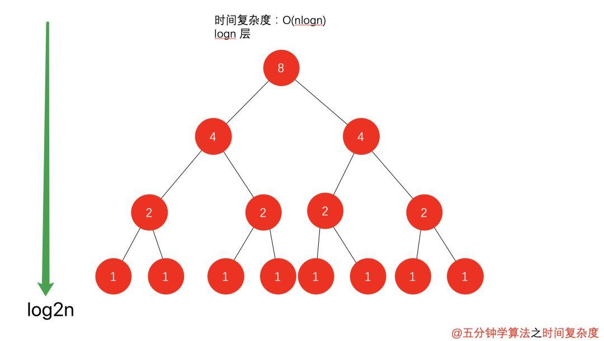
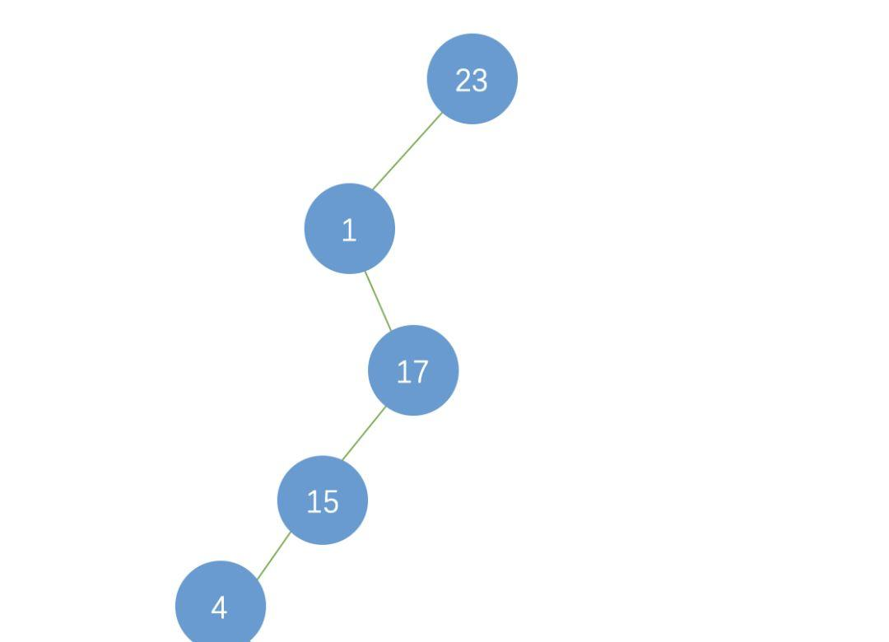

## 空间复杂度

> 🔥🔥🔥🔥，到处都是🔥

一个程序的空间复杂度是指运行完一个程序所需内存的大小。利用程序的空间复杂度，可以对程序的运行所需要的内存多少有个预先估计。一个程序执行时除了需要存储空间和存储本身所使用的指令、常数、变量和输入数据外，还需要一些对数据进行操作的工作单元和存储一些为现实计算所需信息的辅助空间。程序执行时所需存储空间包括以下两部分：

(1) 固定部分，这部分空间的大小与输入/输出的数据的个数多少、数值无关。主要包括指令空间（即代码空间）、数据空间（常量、简单变量）等所占的空间。这部分属于静态空间。

(2) 可变空间，这部分空间的主要包括动态分配的空间，以及递归栈所需的空间等。这部分的空间大小与算法有关。

一个算法所需的存储空间用f(n)表示。S(n)=O(f(n))，其中n为问题的规模，S(n)表示空间复杂度。

**空间复杂度可以理解为除了原始序列大小的内存，在算法过程中用到的额外的存储空间。**

以二叉查找树为例，举例说明二叉排序树的查找性能。

### 平衡二叉树

如果二叉树的是以红黑树等平衡二叉树实现的，则 n 个节点的二叉排序树的高度为 log2n+1 ，其查找效率为O(Log2n)，近似于折半查找。

### 列表二叉树

如果二叉树退变为列表了，则 n 个节点的高度或者说是长度变为了n，查找效率为O(n)，变成了顺序查找。

### 一般二叉树

介于「列表二叉树」与「平衡二叉树」之间，查找性能也在O(Log2n)到O(n)之间。

## 冰火交融

对于一个算法，其时间复杂度和空间复杂度往往是相互影响的。

比如说，要判断某某年是不是闰年：

- 可以编写一个算法来计算，这也就意味着，每次给一个年份，都是要通过计算得到是否是闰年的结果。
- 还有另一个办法就是，事先建立一个有 5555 个元素的数组（年数比现实多就行），然后把所有的年份按下标的数字对应，如果是闰年，此数组项的值就是1，如果不是值为0。这样，所谓的判断某一年是否是闰年，就变成了查找这个数组的某一项的值是多少的问题。此时，我们的运算是最小化了，但是硬盘上或者内存中需要存储这 5555 个 0 和 1 。

这就是典型的使用空间换时间的概念。

当追求一个较好的时间复杂度时，可能会使空间复杂度的性能变差，即可能导致占用较多的存储空间；  
反之，求一个较好的空间复杂度时，可能会使时间复杂度的性能变差，即可能导致占用较长的运行时间。

另外，算法的所有性能之间都存在着或多或少的相互影响。因此，当设计一个算法(特别是大型算法)时，要综合考虑算法的各项性能，算法的使用频率，算法处理的数据量的大小，算法描述语言的特性，算法运行的机器系统环境等各方面因素，才能够设计出比较好的算法。

