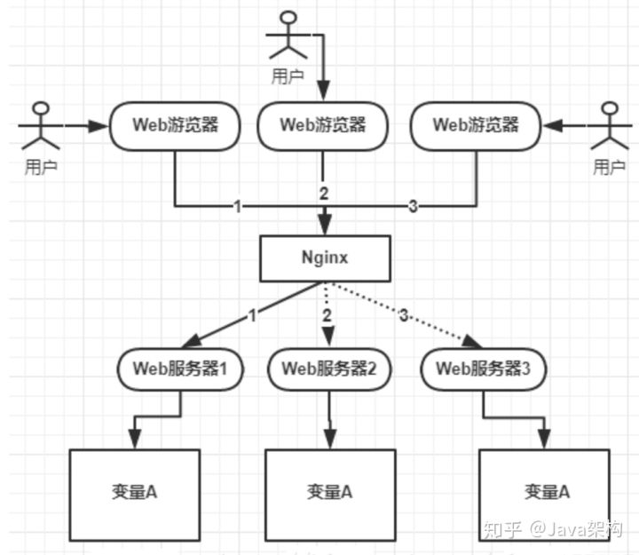

在很多场景中，我们为了保证数据的最终一致性，需要很多的技术方案来支持，比如分布式事务、分布式锁等。那具体什么是分布式锁，分布式锁应用在哪些业务场景、如何来实现分布式锁呢？

# 为什么要使用分布式锁

我们在开发应用的时候，如果需要对某一个共享变量进行多线程同步访问的时候，可以使用我们学到的锁进行处理，并且可以完美的运行，毫无Bug！

注意这是单机应用，后来业务发展，需要做集群，一个应用需要部署到几台机器上然后做负载均衡，大致如下图：



上图可以看到，变量A存在三个服务器内存中（这个变量A主要体现是在一个类中的一个成员变量，是一个有状态的对象），如果不加任何控制的话，变量A同时都会在分配一块内存，三个请求发过来同时对这个变量操作，显然结果是不对的！即使不是同时发过来，三个请求分别操作三个不同内存区域的数据，变量A之间不存在共享，也不具有可见性，处理的结果也是不对的！

如果我们业务中确实存在这个场景的话，我们就需要一种方法解决这个问题！

为了保证一个方法或属性在高并发情况下的同一时间只能被同一个线程执行，在传统单体应用单机部署的情况下，可以使用并发处理相关的功能进行互斥控制。但是，随着业务发展的需要，原单体单机部署的系统被演化成分布式集群系统后，由于分布式系统多线程、多进程并且分布在不同机器上，这将使原单机部署情况下的并发控制锁策略失效，单纯的应用并不能提供分布式锁的能力。为了解决这个问题就需要一种跨机器的互斥机制来控制共享资源的访问，这就是分布式锁要解决的问题！

# 分布式锁应该具备哪些条件

在分析分布式锁的三种实现方式之前，先了解一下分布式锁应该具备哪些条件：

1、在分布式系统环境下，一个方法在同一时间只能被一个机器的一个线程执行；

2、高可用的获取锁与释放锁；

3、高性能的获取锁与释放锁；

4、具备可重入特性；

5、具备锁失效机制，防止死锁；

6、具备非阻塞锁特性，即没有获取到锁将直接返回获取锁失败。

# 分布式锁的三种实现方式

目前几乎很多大型网站及应用都是分布式部署的，分布式场景中的数据一致性问题一直是一个比较重要的话题。分布式的CAP理论告诉我们“任何一个分布式系统都无法同时满足一致性（Consistency）、可用性（Availability）和分区容错性（Partition tolerance），最多只能同时满足两项。”所以，很多系统在设计之初就要对这三者做出取舍。在互联网领域的绝大多数的场景中，都需要牺牲强一致性来换取系统的高可用性，系统往往只需要保证“最终一致性”，只要这个最终时间是在用户可以接受的范围内即可。

在很多场景中，我们为了保证数据的最终一致性，需要很多的技术方案来支持，比如分布式事务、分布式锁等。有的时候，我们需要保证一个方法在同一时间内只能被同一个线程执行。

## 基于数据库实现分布式锁

基于数据库的实现方式的核心思想是：在数据库中创建一个表，表中包含**方法名**等字段，并在**方法名字段上创建唯一索引**，想要执行某个方法，就使用这个方法名向表中插入数据，成功插入则获取锁，执行完成后删除对应的行数据释放锁。

+ 创建一个表

```mysql
DROP TABLE IF EXISTS `method_lock`;
CREATE TABLE `method_lock` (
	`id` INT ( 11 ) UNSIGNED NOT NULL AUTO_INCREMENT COMMENT '主键',
	`method_name` VARCHAR ( 64 ) NOT NULL COMMENT '锁定的方法名',
	`desc_info` VARCHAR ( 255 ) NOT NULL COMMENT '备注信息',
	`update_time` TIMESTAMP NOT NULL DEFAULT CURRENT_TIMESTAMP ON UPDATE CURRENT_TIMESTAMP,
	PRIMARY KEY ( `id` ),
	UNIQUE KEY `uidx_method_name` ( `method_name` ) USING BTREE 
) ENGINE = INNODB AUTO_INCREMENT = 3 DEFAULT CHARSET = utf8 COMMENT = '锁定中的方法';
```

+ 想要执行某个方法，就使用这个方法名向表中插入数据

```mysql
INSERT INTO method_lock (method_name, desc_info) VALUES ('methodName', '测试的methodName');
```

因为我们对method_name做了**唯一性约束**，这里如果有多个请求同时提交到数据库的话，数据库会保证只有一个操作可以成功，那么我们就可以认为操作成功的那个线程获得了该方法的锁，可以执行方法体内容。

+ 成功插入则获取锁，执行完成后删除对应的行数据释放锁：

```mysql
delete from method_lock where method_name ='methodName';
```

注意：这只是使用基于数据库的一种方法，使用数据库实现分布式锁还有很多其他的玩法！

+ 使用基于数据库的这种实现方式很简单，但是对于分布式锁应该具备的条件来说，它有一些问题需要解决及优化：

  1、因为是基于数据库实现的，数据库的可用性和性能将直接影响分布式锁的可用性及性能，所以，数据库需要双机部署、数据同步、主备切换；

  2、不具备可重入的特性，因为同一个线程在释放锁之前，行数据一直存在，无法再次成功插入数据，所以，需要在表中新增一列，用于记录当前获取到锁的机器和线程信息，在再次获取锁的时候，先查询表中机器和线程信息是否和当前机器和线程相同，若相同则直接获取锁；

  3、没有锁失效机制，因为有可能出现成功插入数据后，服务器宕机了，对应的数据没有被删除，当服务恢复后一直获取不到锁，所以，需要在表中新增一列，用于记录失效时间，并且需要有定时任务清除这些失效的数据；

  4、不具备阻塞锁特性，获取不到锁直接返回失败，所以需要优化获取逻辑，循环多次去获取。

  5、在实施的过程中会遇到各种不同的问题，为了解决这些问题，实现方式将会越来越复杂；依赖数据库需要一定的资源开销，性能问题需要考虑。

## 基于缓存(Redis)实现分布式锁

基于Redis命令：

```shell
# SET key value NX EX max-lock-time
```

这里补充下： 从2.6.12版本后, 就可以使用set来获取锁, Lua 脚本来释放锁。setnx是老黄历了，set命令nx,xx等参数, 是为了实现 setnx 的功能。

Demo

```java
public class RedisTool {

    private static final Long RELEASE_SUCCESS = 1L;
    private static final String LOCK_SUCCESS = "OK";
    private static final String SET_IF_NOT_EXIST = "NX";
    private static final String SET_WITH_EXPIRE_TIME = "EX";
    private static final String RELEASE_LOCK_SCRIPT = "if redis.call('get', KEYS[1]) == ARGV[1] then return redis.call('del', KEYS[1]) else return 0 end";

    @Autowired
    private RedisTemplate redisTemplate;

    @Autowired
    private RedissonClient redissonClient;

    /**
     *  该加锁方法仅针对单实例 Redis 可实现分布式加锁，对于 Redis 集群则无法使用
     *  支持重复，线程安全
     *
     * @param lockKey
     * @param clientId 客户端唯一标识(采用UUID)
     * @param seconds 锁过期时间
     * @return
     */
    public Boolean lock(String lockKey, String clientId, long timeout, long expireTime) {
        if (StringUtils.isEmpty(lockKey)) {
            logger.error("Lock object is empty!");
            return false;
        }
        long startTime = System.currentTimeMillis();
        Jedis jedis = null;
        try {
            jedis= jedisPool.getResource();
            if (null == jedis) {
                logger.error("fail to get jedis from pool");
                return false;
            }

            do{
                String result = jedis.set(lockKey, clientId, SET_IF_NOT_EXIST, SET_WITH_EXPIRE_TIME, expireTime);
                if (LOCK_SUCCESS.equals(result)) {
                    return Boolean.TRUE;
                } else{
                    try {
                        Thread.sleep(100);
                    } catch (InterruptedException e) {
                        logger.warn("Sleep failed:"+e.getMessage());
                    }
                }

            }while(timeout == -1L || System.currentTimeMillis() - startTime < timeout);
        }finally {
            if(jedis != null){
                jedis.close();
            }
        }
        return Boolean.FALSE;
    }

    /**
     *  释放锁
     * @param lockKey
     * @param clientId
     * @return
     */
    public Boolean unLock(String lockKey, String clientId){

        if(StringUtils.isEmpty(lockKey)){
            return Boolean.FALSE;
        }
        Jedis jedis = null;
        try {
            jedis = jedisPool.getResource();
            if (null == jedis) {
                logger.error("fail to get jedis from pool");
                return Boolean.FALSE;
            }
            Object result = jedis.eval(RELEASE_LOCK_SCRIPT, Collections.singletonList(lockKey), Collections.singletonList(clientId));
            if (RELEASE_SUCCESS.equals(result)) {
                return Boolean.TRUE;
            }
        }finally {
            if(jedis != null){
                jedis.close();
            }
        }
        return Boolean.FALSE;
    }
}

```

加锁方法

```java
jedis.set(String key, String value, String nxxx, String expx, int time)
```

**这个set()方法一共有五个形参：**
第一个为key，我们使用key来当锁，因为key是唯一的。
第二个为value，我们传的是requestId，很多童鞋可能不明白，有key作为锁不就够了吗，为什么还要用到value？原因就是我们在上面讲到可靠性时，分布式锁要满足第四个条件解铃还须系铃人，通过给value赋值为requestId，我们就知道这把锁是哪个请求加的了，在解锁的时候就可以有依据。requestId可以使用UUID.randomUUID().toString()方法生成。
第三个为nxxx，这个参数我们填的是NX，意思是SET IF NOT EXIST，即当key不存在时，我们进行set操作；若key已经存在，则不做任何操作；
第四个为expx，这个参数我们传的是PX，意思是我们要给这个key加一个过期的设置，具体时间由第五个参数决定。
第五个为time，与第四个参数相呼应，代表key的过期时间。

> 为什么上面的代码可以实现分布式锁，根本原因在于 redis 对 set 命令中的 NX 选项和对 lua 脚本的执行都是原子的，因此当多个客户端去争抢执行上锁或解锁代码时，最终只会有一个客户端执行成功。同时 set 命令还可以指定key的有效期，这样即使当前客户端奔溃，过一段时间锁也会被 redis 自动释放，这就给了其它客户端获取锁的机会。

## 基于Zookeeper实现分布式锁

ZooKeeper是一个为分布式应用提供一致性服务的开源组件，它内部是一个分层的文件系统目录树结构，规定同一个目录下只能有一个唯一文件名。基于ZooKeeper实现分布式锁的步骤如下：

（1）创建一个目录mylock；

（2）线程A想获取锁就在mylock目录下创建临时顺序节点；

（3）获取mylock目录下所有的子节点，然后获取比自己小的兄弟节点，如果不存在，则说明当前线程顺序号最小，获得锁；

（4）线程B获取所有节点，判断自己不是最小节点，设置监听比自己次小的节点；

（5）线程A处理完，删除自己的节点，线程B监听到变更事件，判断自己是不是最小的节点，如果是则获得锁。

这里推荐一个Apache的开源库Curator，它是一个ZooKeeper客户端，Curator提供的InterProcessMutex是分布式锁的实现，acquire方法用于获取锁，release方法用于释放锁。

优点：具备高可用、可重入、阻塞锁特性，可解决失效死锁问题。

缺点：因为需要频繁的创建和删除节点，性能上不如Redis方式。


上面的三种实现方式，没有在所有场合都是完美的，所以，应根据不同的应用场景选择最适合的实现方式。
