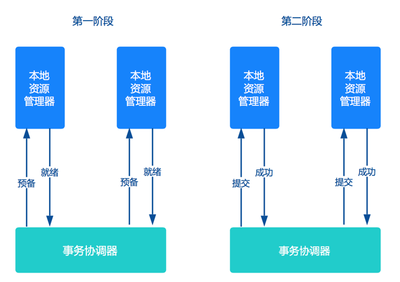
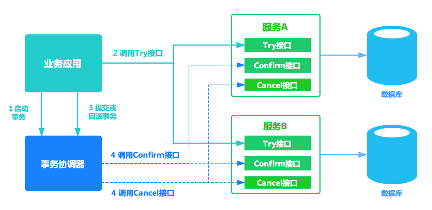
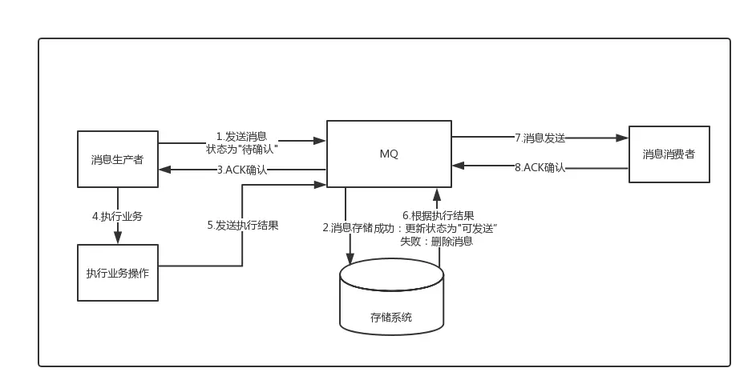

# 一、概述

分布式事务是指事务的参与者、支持事务的服务器、资源服务器以及事务管理器分别位于不同的分布式系统的不同节点之上。简单的说，就是一次大的操作由不同的小操作组成，这些小的操作分布在不同的服务器上，且属于不同的应用，分布式事务需要保证这些小操作要么全部成功，要么全部失败。本质上来说，分布式事务就是为了保证不同数据库的数据一致性。 

分布式事务要满足CAP理论和BASE理论

+ CAP理论：指的是在一个分布式系统中，`Consistency`（一致性）、 `Availability`（可用性）、`Partition tolerance`（分区容错性），三者不可兼得 。
+ BASE理论：`Basically Available`（基本可用）、`Soft state`（软状态）和`Eventually consistent`（最终一致性） 的缩写。

# 二、解决方案

## 2.1 XA规范(两段提交)

XA 是指由 X/Open 组织提出的分布式事务处理的规范。XA规范主要定义了Transaction Manager（TM）和Resource Manager（RM）之间的接口，结构如下图所示 :

TM与RM之间的提交处理，采用两阶段提交协议。第一阶段是**表决阶段**，所有参与者都将本事务能否成功的信息反馈发给协调者；第二阶段是**执行阶段**，协调者根据所有参与者的反馈，通知所有参与者，步调一致地在所有分支上提交或者回滚。

TM在第一阶段对所有的参与事务的RM请求“预备”操作，达成关于分布式事务一致性的共识。事务参与者必须完成所有的约束检查，并且确保后续提交或放弃时所需要的数据已持久化。在第二阶段，根据之前达到的提交或回滚的共识，请求所有参事务的RM完成相应的操作。

提交事务的过程中需要在多个资源节点之间进行协调，而各节点对锁资源的释放必须等到事务最终提交时，所以两阶段提交在执行同样的事务时会比一阶段提交消耗更多的时间。当事务并发量达到一定数量时，就会出现大量事务积压甚至出现死锁，系统性能和处理吞吐量就会严重下滑。

> 两阶段提交方案应用非常广泛，几乎所有商业OLTP数据库都支持XA协议。但是两阶段提交方案锁定资源时间长，对性能影响很大，基本不适合解决微服务事务问题。

## 2.2 TCC模式(三段提交)

说明：

- 一个完整的业务活动由一个主业务服务与若干从业务服务组成。
- 主业务服务负责发起并完成整个业务活动。
- 从业务服务提供TCC型业务操作。
- 事务协调器控制业务活动的一致性，它登记业务活动中的操作，并在业务活动提交时确认所有的TCC型操作的confirm操作，在业务活动取消时调用所有TCC型操作的cancel操作。

TCC业务包括两个阶段完成：

- 第一阶段：主业务服务分别调用所有从业务的 try 操作，并在活动管理器中登记所有从业务服务。当所有从业务服务的 try 操作都调用成功或者某个从业务服务的 try 操作失败，进入第二阶段。
- 第二阶段：活动管理器根据第一阶段的执行结果来执行 confirm 或 cancel 操作。如果第一阶段所有 try 操作都成功，则活动管理器调用所有从业务活动的 confirm操作。否则调用所有从业务服务的 cancel 操作。

TCC方案让应用自己定义数据库操作的粒度，使得降低锁冲突、提高吞吐量成为可能。 当然TCC方案也有不足之处，集中表现在以下两个方面：

- **对应用的侵入性强**。业务逻辑的每个分支都需要实现try、confirm、cancel三个操作，应用侵入性较强，改造成本高。
- **实现难度较大**。需要按照网络状态、系统故障等不同的失败原因实现不同的回滚策略。为了满足一致性的要求，confirm和cancel接口必须实现幂等。

小结

可靠消息与TCC模式通过避免XA两阶段提交对数据资源的长期锁定提升了性能，通过在数据库外部实现事务机制达到了最终一致性，但牺牲了应用灵活性，需要开发人员实现事务检查与回滚的细节，面临着花费大量精力保证应用正确性的问题。

## 2.3 基于消息的最终一致性方案

示意图

具体说明

执行步骤：

+ 事务消息与普通消息的区别就在于消息生产环节，生产者首先预发送一条消息到MQ(这也被称为发送half消息)
+ MQ接受到消息后，先进行持久化，则存储中会新增一条状态为`待发送`的消息
+ 然后返回ACK给消息生产者，此时MQ不会触发消息推送事件
+ 生产者预发送消息成功后，执行本地事务
+ 执行本地事务，执行完成后，发送执行结果给MQ
+ MQ会根据结果删除或者更新消息状态为`可发送`
+ 如果消息状态更新为`可发送`，则MQ会push消息给消费者，后面消息的消费和普通消息是一样的

**注意点**：由于MQ通常都会保证消息能够投递成功，因此，如果业务没有及时返回ACK结果，那么就有可能造成MQ的重复消息投递问题。**因此，对于消息最终一致性的方案，消息的消费者必须要对消息的消费支持幂等，不能造成同一条消息的重复消费的情况。** 

现在目前较为主流的MQ，比如ActiveMQ、RabbitMQ、Kafka、RocketMQ等，只有RocketMQ支持事务消息。 

##  2.4 阿里-Seata

基于XA规范--[官方Wiki](https://github.com/seata/seata/wiki/Home_Chinese)

- **对业务无侵入：** 这里的 **侵入** 是指，因为分布式事务这个技术问题的制约，要求应用在业务层面进行设计和改造。这种设计和改造往往会给应用带来很高的研发和维护成本。我们希望把分布式事务问题在 **中间件** 这个层次解决掉，不要求应用在业务层面做额外的工作。
- **高性能：** 引入分布式事务的保障，必然会有额外的开销，引起性能的下降。我们希望把分布式事务引入的性能损耗降到非常低的水平，让应用不因为分布式事务的引入导致业务的可用性受影响。

 

 

  