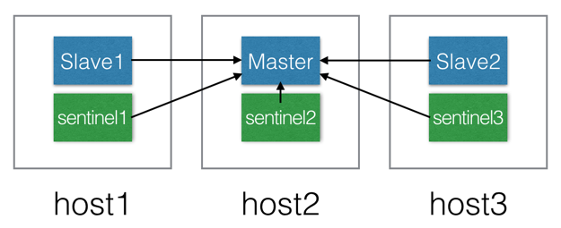

# 单机搭建

## 拉取镜像

+ 查找Docker Hub上的redis镜像 

```shell
$ docker search  redis
```

+ 这里我们拉取官方的镜像 ，标签为latest

```shell
$ docker pull redis
```

+ 等待下载完成后，我们就可以在本地镜像列表里查到REPOSITORY为redis,标签为3.2的镜像。 

```shell
$ docker images redis
REPOSITORY          TAG                 IMAGE ID            CREATED             SIZE
redis               latest              3c41ce05add9        4 days ago          95MB
```

## 运行容器

```shell
$ docker run -p 6379:6379 --name redis  -d redis:latest redis-server --appendonly yes
54bf9c85fb795dd7ebaacfff39d1411777033d033e9f1f4e2ec3f1c4a41e91b1
```

> 命令说明：
>
> **-p 6379:6379 :** 将容器的6379端口映射到主机的6379端口
>
> **-- name redis:** 容器的名字redis
>
> **redis-server --appendonly yes :** 在容器执行redis-server启动命令，并打开redis持久化配置

+ 查看容器启动情况

```shell
$ docker ps
CONTAINER ID      IMAGE          COMMAND          CREATED        STATUS             PORTS              NAMES
54bf9c85fb79  redis:latest  "docker-entrypoi"  2 minutes ago  Up 2 minutes    0.0.0.0:6379->6379/tcp   redis
```

+ 连接、查看容器

使用redis镜像执行redis-cli命令连接到刚启动的容器,主机IP为172.17.0.1

```shell
$ docker exec -it redis redis-cli
127.0.0.1:6379> info
# Server
redis_version:5.0.5
......
```

# 集群搭建

## 准备

1. 在docker库获取镜像：redis(版本是5.0，不适用ruby搭建)

```shell
# docker pull redis
```

2. 找到一份原始的redis.conf文件，将其重命名为：redis-cluster.tmpl，并配置如下几个参数，此文件的目的是生成每一个redis实例的redis.conf:

```bash
# bind 127.0.0.1
protected-mode no
port ${PORT}
daemonize no
dir /data/redis
appendonly yes
cluster-enabled yes
cluster-config-file nodes.conf
cluster-node-timeout 15000
```

## **搭建**

​        这里我准备的是2套环境：所有redis实例运行在同一台宿主机上；redis实例运行在不同的宿主机上。相信大家在生产环境中都应该是部署在不同的机器上，下面我将分别讲述：

### redis实例运行在同一台宿主机上

1. 由于此处所有redis实例运行在同一台宿主机，而redis-cluster之间需要通信，所以需要创建docker network

```shell
# 创建docker内部网络
# docker network create redis-cluster-net
db0e0d089b88d7d7aeaee3d073e6972de88fa146bab90ce6aa8c9b837112f03c
```

2. 创建 master 和 slave 文件夹并生成配置文件，用于存放配置文件redis.conf以及redis数据

```shell
# 命令详情可直接复制
for port in `seq 7000 7005`; do
    ms="master"
    if [ $port -ge 7003 ]; then
        ms="slave"
    fi
    mkdir -p ./$ms/$port/ && mkdir -p ./$ms/$port/data \
    && PORT=$port envsubst < ./redis-cluster.tmpl > ./$ms/$port/redis.conf;
done
# 执行命令
root@ubuntu18:/home/buyilihao/Learning/Docker/Redis# for port in `seq 7000 7005`; do
>     ms="master"
>     if [ $port -ge 7003 ]; then
>         ms="slave"
>     fi
>     mkdir -p ./$ms/$port/ && mkdir -p ./$ms/$port/data \
>     && PORT=$port envsubst < ./redis-cluster.tmpl > ./$ms/$port/redis.conf;
> done
```

3. 运行docker redis 的 master 和 slave 实例

```shell
for port in `seq 7000 7005`; do
    ms="master"
    if [ $port -ge 7003 ]; then
        ms="slave"
    fi
    docker run -d -p $port:$port -p 1$port:1$port \
    -v $PWD/$ms/$port/redis.conf:/data/redis.conf \
    -v $PWD/$ms/$port/data:/data/redis \
    --name redis-$ms-$port --net redis-cluster-net \
    redis:latest redis-server /data/redis.conf;
done
```

4. 查看redis实例IP地址

```shell
# docker inspect redis-master-7000|grep IPAddress
            "SecondaryIPAddresses": null,
            "IPAddress": "",
                    "IPAddress": "172.18.0.2",
# docker inspect redis-master-7001|grep IPAddress
            "SecondaryIPAddresses": null,
            "IPAddress": "",
                    "IPAddress": "172.18.0.3",
```

5. 创建docker-cluster，需要在接下来的console中输入“yes”，即可完成docker-cluster的搭建

```shell
# docker run -it --rm --net redis-cluster-net redis redis-cli --cluster create 172.18.0.2:7000 172.18.0.3:7001 172.18.0.4:7002 172.18.0.5:7003 172.18.0.6:7004 172.18.0.7:7005 --cluster-replicas 1
```

6. 测试

```shell
# docker exec -it redis-master-7000 redis-cli -c -h 172.18.0.2 -p 7000
172.18.0.2:7000> cluster info
cluster_state:ok
cluster_slots_assigned:16384
cluster_slots_ok:16384
cluster_slots_pfail:0
cluster_slots_fail:0
cluster_known_nodes:6
cluster_size:3
cluster_current_epoch:6
cluster_my_epoch:1
cluster_stats_messages_ping_sent:18906
cluster_stats_messages_pong_sent:18144
cluster_stats_messages_sent:37050
cluster_stats_messages_ping_received:18139
cluster_stats_messages_pong_received:18906
cluster_stats_messages_meet_received:5
cluster_stats_messages_received:37050
172.18.0.2:7000> 
```

### redis实例运行在不同的宿主机上

> 这种方式我没有测试过，只做搬运

这里我将3个master实例运行在一台机(10.82.12.95)上，3个slave实例运行在另一台机器(10.82.12.98)上

1. 在两台机器上分别创建文件夹

```shell
# 创建文件夹
for port in `seq 7000 7002`; do
    mkdir -p ./$port/ && mkdir -p ./$port/data \
    && PORT=$port envsubst < ./redis-cluster.tmpl > ./$port/redis.conf;
done
```

2. 在两台机器上分别运行docker redis 实例，注意这里就没有使用docker network了，直接使用的是宿主机的host，原因是要在不同机器的docker容器中通信是很麻烦的，有兴趣的朋友可以看下相关文章

```shell
# 运行docker redis 实例
for port in `seq 7000 7002`; do
    docker run -d \
    -v $PWD/$port/redis.conf:/data/redis.conf \
    -v $PWD/$port/data:/data/redis \
    --restart always --name redis-$port --net host \
    redis redis-server /data/redis.conf;
done
```

3. 在任意一台机器上创建docker-cluster

```shell
# 创建docker-cluster
docker run -it --rm redis-trib ruby redis-trib.rb create --replicas 1 10.82.12.95:7000 10.82.12.95:7001 10.82.12.95:7002 10.82.12.98:7000 10.82.12.98:7001 10.82.12.98:7002
```

4. 执行第3步的命令后，需要在接下来的console中输入“yes”，即可完成docker-cluster的搭建

## 重启

+ 删除所有已关闭的redis容器
+ 删除node.conf配置文件

```shell
root@ubuntu18:/home/buyilihao/Learning/Docker/Redis# rm master/7000/data/nodes.conf 
root@ubuntu18:/home/buyilihao/Learning/Docker/Redis# rm master/7001/data/nodes.conf 
root@ubuntu18:/home/buyilihao/Learning/Docker/Redis# rm master/7002/data/nodes.conf 
root@ubuntu18:/home/buyilihao/Learning/Docker/Redis# rm slave/7003/data/nodes.conf 
root@ubuntu18:/home/buyilihao/Learning/Docker/Redis# rm slave/7004/data/nodes.conf 
root@ubuntu18:/home/buyilihao/Learning/Docker/Redis# rm slave/7005/data/nodes.conf 
```

+ 重复上面的3,4,5步骤。

# 哨兵模式

## 一：redis集群分类

大家都知道redis集群有两种，一种是[redis sentinel](https://yq.aliyun.com/go/articleRenderRedirect?url=http://redis.io/topics/sentinel)，高可用集群，同时只有一个master，各实例数据保持一致；一种是[redis cluster](https://yq.aliyun.com/go/articleRenderRedirect?url=http://redis.io/topics/cluster-tutorial)，分布式集群，同时有多个master，数据分片部署在各个master上。基于我们的需求和redis本身技术的成熟度，本次要搭建的是redis sentinel。

关于它的介绍：
Redis 的 Sentinel 系统用于管理多个 Redis 服务器（instance）， 该系统执行以下三个任务：

- 监控（Monitoring）： Sentinel 会不断地检查你的主服务器和从服务器是否运作正常。
- 提醒（Notification）： 当被监控的某个 Redis 服务器出现问题时， Sentinel 可以通过 API 向管理员或者其他应用程序发送通知。
- 自动故障迁移（Automatic failover）： 当一个主服务器不能正常工作时， Sentinel 会开始一次自动故障迁移操作， 它会将失效主服务器的其中一个从服务器升级为新的主服务器， 并让失效主服务器的其他从服务器改为复制新的主服务器； 当客户端试图连接失效的主服务器时， 集群也会向客户端返回新主服务器的地址， 使得集群可以使用新主服务器代替失效服务器。

## 二：制作镜像

整个集群可以分为一个master，N个slave，M个sentinel，本次以2个slave和3个sentinel为例：

首先增加`redis.conf`

```shell
##redis.conf
##redis-0,默认为master
port $redis_port
##授权密码，请各个配置保持一致
##暂且禁用指令重命名
##rename-command
##开启AOF，禁用snapshot
appendonly yes
#slaveof redis-master $master_port
slave-read-only yes
```

默认为master，`#slaveof `注释去掉后变为slave，这里固化了master的域名` redis-master`。
增加`sentinel.conf`

```shell
port $sentinel_port
dir "/tmp"
##sentinel监控的redis的名字、IP和端口，最后一个数字是sentinel做决策的时候需要投赞同票的最少的sentinel的数量。
sentinel monitor mymaster redis-master $master_port 2
##选项指定了在执行故障转移时， 最多可以有多少个从服务器同时对新的主服务器进行同步， 这个数字越小， 完成故障转移所需的时间就越长。
sentinel config-epoch mymaster 1
sentinel leader-epoch mymaster 1
sentinel current-epoch 1
```

增加启动脚本`start.sh`，根据入参判断启动master，slave，sentinel

```shell
cd /data
redis_role=$1
echo $redis_role
if [ $redis_role = "master" ] ; then
    echo "master" 
    sed -i "s/\$redis_port/$redis_port/g" redis.conf
    redis-server /data/redis.conf
elif [ $redis_role = "slave" ] ; then   
    echo "slave" 
    sed -i "s/\$redis_port/$redis_port/g" redis.conf
    sed -i "s/#slaveof/slaveof/g" redis.conf
    sed -i "s/\$master_port/$master_port/g" redis.conf
    redis-server /data/redis.conf
elif [ $redis_role = "sentinel" ] ; then 
    echo "sentinel" 
    sed -i "s/\$sentinel_port/$sentinel_port/g" sentinel.conf
    sed -i "s/\$master_port/$master_port/g" sentinel.conf
    redis-sentinel /data/sentinel.conf
else 
    echo "unknow role!" 
fi     #ifend
```

其中$redis_port和$master_port,$sentinel_port都是取自环境变量，通过Docker启动时候传入。
编写`Dockerfile`

```dockerfile
FROM redis:3-alpine
MAINTAINER voidman <voidman>

COPY Shanghai /etc/localtime
COPY redis.conf /data/redis.conf
COPY sentinel.conf /data/sentinel.conf
COPY start.sh /data/start.sh
RUN chmod +x /data/start.sh
RUN chown redis:redis /data/*
ENTRYPOINT ["sh","/data/start.sh"] 
CMD ["master"]
```

选取redis-alpine镜像作为基础镜像，因为它非常小，只有9M，修改时区和把一些配置拷贝进去后，变更下权限和用户组，因为基础镜像是redis用户组。`ENTRYPOINT`和`CMD`组合，默认以master方式启动。

```shell
# docker build -t redis-sentinel
```

