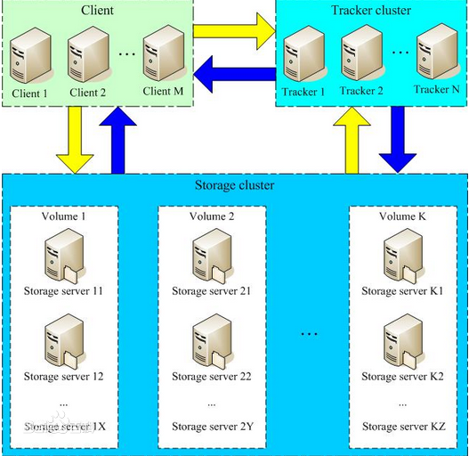
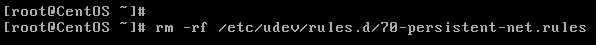

# FastDFS笔记

参考资料：https://github.com/happyfish100/fastdfs  
参考资料：https://www.oschina.net/p/fastdfs

## 一、简介
**FastDFS**高性能的分布式文件系统，主要功能包含文件的存储、同步、访问（上传和下载），特别适用于以文件为主体的网络站点（图片分享和视频分享）

**FastDFS**包含两个角色  
- **Tracker**(追踪器 调度服务器)：调度和文件访问的负载均衡
- **Storage**(存储器 存储服务器)：文件的管理（存储、同步、访问接口）和文件的元数据

支持水平扩展，不会对在线服务造成任何影响

存储服务器通过**卷/组**组织管理，不同的卷管理不同的文件，一个卷管理一台或者多台存储服务器，并且这些存储服务器之间互相备份

存储容量=所有卷容量之和

文件在集群中标示=卷名+文件名

架构图：



## 二、环境搭建（单机版）

### 1. Linux安装

1. 克隆虚拟器  
   ```shell
   vi /etc/sysconfig/network-scripts/ifcfg-eth0
   
   # 删除两行
   UUID
   HWADDR
   ```
   

2. 安装
  ```shell
  yum install gcc-c++ perl-devel pcre-devel openssl-devel zlib-devel wget
  
  wget https://github.com/happyfish100/fastdfs/archive/V5.11.tar.gz
  
  wget https://github.com/happyfish100/libfastcommon/archive/V1.0.36.tar.gz
  
  tar -zxvf V1.0.36.tar.gz
  
  cd libfastcommon-1.0.36/
  
  ./make.sh && ./make.sh install
  
  tar -zxvf V5.11.tar.gz
  
  cd fastdfs-5.11/
  
  ./make.sh && ./make.sh install
  ```
3. 修改配置文件
  ```shell
  cd  /etc/fdfs
  [root@baizhi fdfs]# cp tracker.conf.sample tracker.conf
  [root@baizhi fdfs]# cp storage.conf.sample storage.conf
  [root@baizhi fdfs]# cp client.conf.sample client.conf
  
  vi tracker.conf
  # 修改
  base_path=/data/fastdfs/tracker
  
  vi storage.conf
  # 修改
  base_path=/data/fastdfs/storage
  store_path0=/data/fastdfs/storage/store
  tracker_server=192.168.43.136:22122
  
  # 创建目录
  [root@baizhi fdfs]# mkdir -p /data/fastdfs/tracker
  [root@baizhi fdfs]# mkdir -p /data/fastdfs/storage/store
  
  vi client.conf
  # 修改
  base_path=/tmp
  tracker_server=192.168.43.136:22122
  ```
4. 启动
  ```shell
  # 启动tracker server
  [root@baizhi fdfs]# fdfs_trackerd /etc/fdfs/tracker.conf start
  
  # 再启动storage server
  [root@baizhi fdfs]# fdfs_storaged /etc/fdfs/storage.conf start
  ```
5. 测试
  ```shell
  # 监控指令
  fdfs_monitor /etc/fdfs/client.conf
  
  # 上传文件
  fdfs_upload_file /etc/fdfs/client.conf /root/1.png
  
  # 下载文件
  fdfs_download_file /etc/fdfs/client.conf group1/M00/00/00/wKgriFr0YmeAI_lcABr-dch7j3Q658.png /root/2.png
  
  # 删除文件
  ```

### 2. Docker安装

详情请查看docker文件下笔记

## 三、JAVA API

1. 将fastdfs-client-java安装到Maven本地仓库
  ```xml
 <!--要手动安装到maven仓库-->
        <dependency>
            <groupId>com.fastdfs</groupId>
            <artifactId>fastdfs</artifactId>
            <version>1.27</version>
        </dependency>
  ```
2. 准备配置文件fdfs_client.conf
  ```
  # 文件内容如下
  tracker_server = 192.168.43.136:22122
  ```
3. 测试代码
  ``` JAVA
  import org.csource.common.MyException;
  import org.csource.common.NameValuePair;
  import org.csource.fastdfs.*;
  import org.junit.Before;
  import org.junit.Test;
  
  import java.io.FileOutputStream;
  import java.io.IOException;
  import java.util.Arrays;
  import java.util.List;
  
  /**
   * Created by Administrator on 2018/5/10.
   */
  public class FastDFSJavaApiTest {
      StorageClient client = null;
      /**
       * 单元测试方法之前执行
       *
       * @throws IOException
       * @throws MyException
       */
      @Before
      public void before() throws IOException, MyException {
          // 加载配置文件
          ClientGlobal.init("fdfs_client.conf");
          TrackerClient trackerClient = new TrackerClient();
          TrackerServer trackerServer = trackerClient.getConnection();
          // 通过client对象操作分布式文件系统
          client = new StorageClient(trackerServer, null);
      }
  
      /**
       * 测试文件上传
       */
      @Test
      public void testUpload() throws IOException, MyException {
          // 参数一：本地文件路径  参数二: 文件的扩展名  参数三：元数据列表
          //String[] str = client.upload_file("C:\\Users\\Administrator\\Desktop\\1.png", "png", null);
          String[] str = client.upload_file("C:\\Users\\Administrator\\Desktop\\1.png", "png",
                  new NameValuePair[]{new NameValuePair("width","1080"),new NameValuePair("author","zs")}
                  );
          for (String s : str) {
              System.out.println(s);
          }
      }
  
      /**
       * 文件下载
       * @throws IOException
       * @throws MyException
       */
      @Test
      public void testDownload() throws IOException, MyException {
          byte[] b = client.download_file("group1", "M00/00/00/wKgriFr0ebmAI1gBABr-dch7j3Q224.png");
          FileOutputStream fileOutputStream = new FileOutputStream("e:\\aa.png");
          fileOutputStream.write(b);
          fileOutputStream.close();
      }
  
      /**
       * 文件删除
       * @throws IOException
       * @throws MyException
       */
      @Test
      public void testDelete() throws IOException, MyException {
          client.delete_file("group1", "M00/00/00/wKgriFr0ebmAI1gBABr-dch7j3Q224.png");
      }
  
      @Test
      public void testGetFileInfo() throws IOException, MyException {
          FileInfo fileInfo = client.get_file_info("group1", "M00/00/00/wKgriFr0e4qAB0ndABr-dch7j3Q248.png");
  
          System.out.println(fileInfo.getCrc32() + " | " +fileInfo.getCreateTimestamp() + " | "+fileInfo.getFileSize());
      }
  
      @Test
      public void testGetMetadata() throws IOException, MyException {
          try {
              NameValuePair[] nameValuePairs = client.get_metadata("group1", "M00/00/00/wKgriFr0e4qAB0ndABr-dch7j3Q248.png");
              for (NameValuePair nameValuePair : nameValuePairs) {
                  System.out.println(nameValuePair.getName() +"|"+nameValuePair.getValue());
              }
          } catch (IOException e) {
              e.printStackTrace();
          } catch (MyException e) {
              e.printStackTrace();
          }
      }
  }
  ```


## 四、Spring Boot整合

1. 创建spring boot工程
  ``` xml
  <parent>
      <groupId>org.springframework.boot</groupId>
      <artifactId>spring-boot-starter-parent</artifactId>
      <version>1.5.8.RELEASE</version>
      <relativePath/> <!-- lookup parent from repository -->
  </parent>
  
  <properties>
      <project.build.sourceEncoding>UTF-8</project.build.sourceEncoding>
      <project.reporting.outputEncoding>UTF-8</project.reporting.outputEncoding>
      <java.version>1.7</java.version>
  </properties>
  
  <dependencies>
      <dependency>
          <groupId>org.springframework.boot</groupId>
          <artifactId>spring-boot-starter-web</artifactId>
      </dependency>
  
      <dependency>
          <groupId>org.springframework.boot</groupId>
          <artifactId>spring-boot-starter-test</artifactId>
          <scope>test</scope>
      </dependency>
  
      <dependency>
          <groupId>com.github.tobato</groupId>
          <artifactId>fastdfs-client</artifactId>
          <version>1.26.2</version>
      </dependency>
  </dependencies>
  ```
2. 配置入口类
  ``` JAVA
  @Import(FdfsClientConfig.class)
  // 解决jmx重复注册bean的问题
  @EnableMBeanExport(registration = RegistrationPolicy.IGNORE_EXISTING)
  @SpringBootApplication
  public class SpringbootFastdfsDemoApplication {
  
  	public static void main(String[] args) {
  		SpringApplication.run(SpringbootFastdfsDemoApplication.class, args);
  	}
  }
  ```
3. 配置文件
  ``` yml
  # ===================================================================
  # 分布式文件系统FDFS配置
  # ===================================================================
  fdfs:
    so-timeout: 1501
    connect-timeout: 601
    thumb-image:             #缩略图生成参数
      width: 150
      height: 150
    tracker-list:            #TrackerList参数,支持多个
      - 192.168.43.136:22122
  ```
4. 测试代码
  ``` JAVA
  package com.baizhi;
  import com.github.tobato.fastdfs.domain.StorePath;
  import com.github.tobato.fastdfs.service.FastFileStorageClient;
  import com.github.tobato.fastdfs.service.GenerateStorageClient;
  import org.junit.Test;
  import org.junit.runner.RunWith;
  import org.springframework.beans.factory.annotation.Autowired;
  import org.springframework.boot.test.context.SpringBootTest;
  import org.springframework.test.context.junit4.SpringRunner;
  
  import java.io.File;
  import java.io.FileInputStream;
  import java.io.FileNotFoundException;
  
  @RunWith(SpringRunner.class)
  @SpringBootTest
  public class SpringbootFastdfsDemoApplicationTests {
  
  	@Autowired
  	private FastFileStorageClient storageClient;
  	
      // 文件上传
  	@Test
  	public void contextLoads() throws FileNotFoundException {
  
  		File file = new File("E:\\aa.png");
  
  		FileInputStream inputStream = new FileInputStream(file);
  
  		StorePath storePath = storageClient.uploadFile(inputStream, file.length(), "png", null);
  
  		System.out.println(storePath.getGroup() + " | " + storePath.getPath());
  	}
      /**
       * 文件下载
       * @throws IOException
       */
  	@Test
  	public void testDownload() throws IOException {
          byte[] b = storageClient.downloadFile("group1", "M00/00/00/wKgriFr1bX-AG3JlABr-dch7j3Q095.png", new DownloadByteArray());
          FileOutputStream fileOutputStream = new FileOutputStream("E:\\2.png");
          fileOutputStream.write(b);
          fileOutputStream.close();
      }
  }
  ```


## 五、集成fastdfs-nginx-module

1. 原因
   - 为分布式文件系统提供Http服务支持
   - 解决复制延迟问题（重定向到文件存储的源存储服务器获取文件）

2. 环境搭建

   ```shell
   # fastdfs版本大于等于5.11
   
   # 上传fastdfs-nginx-module 和 nginx-1.11.1.tar.gz
   
   # 移动安装包软件安装目录
   
    tar -zxvf nginx-1.11.1.tar.gz 
    cd nginx-1.11.1
    
    ./configure --add-module=/usr/local/src/fastdfs-nginx-module/src/ --prefix=/usr/local/nginx
    make && make install
    
    cp /usr/local/src/fastdfs-nginx-module/src/mod_fastdfs.conf /etc/fdfs
    
    cp fastdfs-5.11/conf/http.conf /etc/fdfs
    cp fastdfs-5.11/conf/mime.types /etc/fdfs
    
    # 修改nginx.conf
    
    vi /usr/local/nginx/conf/nginx.conf
    
    server {
   		    listen       8888;    ## 该端口为storage.conf中的http.server_port相同
   		    server_name  localhost;
   		    location ~/group[0-9]/ {
   		        ngx_fastdfs_module;
   		    }
   		    error_page   500 502 503 504  /50x.html;
   		    location = /50x.html {
   		    	root   html;
   		    }
   		}
   		
   # vi  /etc/fdfs/mod_fastdfs.conf
       tracker_server=192.168.128.141:22122
       url_have_group_name = true
       group_name=group1
       # 当前需要提供web支持的存储服务器的文件存储目录
       store_path0=/data/fastdfs/storage/store
       
   # 启动Nginx服务器
    ./nginx -c /usr/local/nginx/conf/nginx.conf
   # 启动FastDFS服务
    fdfs_trackerd /etc/fdfs/tracker.conf start
    fdfs_storaged /etc/fdfs/storage.conf start
   ```

3. 测试

   打开浏览器访问：

   http://nginxserver:8888/groupname/filename

   如: http://192.168.43.136:8888/group1/M00/00/00/wKgriFr1bX-AG3JlABr-dch7j3Q095.png


## 六、集成FastDHT（文件去重）

### 1. 排重原理

​	FastDFS本身支持文件的排重处理机制（ fdfd_crc32 效率高于MD5），但需要FastDHT作为文件hash的索引存储。FastDHT是同一个作者的开源key-value数据库。

​	<u>FastDFS的storage server每次上传均计算文件的hash值，然后从FastDHT服务器上进行查找比对，如果没有返回，则写入hash，并将文件保存如果有返回，则建立一个新的文件链接（软连接 ln -s），不保存文件。</u>

### 2. 环境搭建

```shell
# 安装BerkeleyDB 下载db-4.7.25.tar.gz
[root@CentOS ~]# tar -zxf db-4.7.25.tar.gz
[root@CentOS ~]# cd db-4.7.25
[root@CentOS db-4.7.25]# cd build_unix/
[root@CentOS build_unix]# ./../dist/configure
[root@CentOS build_unix]# make
[root@CentOS build_unix]# make install

# 安装FastDHT
[root@CentOS ~]# tar zxf FastDHT_v2.01.tar.gz
[root@CentOS ~]# cd FastDHT
[root@CentOS FastDHT]# ./make.sh
[root@CentOS FastDHT]# ./make.sh install

# 安装结束后会在/etc目录下产生fdht文件夹
/etc/fdht/
    ├── fdht_client.conf
    ├── fdhtd.conf
    └── fdht_servers.conf
 
#配置
	1.修改fdhtd.conf
		base_path=/data/fastdht
	2.创建目录
		mkdir -p /data/fastdht
	3.修改fdht_servers.conf （用来配置fastdht集群的，dht server也是通过组进行管理的,同组备份）
		group_count = 1
		group0 = 192.168.145.150:11411
		
	4.修改/etc/fdfs/storage.conf配置文件
		check_file_duplicate=1
		keep_alive=1
		#include /etc/fdht/fdht_servers.conf
# 启动
	1.分别启动fdhtd服务、fastdfs
	[root@CentOS usr]# /usr/local/bin/fdhtd /etc/fdht/fdhtd.conf start
	[root@CentOS usr]# /usr/bin/fdfs_trackerd /etc/fdfs/tracker.conf restart
	[root@CentOS usr]# /usr/bin/fdfs_storaged /etc/fdfs/storage.conf restart

```

### 3.  测试

​	上传相同文件，发现原始文件只会保留一份，相同文件上传都会变为快捷方式

## 七、FastDFS分布式文件系统集群环境搭建

### 1. 搭建分布式文件系统步骤

```shell
# 准备3台机器（克隆虚拟机）
192.168.43.136  tracker server
192.168.43.137  storage server  group1
192.168.43.138  storage server  group2

# ---------------------------------------------
# 修改tracker server的配置文件（克隆单机版的机器 配置文件无需任何修改）

# 删除tracker server中的历史数据
rm -rf /data/fastdfs/tracker/*
	
# 启动tracker server服务
fdfs_trackerd /etc/fdfs/tracker.conf start
# ---------------------------------------------


# ---------------------------------------------
# 修改storage server的配置文件
# 注意：拷贝一份新的配置文件，修改
cd /etc/fdfs/
rm -rf storage.conf
cp storage.conf.sample storage.conf
vi storage.conf
修改内容：
	# 修改卷名 
	# 192.168.43.137 group1
	# 192.168.43.138 group2
	group_name=group1
	base_path=/data/fastdfs/storage
	store_path0=/data/fastdfs/storage/store
	tracker_server=192.168.43.136:22122
# 保存退出

# 删除storage server中的历史数据
rm -rf /data/fastdfs/storage/store/*
rm -rf /data/fastdfs/storage/data/
rm -rf /data/fastdfs/storage/logs/

# 启动storage server服务
fdfs_storaged /etc/fdfs/storage.conf start
#------------------------------------------------

```


### 2. 测试

使用监控指令：`fdfs_monitor /etc/fdfs/client.conf`


> Note：
>
> ​	tracker server默认会将文件上传到空余容量最大的*卷*中存储

### 3. 分布式文件系统集成Nginx

每一台存储服务器中集成：<u>fastdfs-nginx-module</u>

> **Note:** 
>
>  集成fastdfs-nginx-module步骤可参考：章节五
>
> 克隆机，可以省略修改nginx配置文件之前的所有内容，修改以下配置即可

修改Storage Server中的 *mod_fastdfs.conf* 文件

```shell

# storage server1 —— 192.168.43.137
# vi /etc/fdfs/mod_fastdfs.conf
tracker_server=192.168.43.136:22122
url_have_group_name = true
group_name=group1
# 当前需要提供web支持的存储服务器的文件存储目录
store_path0=/data/fastdfs/storage/store

# ---------------------------------------------

# storage server2 —— 192.168.43.138
# vi /etc/fdfs/mod_fastdfs.conf
tracker_server=192.168.43.136:22122
url_have_group_name = true
group_name=group2
# 当前需要提供web支持的存储服务器的文件存储目录
store_path0=/data/fastdfs/storage/store


# 启动Storage1和Storage2中的Nginx服务器和对应的FastDFS服务
./nginx -c/usr/local/nginx/conf/nginx.conf
# 启动
fdfs_trackerd /etc/fdfs/tracker.conf start
fdfs_storaged /etc/fdfs/storage.conf start
```

#### 3.1 测试

> **Note:**
>
> ​	可以通过  Http://nginxserver:port/groupname/filename 访问不同存储服务器中的文件

<u>如： 上传到group1，可以通过以下方式获取文件</u>

http://192.168.43.137:8888/group1/M00/00/00/wKgriVr1q_qAO2YfABr-dch7j3Q415.png


<u>如： 上传到group2，可以通过以下方式获取文件</u>

http://192.168.43.138:8888/group2/M00/00/00/wKgrilr1q76AVbeQABr-dch7j3Q997.png


#### 3. 2 问题

- 集成<u>fastdfs-nginx-module</u>，存在以下问题：

1. 访问不同组，ip地址需要变动
2. 存储服务器直接暴漏给用户，会造成数据不安全

- 解决之道：

  ​        配置网关服务器（Nginx），提供统一的请求入口，避免数据服务器直接暴漏给用户造成的数据安全问题


- 搭建网关服务器Nginx

  注：在这里，我们将网关服务器集成到tracker server中，具体步骤如下

  ```shell
  cd /usr/local
  rm -rf nginx/
  cd /usr/local/src/
  rm -rf nginx-1.11.1
  tar -zxvf nginx-1.11.1.tar.gz 
  cd nginx-1.11.1
  ./configure --prefix=/usr/local/nginx
  make && make install
  ```

  修改网关服务器Nginx的配置文件

  ` vi /usr/local/nginx/conf/nginx.conf`

  修改内容如图所示

  

  

  启动网关服务器测试

  > **Note:**
  >
  > ​	可以通过  Http://网关服务器IP:port/groupname/filename 访问不同存储服务器中的文件

  如：

  http://192.168.43.136/group2/M00/00/00/wKgrilr1xP-AVeu4ABr-dSV9erc107.png

  http://192.168.43.136/group1/M00/00/00/wKgriVr1u_CABRxNABr-dch7j3Q579.png

  

### 4. 分布式文件系统集成FastDHT（文件去重）

- 在tracker server中安装FastDHT服务（具体步骤可参考章节六）	

  ```shell
  # 注：如果是克隆机，可省略搭建步骤，只需要清空dht历史数据即可
  rm -rf /data/fastdht/*
  ```

  

- 修改存储服务器的配置文件

  ```shell
  # 注意：需要将tracker server中/etc/fdht/fdht_servers.conf 拷贝到storage server中的/etc/fdht目录中
  vi /etc/fdfs/storage.conf	
  	check_file_duplicate=1
  	keep_alive=1
  	#include /etc/fdht/fdht_servers.conf
  ```

- 启动服务

  ```shell
  # 启动tracker 中的 dht服务
  [root@CentOS usr]# fdhtd /etc/fdht/fdhtd.conf 
  # 重启tracker
  [root@CentOS usr]# fdfs_trackerd /etc/fdfs/tracker.conf restart
  # 重启storage
  [root@CentOS usr]# fdfs_storaged /etc/fdfs/storage.conf restart
  ```

- 测试

  重复上传相同文件

  

  