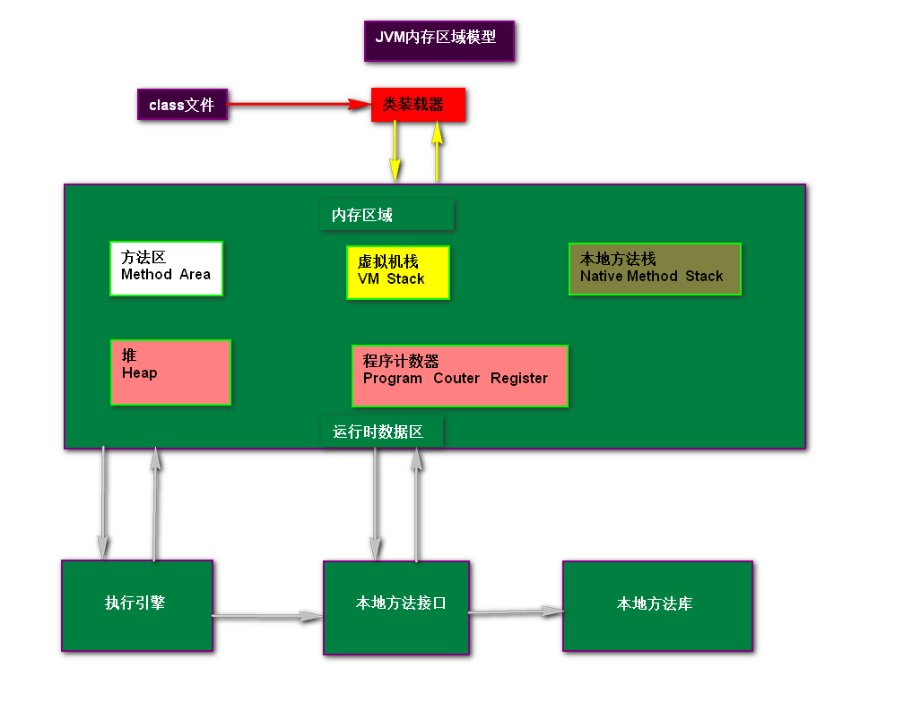
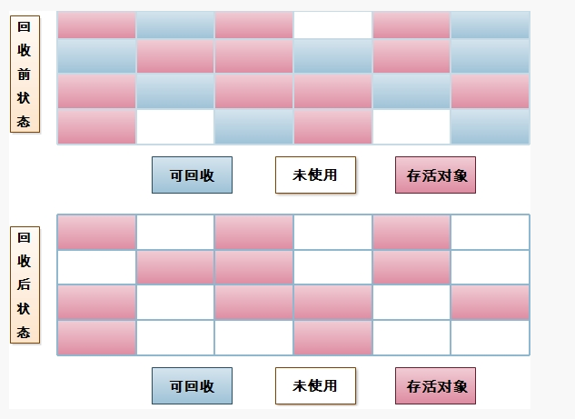
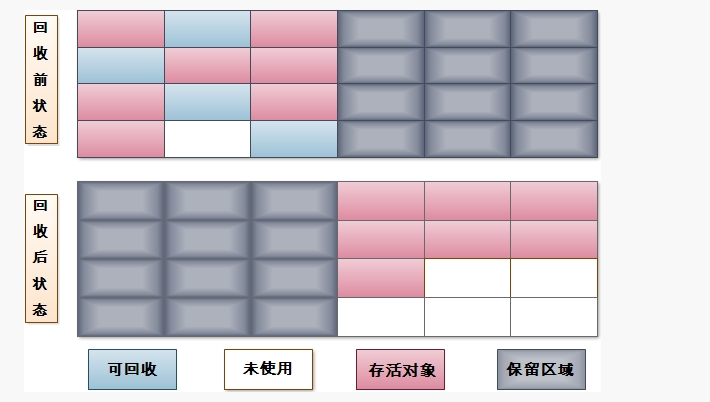
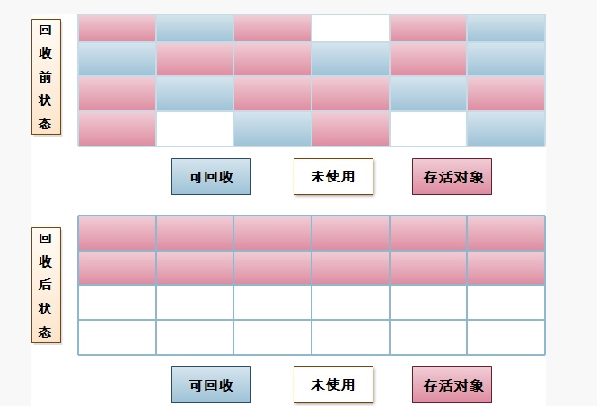

# 一、JVM引言

 JVM(Java Virtual Machine )在整个jdk中处于最底层，负责于操作系统的交互，用来屏蔽操作系统环境，提供一个完整的Java运行环境，因此也叫虚拟计算机。操作系统装入JVM是通过jdk中Java.exe来完成的。

# 二、JVM内存结构

+ 内存结构图



## 1. 方法区

所有线程共享，也称“**永久代(permanent generation)**”，“**非堆**”，用于储存虚拟机加载的类信息，常量，静态变量。

运行时常量池：方法区的一部分，Class文件中除了有类的版本，字段，方法，接口等描述信息外，还有一项信息就是常量池，用于存放编译器生成的各种符号引用，这部分内容将在类加载后放到方法区的运行时常量池中.

GC很少在这个区域进行，但不代表不会回收(Full GC)。这个区域回收目标主要是针对常量池的回收和对类型的卸载。当内存申请大于实际可用内存，抛OOM。

## 2. 堆

> Heap

所有线程共享，虚拟机启动时创建，存放对象实例和数组。所占内存最大，分为新生代（Young区），老年代（Old区）。新生代分Eden区，Servior区。Servior区又分为From space区和To Space区。Eden区和Servior区的内存比为8:1。 当扩展内存大于可用内存，抛OOM。

JVM的优化也可以称为堆的优化.

## 3. 程序计数器

线程私有，是最小的一块内存，它的作用是当前线程所执行的字节码的行号指示器，在虚拟机的模型里，字节码解释器工作时就是通过改变这个计数器的值来选取下一条需要执行的字节码指令，分支，循环，异常处理，线程恢复等基础功能都需要依赖计数器完成。

## 4. 虚拟机栈

> Stack

线程私有，描述的是java方法执行的内存模型，每个方法被执行的时候，都会创建一个“栈帧”用于存储局部变量（包括参数），操作栈，方法出口等信息。

每个方法被调用到执行完成的过程，就对应着一个栈帧在虚拟机栈中从入栈到出栈的过程。声明周期与线程相同，是线程私有的.

局部变量表：存放八种基本类型，对象引用，其中64位长度的long和double类型的数据会占用两个局部变量的空间，其余数据类型只占一个。局部变量表是在编译时完成分配的，当进入一个方法时，这个方法需要在栈帧中分配多大的局部变量是完全确定的，在运行期间不再改变.

存在两种异常情况：若线程请求深度大于栈的深度，抛StackOverflowError。若栈在动态扩展时无法请求足够内存，抛OOM。

### 4.1 栈区详解：

栈的特点

> 也叫栈内存，是java虚拟机的内存模型之一，每当启动一个新线程时，Java虚拟机都会为它分配一个Java栈。虚拟机只会直接对Java栈执行两种操作，以帧为单位的压栈和出栈。

栈存储的是什么 

> 方法内的局部变量表、操作数栈、动态链接、方法出口信息、其他等信息

栈的生命周期 

> 是在线程创建时创建，线程结束而消亡，释放内存，由此可见栈内存是私有的。 

栈内存是以栈帧(Stack Frame)为单位存储，栈帧是一个内存区块，是一个有关方法(Method)和运行期数据的数据集。 

## 5. 本地方法栈

线程私有。与Java栈类似，但是不是为Java方法（字节码）服务，而是为本地非Java方法服务。也会抛StackOverflowError和OOM。

### 5.1 方法栈详解：

本地方法栈与虚拟机栈发挥的功能非常类似，只是虚拟机栈为虚拟机执行java方法而服务，而本地方法栈为虚拟机执行native方法而服务。 有的虚拟机把本地方法栈和虚拟机栈合二为一，比如**Sun HotSpot 虚拟机。** 

本地方法：

- JAVA方法是由JAVA编写的，编译成字节码，存储在class文件中
- 本地方法是由其它语言编写的，编译成和处理器相关的机器代码
- 简单地讲，一个Native Method就是一个java调用非java代码的接口。一个Native Method是这样一个java的方法：该方法的实现由非java语言实现，比如C。

## 6. 名词解释

##### 6.1.StackOverflowError：栈溢出错误

​	每当java程序启动一个新的线程时，java虚拟机会为他分配一个栈，java栈以帧为单位保持线程运行状态；当线程调用一个方法是，jvm压入一个新的栈帧到这个线程的栈中，只要这个方法没执行结束，这个栈帧就存在。 如果方法的嵌套调用层次太多(如递归调用),随着java栈中的帧的增多，最终导致这个线程的栈中的所有栈帧的大小的总和大于-Xss设置的值，而产生StackOverflowError溢出异常。

如果一个线程在计算时所需要用到栈大小 > 配置允许最大的栈大小，那么Java虚拟机将抛StackOverflowError 

##### 6.2 OutOfMemoryError：内存溢出错误

- 1、栈内存溢出

  java程序启动一个新线程时，没有足够的空间为改线程分配java栈，一个线程java栈的大小由-Xss设置决定；JVM则抛出OutOfMemoryError异常。

- 2、堆内存溢出

  java堆用于存放对象的实例，当需要为对象的实例分配内存时，而堆的占用已经达到了设置的最大值(通过-Xmx)设置最大值，则抛出OutOfMemoryError异常。

- 3、方法区内存溢出

  方法区用于存放java类的相关信息，如类名、访问修饰符、常量池、字段描述、方法描述等。在类加载器加载class文件到内存中的时候，JVM会提取其中的类信息，并将这些类信息放到方法区中。 
  当需要存储这些类信息，而方法区的内存占用又已经达到最大值（通过-XX:MaxPermSize）；将会抛出OutOfMemoryError异常对于这种情况的测试，基本的思路是运行时产生大量的类去填满方法区，直到溢出。这里需要借助CGLib直接操作字节码运行时，生成了大量的动态类。

# 三、JVM代的划分

+ 永久代(Permanent Generation)    
+ 年轻代(Young Generation)  
+ 老年代(Old Generation)

Heap(堆) =  年轻代  (Eden + survivor1+survivor2) +   老年代  

# 四、触发GC和Full GC

GC: 一般情况下，当新对象生成，并且在Eden申请空间失败时，就会触发GC

Full GC:

​      老年代（Old ）被写满

​     永久代（Perm）被写满

​     System.gc()被显式调用 

# 五、垃圾回收算法

## 1. Mark-Sweep（标记-清除）

它是最基础的垃圾回收算法，其他算法都是基于这种思想。标记-清除算法分为“标记”，“清除”两个阶段：首先标记出需要回收的对象，标记完成后统一清除对象。




> 缺点：
>
> 1：标记和清除的效率不高
>
> 2：标记之后会产生大量不连续的内存碎片

##  2. Copying（复制）算法

它将可用内存分为两块，每次只用其中的一块，当这块内存用完以后，将还存活的对象复制到另一块上面，然后再把已经使用的内存空间一次清理掉.



> 优点：
>
> 1：不会产生内存碎片
>
> 2：只要移动堆顶的指针，按顺序分配内存即可，实现简单，运行高效
>
> 缺点：
>
> 1：内存缩小为原来的一半

## 3. Mark-Compact（标记-整理）

标记整理算法采用标记-清除算法一样的方式进行对象的标记，但在清除时不同，在回收未存活的对象占用的空间后，会将所有的存活对象往一端的空闲空间移动，并更新对应的指针。标记-整理算法是在标记-清除算法的基础上，又进行了对象的移动，因此成本更高，但是却解决了内存碎片的问题。



> 优点：不会产生内存碎片
>
> 缺点：在“标记-清除”基础上还要进行对象的移动，成本相对较高

## 4. Generational Collection（分代收集）

分代收集算法是目前大部分JVM的垃圾收集器采用的算法。它的核心思想是根据对象存活的生命周期将内存划分为若干个不同的区域。一般情况下将堆区划分为老年代（Tenured Generation）和新生代（Young Generation），`老年代的特点是每次垃圾收集时只有少量对象需要被回收，而新生代的特点是每次垃圾回收时都有大量的对象需要被回收，`那么就可以根据不同代的特点采取最适合的收集算法。

　　目前大部分垃圾收集器对于新生代都采取**(Coping)复制算法**，因为新生代中每次垃圾回收都要回收大部分对象，也就是说需要复制的操作次数较少，但是实际中并不是按照1：1的比例来划分新生代的空间的，一般来说是将新生代划分为一块较大的Eden空间和两块较小的Survivor空间，每次使用Eden空间和其中的一块Survivor空间，当进行回收时，将Eden和Survivor中还存活的对象复制到另一块Survivor空间中，然后清理掉Eden和刚才使用过的Survivor空间。


　　而由于老年代的特点是每次回收都只回收少量对象，一般使用的是**(Mark-Compact)标记整理算法**。

　　注意，在堆区之外还有一个代就是永久代（Permanet Generation），它用来存储class类、常量、方法描述等。对永久代的回收主要回收两部分内容：废弃常量和无用的类。

**一个对象的这一辈子** 

> 我是一个普通的java对象，我出生在Eden区，在Eden区我还看到和我长的很像的小兄弟，我们在Eden区中玩了挺长时间。有一天Eden区中的人实在是太多了，我就被迫去了Survivor区的“From”区，自从去了Survivor区，我就开始漂了，有时候在Survivor的“From”区，有时候在Survivor的“To”区，居无定所。直到我18岁的时候，爸爸说我成人了，该去社会上闯闯了。于是我就去了年老代那边，年老代里，人很多，并且年龄都挺大的，我在这里也认识了很多人。在年老代里，我生活了20年(每次GC加一岁)，然后被回收。 

# 六、垃圾收集器

垃圾收集算法是 内存回收的理论基础，而垃圾收集器就是内存回收的具体实现。下面介绍一下HotSpot（JDK 7)虚拟机提供的几种垃圾收集器，用户可以根据自己的需求组合出各个年代使用的收集器。

## 1. Serial/Serial Old

　　Serial/Serial Old收集器是最基本最古老的收集器，它是一个单线程收集器，属于串行收集器 ，并且在它进行垃圾收集时，必须暂停所有用户线程。Serial收集器是针对新生代的收集器，采用的是Copying算法，Serial Old收集器是针对老年代的收集器，采用的是Mark-Compact算法。它的优点是实现简单高效，但是缺点是会给用户带来停顿。

串行回收方式适合低端机器，是Client模式下的默认收集器，对CPU和内存的消耗不高，适合用户交互比较少，后台任务较多的系统。 

## 2. ParNew

　   ParNew收集器是Serial收集器的多线程版本，使用多个线程进行垃圾收集。 同样有Stop The World的问	 题，他是多CPU模式下的首选回收器（该回收器在单CPU的环境下回收效率远远低于Serial收集器，所以一定要注意场景哦），也是Server模式下的默认收集器。

## 3. Parallel Scavenge(并行收集器)

　　Parallel Scavenge收集器是一个新生代的多线程收集器（并行收集器），它在回收期间不需要暂停其他用户线程，其采用的是Copying算法，该收集器与前两个收集器有所不同，它主要是为了达到一个可控的吞吐量。

吞吐量=程序运行时间/(JVM执行回收的时间+程序运行时间) 。

`在当今网络告诉发达的今天，良好的响应速度是提升用户体验的一个重要指标，多核并行云计算的发展要求程序尽可能的使用CPU和内存资源，尽快的计算出最终结果，因此在交互不多的云端，比较适合使用该回收器。` 

## 4. Parallel Old**(年老代并行收集器)** 

　ParallelOld是老生代并行收集器的一种，使用标记整理算法、是老生代吞吐量优先的一个收集器。这个收集器是JDK1.6之后刚引入的一款收集器，我们看之前那个图之间的关联关系可以看到，早期没有ParallelOld之前，吞吐量优先的收集器老生代只能使用串行回收收集器，大大的拖累了吞吐量优先的性能，自从JDK1.6之后，才能真正做到较高效率的吞吐量优先。 

## 5. CMS**(并发收集器)** 

　　CMS（Current Mark Sweep）收集器是一种以获取最短回收停顿时间为目标的收集器，CMS又称响应时间优先(最短回收停顿)的回收器，使用并发模式回收垃圾，使用标记-清除算法，CMS对CPU是非常敏感的，它的回收线程数=（CPU+3）/4，因此当CPU是2核的实惠，回收线程将占用的CPU资源的50%，而当CPU核心数为4时仅占用25%。 

CMS 为了确保能够扫描到所有的对象，避免在InitialMarking 中还有未标识到的对象，采用的方法为找到标记了的对象，并将这些对象放入Stack 中，扫描时寻找此对象依赖的对象，如果依赖的对象的地址在其之前，则将此对象进行标记，并同时放入Stack 中，如依赖的对象地址在其之后，则仅标记该对象。 

在进行ConcurrentMarking 时minor GC 也可能会同时进行，这个时候很容易造成旧生代对象引用关系改变，CMS 为了应对这样的并发现象，提供了一个Mod UnionTable 来进行记录，在这个Mod Union Table中记录每次minor GC 后修改了的Card 的信息。这也是ParallelScavenge不能和CMS一起使用的原因。 

## 6. G1

　　G1收集器是当今收集器技术发展最前沿的成果，它是一款面向服务端应用的收集器，它能充分利用多CPU、多核环境。因此它是一款并行与并发收集器，并且它能建立可预测的停顿时间模型。

他是商用高性能垃圾回收器，通过重新划分内存区域，整合优化CMS，同时注重吞吐量和响应时间，但是杯具的是被oracle收购之后这个收集器属于商用收费收集器，因此目前基本上没有人使用 。

# 七、如何确定某个对象是“垃圾”？

## 1. 引用计数器算法：

在java中是通过引用来和对象进行关联的，也就是说如果要操作对象，必须通过引用来进行。那么很显然一个简单的办法就是通过引用计数来判断一个对象是否可以被回收。不失一般性，如果一个对象没有任何引用与之关联，则说明该对象基本不太可能在其他地方被使用到，那么这个对象就成为可被回收的对象了。这种方式成为引用计数法。这种方式的特点是实现简单，而且效率较高，但是它无法解决循环引用的问题，两个引用互相引用对方，导致它们的引用计数都不为0，那么垃圾收集器就永远不会回收它们。

## 2. 可达性分析法（根搜索算法/跟踪算法）

为了解决这个问题，在Java中采取了 可达性分析法。该方法的基本思想是通过一系列的“GC Roots”对象作为起点进行搜索，如果在“GC Roots”和一个对象之间没有可达路径，则称该对象是不可达的，不过要注意的是被判定为不可达的对象不一定就会成为可回收对象。被判定为不可达的对象要成为可回收对象必须至少经历两次标记过程，如果在这两次标记过程中仍然没有逃脱成为可回收对象的可能性，则基本上就真的成为可回收对象了。

总结一下平常遇到的比较常见的将对象判定为可回收对象的情况： 

1）显示地将某个引用赋值为null或者将已经指向某个对象的引用指向新的对象，比如下面的代码： 

```java
Object obj = new Object();
obj = null;
Object obj1 = new Object();
Object obj2 = new Object();
obj1 = obj2;
```

2）局部引用所指向的对象，比如下面这段代码： 

```java
void fun() {
 
.....
    for(int i=0;i<10;i++) {
        Object obj = new Object();
        System.out.println(obj.getClass());
    }   
}
```

3）只有弱引用与其关联的对象，比如： 

```java
WeakReference<String> wr = new WeakReference<String>(new String("world"));
```

## 3. 引用的分类

### 3.1 强引用

只要引用存在，垃圾回收器永远不会回收

```java
Objectobj = new Object（）;
// 可直接通过物镜取得对应的对象如obj.equels（NEWOBJECT（））; 
```

而这样 obj对象对后面newObject的一个强引用，只有当obj这个引用被释放之后，对象才会被释放掉，这也是我们经常所用到的编码形式。

### 3.2 软引用

非必须引用，内存溢出之前进行回收，可以通过以下代码实现

```java
Object obj = new Object();
SoftReference<Object> sf = new SoftReference<Object>(obj);

obj =null;
sf.get();//有时候会返回null
```

这时候sf是对obj的一个软引用，通过sf.get()方法可以取到这个对象，当然，当这个对象被标记为需要回收的对象时，则返回null；
软引用主要用户实现类似缓存的功能，在内存足够的情况下直接通过软引用取值，无需从繁忙的真实来源查询数据，shichen提升速度；当内存不足时，自动删除这部分缓存数据，从真正的来源查询这些数据。

### 3.3 弱引用

第二次垃圾回收时回收，可以通过如下代码实现

```java
Object obj = new Object();
WeakReference<Object>wf = new WeakReference<Object>(obj);

obj =null;
wf.get();//有时候会返回null
wf.isEnQueued();//返回是否被垃圾回收器标记为即将回收的垃圾
```

弱引用是在第二次垃圾回收时回收，短时间内通过弱引用取对应的数据，可以取到，当执行过第二次垃圾回收时，将返回null。

弱引用主要用于监控对象是否已经被垃圾回收器标记为即将回收的垃圾，可以通过弱引用的isEnQueued方法返回对象是否被垃圾回收器

### 3.4 虚引用（幽灵/幻影引用）

 垃圾回收时回收，无法通过引用取到对象值，可以通过如下代码实现

```java
Object obj = new Object();
PhantomReference<Object> pf = new PhantomReference<Object>(obj);

obj=null;
pf.get();//永远返回null
pf.isEnQueued();//返回从内存中已经删除

```

虚引用是每次垃圾回收的时候都会被回收，通过虚引用的get方法永远获取到的数据为null，因此也被成为幽灵引用。

虚引用主要用于检测对象是否已经从内存中删除。

# 八、优化参数配置

## 1. 堆设置

`-Xms:`初始堆大小

`-Xmx:`最大堆大小

`-XX:NewSize=n:`设置年轻代大小

`-XX:NewRatio=n:`设置年轻代和年老代的比值。如:为3，表示年轻代与年老代比值为1：3，年轻代占整个年轻代年老代和的1/4

`-XX:SurvivorRatio=n:`年轻代中Eden区与两个Survivor区的比值。注意Survivor区有两个。如：3，表示Eden：Survivor=3：2，一个Survivor区占整个年轻代的1/5

`-XX:MaxPermSize=n:`设置永久代大小

## 2. 收集器设置

`-XX:+UseSerialGC:`设置串行收集器

`-XX:+UseParallelGC:`设置并行收集器

`-XX:+UseParalledlOldGC:`设置并行年老代收集器

`-XX:+UseConcMarkSweepGC:`设置并发收集器

`-XX:+UseG1GC` 设置G1收集器

## 3. 垃圾回收统计信息

`-verbose:gc:`显示虚拟机运行信息 

`-XX:+PrintGC:`打印GC信息

`-XX:+PrintGCDetails:`打印GC详细信息

`-XX:+PrintGCTimeStamps:`打印GC时间戳

`-Xloggc:filename:`打印日志存放位置

## 4. 并行收集器设置

`-XX:ParallelGCThreads=n:`设置并行收集器收集时使用的CPU数。并行收集线程数。

`-XX:MaxGCPauseMillis=n:`设置并行收集最大暂停时间

`-XX:GCTimeRatio=n:`设置垃圾回收时间占程序运行时间的百分比。公式为1/(1+n) 

## 5. 并发收集器设置

`-XX:+CMSIncrementalMode:`设置为增量模式。适用于单CPU情况。

`-XX:ParallelGCThreads=n:`设置并发收集器年轻代收集方式为并行收集时，使用的CPU数。并行收集线程数。

# 九、优化工具的启动虚拟机

1. **打开工具的.ini加入如下配置**

`-verbose:gc`  

`-XX:+PrintGC`

`-XX:+PrintGCDetails`

`-XX:+PrintGCDateStamps`

`-Xloggc:D:\jvm.log`

2. **查看jvm.log文件**

查看触发了Gc/ Full Gc 

3. **更改配置**

`-Xms3096m`  设置堆最小空间

`-Xmx3096m`  设置堆最大空间

`-XX:MaxPermSize=256m`  设置永久代空间

# 十、Tomcat JVM优化

1. **Windows系统中修改环境变量** 

-verbose:gc

 -Xms1400m

 -Xmx1400m

 -XX:PermSize=400m

 -XX:MaxPermSize=400m

 -XX:+PrintGCDetails 

-XX:+PrintGCDateStamps 

-Xloggc:D:\jvm.log

2. **Linux中在/etc/profile中加入**

Export -verbose:gc -Xms1400m -Xmx1400m -XX:PermSize=400m

 -XX:MaxPermSize=400m  -XX:+PrintGCDetails -XX:+PrintGCDateStamps -Xloggc:D:\jvm.log