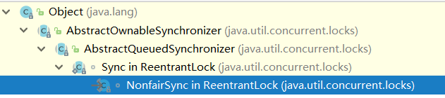
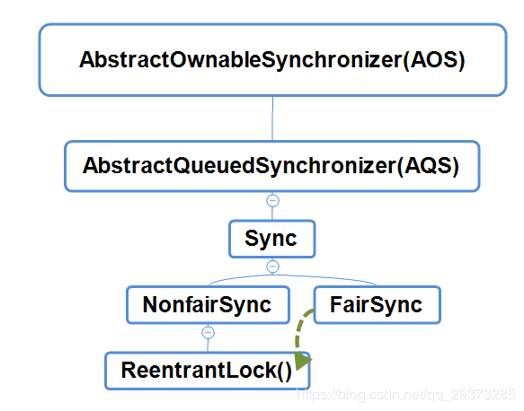
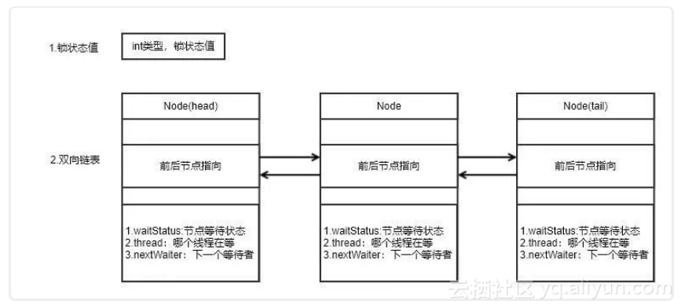
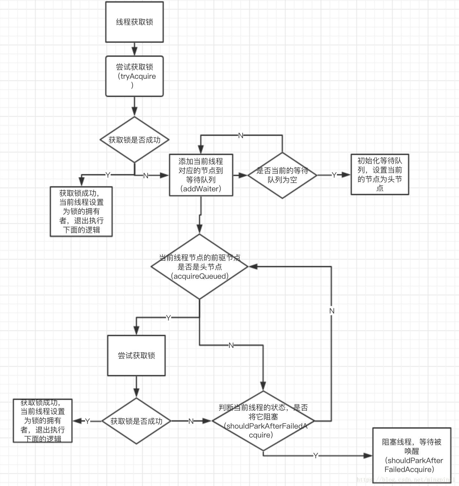

# Lock

## Lock中的四个方法

- lock()是平常使用得最多的一个方法，就是用来获取锁。如果锁已被其他线程获取，则进行等待。unLock()方法是用来释放锁的。
- tryLock()方法是有返回值的，它表示用来尝试获取锁，如果获取成功，则返回true，如果获取失败（即锁已被其他线程获取），则返回false，也就说这个方法无论如何都会立即返回。在拿不到锁时不会一直在那等待。
- tryLock(long time, TimeUnit unit)方法和tryLock()方法是类似的，只不过区别在于这个方法在拿不到锁时会等待一定的时间，在时间期限之内如果还拿不到锁，就返回false。如果如果一开始拿到锁或者在等待期间内拿到了锁，则返回true。
- lockInterruptibly()方法比较特殊，当通过这个方法去获取锁时，如果线程正在等待获取锁，则这个线程能够响应中断，即中断线程的等待状态。也就使说，当两个线程同时通过lock.lockInterruptibly()想获取某个锁时，假若此时线程A获取到了锁，而线程B只有在等待，那么对线程B调用threadB.interrupt()方法能够中断线程B的等待过程。

## 可重入锁(ReentrantLock)

ReentrantLock是唯一实现了Lock接口的类，并且ReentrantLock提供了更多的方法。 

**关键词：计数值、双向链表、CAS+自旋**

### 构造方法

```java
/**
 * 无参构造方法
 */
public ReentrantLock() {
    sync = new NonfairSync();//默认非公平锁
}

/**
 * 有参构造方法
 */
public ReentrantLock(boolean fair) {
    sync = fair ? new FairSync() : new NonfairSync();//当fair为true，公平锁，false为非公平锁。
}
```

`FairSync` 与 `NonfairSync`的区别在于，是不是保证获取锁的公平性。`NonfairSync`的继承关系



`AbstractQueuedSynchronizer`（简称AQS），又是继承于`AbstractOwnableSynchronizer`(简称AOS)，AOS主要是保存获取当前锁的线程对象。最后我们可以看到几个主要类的继承关系：



`AbstractQueuedSynchronizer`类详情

```java
public abstract class AbstractQueuedSynchronizer
    extends AbstractOwnableSynchronizer
    implements java.io.Serializable {

    private static final long serialVersionUID = 7373984972572414691L;

    /**
     * Creates a new {@code AbstractQueuedSynchronizer} instance
     * with initial synchronization state of zero.
     */
    protected AbstractQueuedSynchronizer() { }

    /**
     * Wait queue node class.
     *
     * 双向链表
     * <p>To enqueue into a CLH lock, you atomically splice it in as new
     * tail. To dequeue, you just set the head field.
     * <pre>
     *      +------+  prev +-----+       +-----+
     * head |      | <---- |     | <---- |     |  tail
     *      +------+       +-----+       +-----+
     * </pre>
     *
     */
    static final class Node {
        /** Marker to indicate a node is waiting in shared mode */
        static final Node SHARED = new Node();//SHARED共享锁
        /** Marker to indicate a node is waiting in exclusive mode */
        static final Node EXCLUSIVE = null;//独占锁

        /** waitStatus value to indicate thread has cancelled */
        static final int CANCELLED =  1;
        /** waitStatus value to indicate successor's thread needs unparking */
        static final int SIGNAL    = -1;
        /** waitStatus value to indicate thread is waiting on condition */
        static final int CONDITION = -2;
        /**
         * waitStatus value to indicate the next acquireShared should
         * unconditionally propagate
         */
        static final int PROPAGATE = -3;

        /**
         * Status field, taking on only the values；
         * The field is initialized to 0 for normal sync nodes, and
         * CONDITION for condition nodes.  It is modified using CAS
         * (or when possible, unconditional volatile writes).
         */
        volatile int waitStatus;//等待状态

        volatile Node prev;

        volatile Node next;

        volatile Thread thread;
        
        Node nextWaiter;
        
        ......
	}
	private transient volatile Node head;

    private transient volatile Node tail;

    /**
     * The synchronization state.
     */
    private volatile int state;//锁的同步状态
```

注意：她的变量都被**transient**和**volatile**修饰的

锁的存储结构就两个东西:**"双向链表" + "int类型状态"。**



### 加锁lock()

```java
public void lock() { 
    sync.lock();
}
```

lock默认调用的是NonfairSync.lock()方法

```java
final void lock() {
    if (compareAndSetState(0, 1))//通过CAS算法去修改AQS中的int类型的state值，即为锁的状态
        //Exclusive是独占的意思，ReentrantLock用exclusiveOwnerThread表示“持有锁的线程“
        setExclusiveOwnerThread(Thread.currentThread());
    else
        acquire(1);//等待
}
```

acquire方法实现，做了三件事

- tryAcquire：会尝试再次通过CAS获取一次锁。
- addWaiter：将当前线程加入上面锁的双向链表（等待队列）中
- acquireQueued：通过自旋，判断当前队列节点是否可以获取锁。

```java
/**
     * Acquires in exclusive mode, ignoring interrupts.  Implemented
     * by invoking at least once {@link #tryAcquire},
     * returning on success. 请求独占锁，忽略所有中断，至少执行一次tryAcquire，如果成功就返回
     * Otherwise the thread is queued, possibly
     * repeatedly blocking and unblocking, invoking {@link
     * #tryAcquire} until success.  否则线程进入阻塞--唤醒两种状态切换中，直到tryAcquire成功。
     * This method can be used to implement method {@link Lock#lock}.
     *
     * @param arg the acquire argument.  This value is conveyed to
     *        {@link #tryAcquire} but is otherwise uninterpreted and
     *        can represent anything you like.
     */
public final void acquire(int arg) {
    if (!tryAcquire(arg) &&
        acquireQueued(addWaiter(Node.EXCLUSIVE), arg))
        selfInterrupt();
}
```

#### tryAcquire()

+ 会尝试再次通过CAS获取一次锁

```java
protected final boolean tryAcquire(int acquires) {
    return nonfairTryAcquire(acquires);
}


final boolean nonfairTryAcquire(int acquires) {
    final Thread current = Thread.currentThread();
    int c = getState();//获取该锁的状态
    if (c == 0) {//如果c等于0说明，没有线程拥有该锁
        if (compareAndSetState(0, acquires)) {//CAS原子性设置线程状态
            setExclusiveOwnerThread(current);//AOS里面的方法
            return true;
        }
    }//进入该方法的条件：已经拥有锁但c！=0
    else if (current == getExclusiveOwnerThread()) {//判断当前线程是否和AOS的线程为同一个
        int nextc = c + acquires;//state值++
        if (nextc < 0) // overflow
            throw new Error("Maximum lock count exceeded");
        setState(nextc);//因为没有竞争，所以通过setStatus修改，而非CAS
        return true;
    }
    return false;
}
```

先判断state是否为0，**如果为0就执行上面提到的lock方法的前半部分**，通过CAS操作将state的值从0变为1，否则判断当前线程是否为exclusiveOwnerThread，然后把state++，也就是重入锁的体现，**我们注意前半部分是通过CAS来保证同步，后半部分并没有同步的体现**，原因是：

> 偏向锁概念：后半部分是线程重入，再次获得锁时才触发的操作，此时当前线程拥有锁，所以对ReentrantLock的属性操作是无需加锁的。

**如果tryAcquire()获取失败，则要执行addWaiter()向等待队列中添加一个独占模式的节点**

#### addWaiter() 

+ 添加当前线程到等待链表中

```java
	/**
     * 创建一个入队node为当前线程，Node.EXCLUSIVE 是独占锁, Node.SHARED 是共享锁。
     * 先找到等待队列的tail节点pred，如果pred！=null，就把当前线程添加到pred后面进入等待队列，如果不存在tail节点执行enq()
     * @param mode
     * @return
     */
    private Node addWaiter(Node mode) {
        Node node = new Node(Thread.currentThread(), mode);//Node构造方法，this.nextWaiter = mode;
        // Try the fast path of enq; backup to full enq on failure
        Node pred = tail;//把等待队列的尾部节点复制给pred
        if (pred != null) {
            node.prev = pred;
            if (compareAndSetTail(pred, node)) {//通过CAS确保能够在线程安全的情况下，将当前线程加入到链表的尾部
                pred.next = node;
                return node;
            }
        }
        enq(node);//自旋+上述逻辑
        return node;
    }
```

```java
	/**
     * 死循环，如果此时存在了tail就执行同上一步骤的添加队尾操作，如果依然不存在，就把当前线程作为head结点。
     * 插入节点后，调用acquireQueued()进行阻塞
     * @param node
     * @return
     */
    private Node enq(final Node node) {
        for (;;) {
            Node t = tail;
            if (t == null) { // Must initialize
                //如果tail节点不存在，把当前线程作为head节点
                if (compareAndSetHead(new Node()))
                    tail = head;
            } else {
                //和上一步的逻辑类似
                node.prev = t;
                if (compareAndSetTail(t, node)) {
                    t.next = node;
                    return t;
                }
            }
        }
    }
```

#### acquireQueued()  

+  再次尝试获取锁

```java
	/**
     * 先获取当前节点的前一节点p，如果p是head的话就再进行一次tryAcquire(arg)操作，如果成功就返回，
     * 否则就执行shouldParkAfterFailedAcquire、parkAndCheckInterrupt来达到阻塞效果；
     * @param node
     * @param arg
     * @return
     */
    final boolean acquireQueued(final Node node, int arg) {
        boolean failed = true;
        try {
            boolean interrupted = false;
            for (;;) {
                final Node p = node.predecessor();
                //当前线程到头部的时候，尝试CAS更新锁状态，如果更新成功表示该等待线程获取成功。从头部移除。
                if (p == head && tryAcquire(arg)) {
                    setHead(node);
                    p.next = null; // help GC
                    failed = false;
                    return interrupted;
                }//阻塞
                if (shouldParkAfterFailedAcquire(p, node) &&
                        parkAndCheckInterrupt())
                    interrupted = true;
            }
        } finally {
            if (failed)
                cancelAcquire(node);//取消竞争锁
        }
    }

```

+ shouldParkAfterFailedAcquire()

```java
	/**
     * Checks and updates status for a node that failed to acquire.
     * Returns true if thread should block. This is the main signal
     * control in all acquire loops.  Requires that pred == node.prev.
     * 
     * addWaiter()构造的新节点，waitStatus的默认值是0。此时，进入最后一个if判断，
     * CAS设置pred.waitStatus为SIGNAL==-1。最后返回false。
     * 
     */
    private static boolean shouldParkAfterFailedAcquire(Node pred, Node node) {
        int ws = pred.waitStatus;//waitStatus的默认值是0
        if (ws == Node.SIGNAL)//SIGNAL==-1
            /*
             * This node has already set status asking a release
             * to signal it, so it can safely park.
             */
            return true;
        if (ws > 0) {
            /*
             * Predecessor was cancelled. Skip over predecessors and
             * indicate retry.
             * 什么时候会遇到ws > 0的case呢？当pred所维护的获取请求被取消时（也就是node的waitStatus 值为CANCELLED），
             * 这时就会循环移除所有被取消的前继节点pred，直到找到未被取消的pred。移除所有被取消的前继节点后，直接返回false。
             */
            do {
                node.prev = pred = pred.prev;
            } while (pred.waitStatus > 0);
            pred.next = node;
        } else {
            /*
             * waitStatus must be 0 or PROPAGATE.  Indicate that we
             * need a signal, but don't park yet.  Caller will need to
             * retry to make sure it cannot acquire before parking.
             */
            compareAndSetWaitStatus(pred, ws, Node.SIGNAL);
        }
        return false;
    }
```

> 回到第五步acquireQueued()中后，**由于shouldParkAfterFailedAcquire()返回false，会继续进行循环**。假设node的前继节点pred仍然不是头结点或锁获取失败，则会再次进入shouldParkAfterFailedAcquire()。上一轮循环中，已经将pred.waitStatus设置为SIGNAL==-1，**则这次会进入第一个判断条件，直接返回true，表示应该阻塞。**

+ parkAndCheckInterrupt() 

```java
	/**
     * Convenience method to park and then check if interrupted
     *
     * @return {@code true} if interrupted
     */
    private final boolean parkAndCheckInterrupt() {
        LockSupport.park(this);
        return Thread.interrupted();
    }
```

> 很显然，**一旦shouldParkAfterFailedAcquire返回true也就是应该阻塞，就会执行parkAndCheckInterrupt()来达到阻塞效果，此时线程阻塞在这里，需要其它线程来唤醒，唤醒后就会再次循环第5步acquireQueued里的请求逻辑。**

#### 获取锁的一个流程



### 解锁unlock()

unlock实际调用是sync.release()方法;

```java
    public void unlock() {
        sync.release(1);
	}

	/**
     * 释放独占锁，如果tryRelease成功返回true的话就会解开阻塞等待的线程
     * 显然，tryRelease方法来释放锁，如果释放成功，先判断head节点是否有效，最后unparkSuccessor启动后续等待的线程
     * @param arg
     * @return
     */
    public final boolean release(int arg) {
        if (tryRelease(arg)) {//释放锁
            Node h = head;
            if (h != null && h.waitStatus != 0)//判断头部节点的状态
                unparkSuccessor(h);//启动后续等待的线程
            return true;
        }
        return false;
    }
```

**释放独占锁，如果tryRelease成功返回true的话就会解开阻塞等待的线程**，显然，tryRelease方法来释放锁，如果释放成功，先判断head节点是否有效，最后unparkSuccessor启动后续等待的线程。

#### tryRelease()

```java
	protected final boolean tryRelease(int releases) {
            int c = getState() - releases;//state减1
            if (Thread.currentThread() != getExclusiveOwnerThread())//判断当前线程是否和持有锁线程一致
                throw new IllegalMonitorStateException();
            boolean free = false;
            if (c == 0) {//只有state锁状态为0时，才释放锁
                free = true;
                setExclusiveOwnerThread(null);
            }
            setState(c);
            return free;
        }
```

先获取state减去释放的一次，然后判断当前线程是否和持有锁线程一致，如果不一致，抛出异常，继续判断state的值，**只有当值为0时，free标志才置为true**，否则说明是重入锁，需要多次释放直到state为0。

#### unparkSuccessor()

```java
	private void unparkSuccessor(Node node) {
        /*
         * If status is negative (i.e., possibly needing signal) try
         * to clear in anticipation of signalling.  It is OK if this
         * fails or if status is changed by waiting thread.
         */
        int ws = node.waitStatus;
        if (ws < 0)
            compareAndSetWaitStatus(node, ws, 0);

        /*
         * Thread to unpark is held in successor, which is normally
         * just the next node.  But if cancelled or apparently null,
         * traverse backwards from tail to find the actual
         * non-cancelled successor.
         */
        Node s = node.next;
        if (s == null || s.waitStatus > 0) {
            s = null;
            for (Node t = tail; t != null && t != node; t = t.prev)
                if (t.waitStatus <= 0)
                    s = t;
        }
        if (s != null)
            LockSupport.unpark(s.thread);
    }
```

这个方法名：启动后续线程，先拿到head节点的waitStatus并清空，然后获取next节点，并做检查，如果next节点失效，就从等待队列的尾部进行轮询，拿到第一个有效的节点，然后通过LockSupport.unpark(s.thread);唤醒，令该线程重新进入到获取锁的第5步循环去acquire锁。