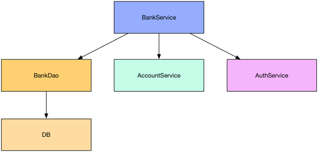
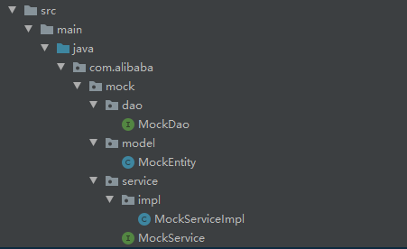

## 什么是 Mockito

Mockito 是一个强大的用于 Java 开发的模拟测试框架, 通过 Mockito 我们可以创建和配置 Mock 对象, 进而简化有外部依赖的类的测试. 所以Mockito就是为了模拟对象，然后进行解耦合测试。 
使用 Mockito 的大致流程如下:

- 创建外部依赖的 Mock 对象, 然后将此 Mock 对象注入到测试类中.
- 执行测试代码.
- 校验测试代码是否执行正确.

## 为什么使用 Mockito

我们已经知道了 Mockito 主要的功能就是创建 Mock 对象,那么自然就会有人问了, 为什么要使用 Mock 对象? 使用它有什么好处呢?
下面我们以一个简单的例子来展示一下 Mock 对象到底有什么用.
假设我们正在编写一个银行的服务 BankService, 这个服务的依赖关系如下:



当我们需要测试 BankService 服务时, 该真么办呢?
一种方法是构建真实的 BankDao, DB, AccountService 和 AuthService 实例, 然后注入到 BankService 中.
不用我说, 读者们也肯定明白, 这是一种既笨重又繁琐的方法, 完全不符合单元测试的精神. 那么还有一种更加优雅的方法吗? 自然是有的, 那就是我们今天的主角 **Mock Object**. 下面来看一下使用 Mock 对象后的框架图:


我们看到, BankDao, AccountService 和 AuthService 都被我们使用了虚拟的对象(Mock 对象) 来替换了, 因此我们就可以对 BankService 进行测试, 而不需要关注它的复杂的依赖了.

## Mockito 基本使用

为了简洁期间, 下面的代码都省略了静态导入 **import static org.mockito.Mockito.\*;**

### Maven 依赖

```xml
<dependency>
    <groupId>org.mockito</groupId>
    <artifactId>mockito-all</artifactId>
    <version>1.10.19</version>
</dependency>
```

### 创建 Mock 对象

```java
@Test
public void createMockObject() {
    // 使用 mock 静态方法创建 Mock 对象.
    List mockedList = mock(List.class);
    Assert.assertTrue(mockedList instanceof List);

    // mock 方法不仅可以 Mock 接口类, 还可以 Mock 具体的类型.
    ArrayList mockedArrayList = mock(ArrayList.class);
    Assert.assertTrue(mockedArrayList instanceof List);
    Assert.assertTrue(mockedArrayList instanceof ArrayList);
}
```

如上代码所示, 我们调用了 **mock** 静态方法来创建一个 Mock 对象. mock 方法接收一个 class 类型, 即我们需要 mock 的类型.

### 配置 Mock 对象

当我们有了一个 Mock 对象后, 我们可以定制它的具体的行为. 例如:

```java
	@Test
    public void configMockObject(){
        List mockList = mock(ArrayList.class);
        //当调用add("one")方法时，返回true
        when(mockList.add("one")).thenReturn(true);
        //当调用size()方法时，返回1
        when(mockList.size()).thenReturn(1);

        System.out.println("one: "+mockList.add("one"));
        System.out.println("two: "+mockList.add("two"));
        System.out.println("size: "+mockList.size());

        Iterator iterator = mock(Iterator.class);
        when(iterator.next()).thenReturn("Hello,").thenReturn("Mockito!");
        System.out.println(iterator.next()+" "+iterator.next());
    }
```

测试结果

```bash
one: true
two: false
size: 1
Hello, Mockito!
```

我们使用 **when(...).thenReturn(...)** 方法链来定义一个行为, 例如 "when(mockedList.add("one")).thenReturn(true)" 表示: **当调用了mockedList.add("one"), 那么返回 true.**. 并且要注意的是, **when(...).thenReturn(...)** 方法链不仅仅要匹配方法的调用, 而且要方法的参数一样才行.
而且有趣的是, **when(​...).thenReturn(​...)** 方法链可以指定多个返回值, 当这样做后, 如果多次调用指定的方法, 那么这个方法会依次返回这些值. 例如 "when(i.next()).thenReturn("Hello,").thenReturn("Mockito!");", 这句代码表示: 第一次调用 i.next() 时返回 "Hello,", 第二次调用 i.next() 时返回 "Mockito!".

### 自定义返回异常

上面的例子我们展示了方法调用返回值的定制, 那么我们可以指定一个抛出异常吗? 当然可以的, 例如:

```java
	@Test(expected = NoSuchElementException.class)
    public void testForException() throws Exception {
        Iterator iterator = mock(Iterator.class);
        when(iterator.next()).thenReturn("Hello,").thenReturn("Mockito!");
        System.out.println(iterator.next()+" "+iterator.next());

        doThrow(new NoSuchElementException()).when(iterator).next();
        iterator.next();
    }
```

上面代码的第一第二步我们已经很熟悉了, 接下来第三部我们使用了一个新语法: `doThrow(ExceptionX).when(x).methodCall`, 它的含义是: 当调用了 x.methodCall 方法后, 抛出异常 ExceptionX.
因此 doThrow(new NoSuchElementException()).when(i).next() 的含义就是: 当第三次调用 i.next() 后, 抛出异常 NoSuchElementException.(因为 i 这个迭代器只有两个元素)

### 校验 Mock 对象的方法调用

Mockito 会追踪 Mock 对象的所用方法调用和调用方法时所传递的参数. 我们可以通过 verify() 静态方法来来校验指定的方法调用是否满足断言. 语言描述有一点抽象, 下面我们仍然以代码来说明一下.

```java
@Test
public void testVerify() {
    List mockedList = mock(List.class);
    mockedList.add("one");
    mockedList.add("two");
    mockedList.add("three times");
    mockedList.add("three times");
    mockedList.add("three times");
    when(mockedList.size()).thenReturn(5);
    Assert.assertEquals(mockedList.size(), 5);

    verify(mockedList, atLeastOnce()).add("one");
    verify(mockedList, times(1)).add("two");
    verify(mockedList, times(3)).add("three times");
    verify(mockedList, never()).isEmpty();
}
```

上面的例子前半部份没有什么特别的, 我们关注后面的:

```java
verify(mockedList, atLeastOnce()).add("one");
verify(mockedList, times(1)).add("two");
verify(mockedList, times(3)).add("three times");
verify(mockedList, never()).isEmpty();
```

读者根据代码也应该可以猜测出它的含义了, 很简单:

- 第一句校验 mockedList.add("one") 至少被调用了 1 次(atLeastOnce)
- 第二句校验 mockedList.add("two") 被调用了 1 次(times(1))
- 第三句校验 mockedList.add("three times") 被调用了 3 次(times(3))
- 第四句校验 mockedList.isEmpty() 从未被调用(never)

### 使用 spy() 部分模拟对象

Mockito 提供的 spy 方法可以包装一个真实的 Java 对象, 并返回一个包装后的新对象. 若没有特别配置的话, 对这个新对象的所有方法调用, 都会委派给实际的 Java 对象. 例如:

```java
	@Test
    public void testSpy(){
        List list = new LinkedList();
        List spy = spy(list);

        spy.add("one");
        spy.add("two");
        // 对 spy.size() 进行定制
        when(spy.size()).thenReturn(100);

        // 因为我们没有对 get(0), get(1) 方法进行定制,因此这些调用其实是调用的真实对象的方法.
        System.out.println(spy.get(0));
        System.out.println(spy.get(1));

        //返回定制方法的结果
        System.out.println(spy.size());
    }
```

这个例子中我们实例化了一个 LinkedList 对象, 然后使用 spy() 方法对 list 对象进行部分模拟. 接着我们使用 **when(...).thenReturn(...)** 方法链来规定 spy.size() 方法返回值是 100. 随后我们给 spy 添加了两个元素, 然后再 调用 spy.get(0) 获取第一个元素.
这里有意思的地方是: 因为我们没有定制 add("one"), add("two"), get(0), get(1), 因此通过 spy 调用这些方法时, 实际上是委派给 list 对象来调用的.
然而我们 定义了 spy.size() 的返回值, 因此当调用 spy.size() 时, 返回 100.

### 参数捕获

Mockito 允准我们捕获一个 Mock 对象的方法调用所传递的参数, 例如:

```java
	@Test
    public void testCaptureArgument() {
        List<String> list = Arrays.asList("one", "two");
        List mockList = mock(List.class);
        mockList.addAll(list);

        ArgumentCaptor<List> argument = ArgumentCaptor.forClass(List.class);
        verify(mockList).addAll(argument.capture());

        System.out.println(argument.getValue());
        System.out.println(argument.getValue().size());
    }
```

我们通过 verify(mockedList).addAll(argument.capture()) 语句来获取 mockedList.addAll 方法所传递的实参 list.

## Spring集成(no prefect)

项目结构，没有连数据库



特别说明MockServiceImpl，mock注入的对象不要加@Autowired注解

```java
@Service
public class MockServiceImpl implements MockService {
//    @Autowired
    private MockDao mockDao;

    @Override
    public MockEntity get(Integer id) {
        return mockDao.selectById(id);
    }
}
```

测试类

- @Mock：创建一个Mock。
- @InjectMocks：创建一个实例，其余用@Mock（或@Spy）注解创建的mock将被注入到用该实例中。

```java
import static org.mockito.Mockito.*;

@SpringBootTest(classes = {Application.class})
@RunWith(SpringRunner.class)
public class MockTest {

    @Mock//创建一个Mock
    private MockDao mockDao;

    @Autowired
    @InjectMocks//@InjectMocks创建一个实例，其余用@Mock（或@Spy）注解创建的mock将被注入到用该实例中
    private MockServiceImpl mockService;//实现类，不是接口

    private MockEntity entity;

    @Before
    public void init(){
        //初始化mock，或者使用@RunWith(MockitoJUnitRunner.class)
        MockitoAnnotations.initMocks(this);

        MockEntity entity = new MockEntity();
        entity.setId(1);
        entity.setName("lihao");

        when(mockDao.selectById(1)).thenReturn(entity);

        this.entity = entity;
    }

    @Test
    public void test01() {
        MockEntity entity = mockService.get(1);
        MockEntity entity1 = mockService.get(1);

        verify(mockDao, times(2)).selectById(1);

        System.out.println("entity: "+entity);
        System.out.println("entity1: "+entity1);
        System.out.println("this.entity: "+this.entity);
    }
}
```

