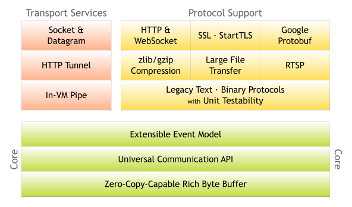

# 简介

Netty是一个NIO客户端服务器框架，可以快速轻松地开发协议服务器和客户端等网络应用程序。它极大地简化并简化了TCP和UDP套接字服务器等网络编程。 

“快速简便”并不意味着最终的应用程序会受到可维护性或性能问题的影响。Netty经过精心设计，具有丰富的协议，如FTP，SMTP，HTTP以及各种二进制和基于文本的传统协议。因此，Netty成功地找到了一种在不妥协的情况下实现易于开发，性能，稳定性和灵活性的方法。 

 

**Netty特点**

- `API简单`，开发门槛低（无需掌握NIO）
- 功能强大，预置了多种编解码器（半包，粘包问题）-支持多种主流协议
- 定制能力强-（人为定制自己编解码器）- 自定义协议
- 修复JDK NIO bug，解决原始NIO的不稳定性
- 使用人群多，社区活跃

# 架构设计


> ChannelHandlerAdapter：处理请求和响应数据
>
> MessageToMessageEncoder：编码器（传输对象）
>
> LengthFieldPrepender：帧编码器（解决粘包、半包问题）
>
> MessageToMessageDecoder：解码器
>
> LengthFiledBaseFrameDecoder：帧解码器

# Hello World

maven依赖

```xml
<dependency>
    <groupId>io.netty</groupId>
    <artifactId>netty-all</artifactId>
    <version>4.1.37.Final</version>
</dependency>
```

## 服务端

```java
package com.hzbank.server;

import io.netty.bootstrap.ServerBootstrap;
import io.netty.channel.ChannelFuture;
import io.netty.channel.EventLoopGroup;
import io.netty.channel.nio.NioEventLoopGroup;
import io.netty.channel.socket.nio.NioServerSocketChannel;

/**
 * 服务端开发步骤
 */
public class Server {
    public static void main(String[] args) throws InterruptedException {

        //1.创建服务启动引导
        ServerBootstrap sbt=new ServerBootstrap();
        //2.创建线程池组 boss worker
        EventLoopGroup boss = new NioEventLoopGroup();
        EventLoopGroup worker = new NioEventLoopGroup();
        //3.设置线程池组
        sbt.group(boss, worker);
        //4.设置服务实现类
        sbt.channel(NioServerSocketChannel.class);
        //5.初始化通讯管道
        sbt.childHandler(new ServerChannelInitializer());
        //6.绑定端口，并启动服务
        System.out.println("我在9999端口监听");
        ChannelFuture future = sbt.bind(9999).sync();

        //7.关闭通道资源
        future.channel().closeFuture().sync();
        //8.释放资源
        boss.shutdownGracefully();
        worker.shutdownGracefully();
    }
}
```

------

```java
package com.hzbank.server;

import io.netty.channel.ChannelInitializer;
import io.netty.channel.ChannelPipeline;
import io.netty.channel.socket.SocketChannel;


public class ServerChannelInitializer extends ChannelInitializer<SocketChannel> {

    /**
     * 初始化通道
     * @param socketChannel
     * @throws Exception
     */
    protected void initChannel(SocketChannel socketChannel) throws Exception {
        //通信管道
        ChannelPipeline pipeline = socketChannel.pipeline();

        //在通道末端，添加最终处理者
        pipeline.addLast(new ServerChannelHandlerAdapter());
    }

}
```

------

```java
package com.hzbank.server;

import io.netty.buffer.ByteBuf;
import io.netty.channel.ChannelFuture;
import io.netty.channel.ChannelFutureListener;
import io.netty.channel.ChannelHandlerContext;
import io.netty.channel.ChannelInboundHandlerAdapter;
import io.netty.util.CharsetUtil;

public class ServerChannelHandlerAdapter extends ChannelInboundHandlerAdapter {

    /**
     * 异常处理
     * @param ctx
     * @param cause
     * @throws Exception
     */
    @Override
    public void exceptionCaught(ChannelHandlerContext ctx, Throwable cause) throws Exception {
        cause.printStackTrace();
    }

    /**
     * 发送和接受消息
     * @param ctx
     * @param msg
     * @throws Exception
     */
    @Override
    public void channelRead(ChannelHandlerContext ctx, Object msg) throws Exception {
        ByteBuf byteBuf = (ByteBuf) msg;
        System.out.println("服务端收到："+byteBuf.toString(CharsetUtil.UTF_8));

        //bytebuf netty的缓冲区
        ByteBuf buf = ctx.alloc().buffer();
        buf.writeBytes("Hello 这里是服务端".getBytes());

        //发送消息
        ChannelFuture future = ctx.writeAndFlush(buf);
        //关闭SocketChannel
        future.addListener(ChannelFutureListener.CLOSE);
    }
}

```

## 客户端

```java
package com.hzbank.client;

import io.netty.bootstrap.Bootstrap;
import io.netty.channel.ChannelFuture;
import io.netty.channel.EventLoopGroup;
import io.netty.channel.nio.NioEventLoopGroup;
import io.netty.channel.socket.nio.NioSocketChannel;

public class Client {
    public static void main(String[] args) throws InterruptedException {
        //1.创启动引导
        Bootstrap bt = new Bootstrap();
        //2.创建线程池组 worker
        EventLoopGroup worker = new NioEventLoopGroup();
        //3.设置线程池组
        bt.group(worker);
        //4.设置服务实现类
        bt.channel(NioSocketChannel.class);
        //5.初始化通讯管道
        bt.handler(new ClientChannelInitializer());
        //6.连接端口，并且启动服务
        ChannelFuture future = bt.connect("127.0.0.1",9999).sync();
        //7.关闭通道资源
        future.channel().closeFuture().sync();
        //8.释放资源
        worker.shutdownGracefully();
    }
}
```

------

```java
package com.hzbank.client;

import io.netty.channel.ChannelInitializer;
import io.netty.channel.ChannelPipeline;
import io.netty.channel.socket.SocketChannel;


public class ClientChannelInitializer extends ChannelInitializer<SocketChannel> {
    protected void initChannel(SocketChannel socketChannel) throws Exception {
        //获取通道
        ChannelPipeline pipeline = socketChannel.pipeline();

        //末端添加最终处理者
        pipeline.addLast(new ClientChannelHandlerAdapter());
    }
}

```

------

```java
package com.hzbank.client;

import io.netty.buffer.ByteBuf;
import io.netty.channel.ChannelHandlerContext;
import io.netty.channel.ChannelInboundHandlerAdapter;
import io.netty.util.CharsetUtil;

public class ClientChannelHandlerAdapter extends ChannelInboundHandlerAdapter {
    /**
     * 接收消息
     * @param ctx
     * @param msg
     * @throws Exception
     */
    @Override
    public void channelRead(ChannelHandlerContext ctx, Object msg) throws Exception {
        ByteBuf buf = (ByteBuf) msg;
        System.out.println("客户端收到："+buf.toString(CharsetUtil.UTF_8));
    }

    /**
     * 连接服务器，发送数据
     * @param ctx
     * @throws Exception
     */
    @Override
    public void channelActive(ChannelHandlerContext ctx) throws Exception {
        ByteBuf buf = ctx.alloc().buffer();
        buf.writeBytes("Hello World,这里是客户端".getBytes());

        ctx.writeAndFlush(buf);
    }

    /**
     * 异常回调
     * @param ctx
     * @param cause
     * @throws Exception
     */
    @Override
    public void exceptionCaught(ChannelHandlerContext ctx, Throwable cause) throws Exception {
        cause.printStackTrace();
    }
}
```

# ByteBuf

**ByteBuffer的局限性**

1. 长度固定，API功能有限
2. 只有一个标识位置的指针position，读写需要手动调用flip()和clear()

**ByteBuf的工作原理**

ByteBuf通过两个位置指针：readerIndex、writerIndex，默认都是0，写入数据writerIndex递增，读取数据readerIndex递增，读取之后，调用discardReadBytes()清空0-readerIndex之间区域，clear()方法清空所有区域，readerIndex、writerInde归零


```java
ByteBuf buf=  Unpooled.buffer(3);
//new PooledByteBufAllocator().buffer();
//new UnpooledByteBufAllocator(true).buffer();
System.out.println("初始化："+buf.readerIndex()+" "+buf.writerIndex()+" "+buf.readableBytes()+" "+buf.capacity());
buf.writeBytes("abcd".getBytes());
System.out.println("写入4个字节："+buf.readerIndex()+" "+buf.writerIndex()+" "+buf.readableBytes()+" "+buf.capacity());

byte[] values=new byte[1];
buf.readBytes(values);
System.out.println("读取1个字节："+buf.readerIndex()+" "+buf.writerIndex()+" "+buf.readableBytes()+" "+buf.capacity());
buf.discardReadBytes();
System.out.println("调用discardReadBytes()："+buf.readerIndex()+" "+buf.writerIndex()+" "+buf.readableBytes()+" "+buf.capacity());

buf.clear();
System.out.println("调用clear()"+buf.readerIndex()+" "+buf.writerIndex()+" "+buf.readableBytes()+" "+buf.capacity());

-------------------------------------------------------------
初始化：0 0 0 3
写入4个字节：0 4 4 64 //会自动扩容
读取1个字节：1 4 3 64
调用discardReadBytes()：0 3 3 64
调用clear()0 0 0 64
```

# 传输对象

思路：继承编解码器，实现编解码方法，利用对象的节点流传输对象

```java
public class ObjectMsgToMsgEncoder extends MessageToMessageEncoder<Object> {
    protected void encode(ChannelHandlerContext channelHandlerContext, Object o, List list) throws Exception {
        //buffer缓冲区
        ByteBuf buffer = Unpooled.buffer();
        //带byte数组的输出流
        ByteArrayOutputStream byteArrarOut = new ByteArrayOutputStream();
        //对象的节点流
        ObjectOutputStream out = new ObjectOutputStream(byteArrarOut);
        out.writeObject(o);
        out.flush();
        out.close();
        //写入buffer缓存区
        buffer.writeBytes(byteArrarOut.toByteArray());
        list.add(buffer);
    }
}
```

```java
public class ObjectMsgToMsgDecoder extends MessageToMessageDecoder<ByteBuf> {

    protected void decode(ChannelHandlerContext channelHandlerContext, ByteBuf byteBuf, List<Object> list) throws Exception {
        //从bytebuf中读取数据放入数组中
        byte[] bytes = new byte[byteBuf.readableBytes()];
        byteBuf.readBytes(bytes);

        //带byte数组的输入流
        ByteArrayInputStream byteArrayInput = new ByteArrayInputStream(bytes);
        ObjectInputStream input = new ObjectInputStream(byteArrayInput);
        Object object = input.readObject();
        input.close();
        list.add(object);
    }
}
```

# 异常捕获

增加监听器

```java
//捕获序列化异常                
future.addListener(ChannelFutureListener.FIRE_EXCEPTION_ON_FAILURE);
//有异常时自动关闭
future.addListener(ChannelFutureListener.CLOSE_ON_FAILURE);
```

# 粘包半包

由于底层的TCP无法理解上层的业务逻辑，所以在底层是无法确保数据包不被拆分和重组的，这个问题只能通过上层的应用协议栈设计来解决，根据业界的主流协议的解决方案，归纳如下： 

（1）消息定长，例如每个报文的大小为固定长度200字节，如果不够，空位补空格； 

（2）在包尾增加回车换行符进行分割，例如FTP协议； 

（3）将消息分为消息头和消息体，消息头中包含表示消息总长度（或者消息体长度）的字段，通常设计思路是消息头的第一个字段用int来表示消息的总长度：

（4）更复杂的应用层协议；

`netty`的帧编解码解决粘包和半包问题

+ `LengthFieldPrepender`   帧编码器
  负责在发送的ByteBuf消息头上增加一个长度字段，用来标识消息的长度
+ `LengthFiledBaseFrameDecoder`：帧解码器
  基于消息长度的半包解码器
  参数列表：
  + 消息包的最大长度 65535
  + 长度域的偏移量       0
  + 长度字段所占字节大小  2
  + 长度补偿        0
  + 从数据帧中跳过的字段数   2


