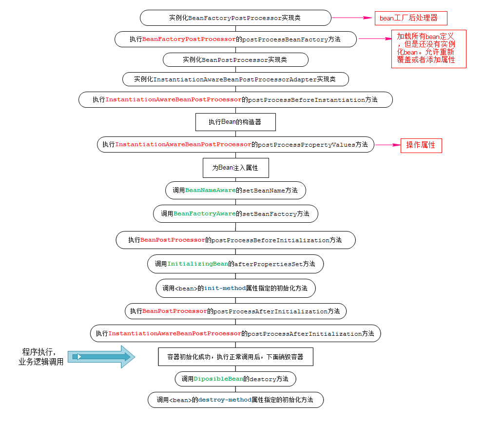

# 一、生命周期流程图

Spring Bean的完整生命周期从创建Spring容器开始，直到最终Spring容器销毁Bean，这其中包含了一系列关键点。



可以看出设计策略是“先顾大局”-类似的操作`BeanFactory`一般出现在Bean之前，操作完`Bean`之后，`BeanFactory`会进行“管理”；`Bean`操作的前提是应用了`BeanPostProcessor`。

# 二、各种接口方法分类

Bean的完整生命周期经历了各种方法调用，这些方法可以划分为以下几类：

1. Bean自身的方法：这个包括了Bean本身调用的方法和通过配置文件中<bean>的`init-method`和`destroy-method`指定的方法

2. Bean级生命周期接口方法：这个包括了`BeanNameAware`、`BeanFactoryAware`、`InitializingBean`和`DiposableBean`这些接口的方法

3. 容器级生命周期接口方法：这个包括了`InstantiationAwareBeanPostProcessor` 和 `BeanPostProcessor` 这两个接口实现，一般称它们的实现类为“后处理器”。

4. 工厂后处理器接口方法：这个包括了`AspectJWeavingEnabler`, `ConfigurationClassPostProcessor`, `CustomAutowireConfigurer`等等非常有用的工厂后处理器　　接口的方法。工厂后处理器也是容器级的。在应用上下文装配配置文件之后立即调用。

# 三、测试代码

## 1、注册的User类

+ 调用Bean自身的方法和Bean级生命周期接口方法，为了方便演示，它实现了`BeanNameAware`、`BeanFactoryAware`、`InitializingBean`和`DiposableBean`这4个接口，同时有2个方法，对应配置文件中<bean>的`init-method`和`destroy-method`。

```java
import lombok.extern.slf4j.Slf4j;
import org.springframework.beans.BeansException;
import org.springframework.beans.factory.*;

@Slf4j
public class User implements BeanFactoryAware,BeanNameAware, InitializingBean, DisposableBean {
    //user的属性
    private Integer id;
    private String name;
    private Integer age;

    private BeanFactory beanFactory;
    private String beanName;

    public User() {
        log.debug("【构造器】调用User的构造器实例化");
    }

    @Override
    public String toString() {
        return "User{" +
                "id=" + id +
                ", name='" + name + '\'' +
                ", age=" + age +
                '}';
    }

    public Integer getId() {
        return id;
    }

    public void setId(Integer id) {
        log.debug("【注入属性】id:"+id);
        this.id = id;
    }

    public String getName() {
        return name;
    }

    public void setName(String name) {
        log.debug("【注入属性】name:"+name);
        this.name = name;
    }

    public Integer getAge() {
        return age;
    }

    public void setAge(Integer age) {
        log.debug("【注入属性】age:"+age);
        this.age = age;
    }

    public BeanFactory getBeanFactory() {
        return beanFactory;
    }

    public String getBeanName() {
        return beanName;
    }

    public void initMethod(){
        log.debug("【init-method】调用<bean>的init-method属性指定的初始化方法");
    }

    public void destoryMethod(){
        log.debug("【destroy-method】调用<bean>的destroy-method属性指定的destroy方法");
    }

    @Override
    public void destroy() throws Exception {
        log.debug("【DiposibleBean接口】调用destroy方法");
    }

    @Override
    public void afterPropertiesSet() throws Exception {
        log.debug("【InitializingBean接口】调用afterPropertiesSet方法");
    }

    @Override
    public void setBeanFactory(BeanFactory beanFactory) throws BeansException {
        log.debug("【BeanFactoryAware接口】调用setBeanFactory方法");
        this.beanFactory = beanFactory;
    }

    @Override
    public void setBeanName(String beanName) {
        log.debug("【BeanNameAware接口】调用setBeanName方法");
        this.beanName = beanName;
    }
}
```

## 2、实现BeanFactoryPostProcessor

```java
import lombok.extern.slf4j.Slf4j;
import org.springframework.beans.BeansException;
import org.springframework.beans.factory.config.BeanDefinition;
import org.springframework.beans.factory.config.BeanFactoryPostProcessor;
import org.springframework.beans.factory.config.ConfigurableListableBeanFactory;

@Slf4j
public class MyBeanFactoryPostProcessor implements BeanFactoryPostProcessor {

    @Override
    public void postProcessBeanFactory(ConfigurableListableBeanFactory configurableListableBeanFactory) throws BeansException {
        log.debug("调用postProcessBeanFactory方法");
        BeanDefinition user = configurableListableBeanFactory.getBeanDefinition("user");
        user.getPropertyValues().addPropertyValue("id",001);
        user.getPropertyValues().addPropertyValue("name","lihao");
        user.getPropertyValues().addPropertyValue("age",18);
    }
}
```

## 3、实现InstantiationAwareBeanPostProcessorAdapter

+ InstantiationAwareBeanPostProcessor 接口本质是BeanPostProcessor的子接口

```java
import lombok.extern.slf4j.Slf4j;
import org.springframework.beans.BeansException;
import org.springframework.beans.PropertyValues;
import org.springframework.beans.factory.config.InstantiationAwareBeanPostProcessor;

@Slf4j
public class MyInstantiationAwareBeanPostProcessor implements InstantiationAwareBeanPostProcessor {

    /**
     * 接口方法、实例化Bean之前调用
     * @param beanClass
     * @param beanName
     * @return
     * @throws BeansException
     */
    @Override
    public Object postProcessBeforeInstantiation(Class<?> beanClass, String beanName) throws BeansException {
        log.debug("调用postProcessBeforeInstantiations实例化方法 "+beanName);
        return null;
    }

    /**
     * 接口方法、实例化Bean之后调用
     * @param bean
     * @param beanName
     * @return
     * @throws BeansException
     */
    @Override
    public boolean postProcessAfterInstantiation(Object bean, String beanName) throws BeansException {
        log.debug("调用postProcessAfterInitialization实例化方法 "+beanName);
        return true;
    }

    /**
     * 接口方法、设置某个属性时调用
     * @param pvs
     * @param bean
     * @param beanName
     * @return
     * @throws BeansException
     */
    @Override
    public PropertyValues postProcessProperties(PropertyValues pvs, Object bean, String beanName) throws BeansException {
        log.debug("调用postProcessPropertyValues方法 beanName:"+beanName+" name:"+pvs.getPropertyValue("name").getValue());
        return pvs;
    }

    /**
     * 初始化之前调用
     * @param bean
     * @param beanName
     * @return
     * @throws BeansException
     */
    @Override
    public Object postProcessBeforeInitialization(Object bean, String beanName) throws BeansException {
        log.debug("调用postProcessBeforeInitialization初始化方法 "+beanName);
        return bean;
    }

    /**
     * 初始化之后调用
     * @param bean
     * @param beanName
     * @return
     * @throws BeansException
     */
    @Override
    public Object postProcessAfterInitialization(Object bean, String beanName) throws BeansException {
        log.debug("调用postProcessAfterInitialization初始化方法 "+beanName);
        return bean;
    }
}

```

## 4、实现BeanPostProcessor

```java
import lombok.extern.slf4j.Slf4j;
import org.springframework.beans.BeansException;
import org.springframework.beans.factory.config.BeanPostProcessor;

@Slf4j
public class MyBeanPostProcessor implements BeanPostProcessor {

    @Override
    public Object postProcessBeforeInitialization(Object bean, String beanName) throws BeansException {
        log.debug("调用方法postProcessBeforeInitialization对属性进行更改");
        return bean;
    }

    @Override
    public Object postProcessAfterInitialization(Object bean, String beanName) throws BeansException {
        log.debug("调用方法postProcessAfterInitialization对属性进行更改");
        return bean;
    }
}
```

## 5、applicationContext.xml配置文件

```xml
<?xml version="1.0" encoding="UTF-8"?>
<beans xmlns="http://www.springframework.org/schema/beans"
       xmlns:cache="http://www.springframework.org/schema/cache" xmlns:xsi="http://www.w3.org/2001/XMLSchema-instance"
       xmlns:mvc="http://www.springframework.org/schema/mvc" xmlns:context="http://www.springframework.org/schema/context"
       xmlns:aop="http://www.springframework.org/schema/aop" xmlns:tx="http://www.springframework.org/schema/tx"
       xsi:schemaLocation="http://www.springframework.org/schema/beans
            http://www.springframework.org/schema/beans/spring-beans-4.0.xsd
            http://www.springframework.org/schema/mvc
            http://www.springframework.org/schema/mvc/spring-mvc-4.0.xsd
            http://www.springframework.org/schema/context
            http://www.springframework.org/schema/context/spring-context-4.0.xsd
            http://www.springframework.org/schema/aop
            http://www.springframework.org/schema/aop/spring-aop-4.0.xsd
            http://www.springframework.org/schema/cache
            http://www.springframework.org/schema/cache/spring-cache-4.0.xsd
            http://www.springframework.org/schema/tx
            http://www.springframework.org/schema/tx/spring-tx-4.0.xsd">

    <bean id="beanPostProcessor" class="com.hzbank.spring.MyBeanPostProcessor"></bean>

    <bean id="instantiationAwareBeanPostProcessor" class="com.hzbank.spring.MyInstantiationAwareBeanPostProcessor"></bean>

    <bean id="beanFactoryPostProcessor" class="com.hzbank.spring.MyBeanFactoryPostProcessor"></bean>

    <bean id="user" class="com.hzbank.spring.User" init-method="initMethod"
          destroy-method="destoryMethod" scope="singleton"  >
        <property name="id" value="2"/>
        <property name="name" value="buyilihao"/>
        <property name="age" value="20"/>
    </bean>
</beans>
```

## 6、测试类BeanLifeCycleTest

```java
import com.hzbank.spring.User;
import lombok.extern.slf4j.Slf4j;
import org.springframework.context.ApplicationContext;
import org.springframework.context.support.ClassPathXmlApplicationContext;

@Slf4j
public class BeanLifeCycleTest {
    public static void main(String[] args) {
        log.debug("初始化容器");
        ApplicationContext ctx = new ClassPathXmlApplicationContext("classpath:applicationContext.xml");
        log.debug("容器初始化成功");
        User user = ctx.getBean("user", User.class);
        System.err.println(user.toString());

        log.debug("关闭容器");
        ClassPathXmlApplicationContext classPathXmlApplicationContext = (ClassPathXmlApplicationContext) (ctx);
        classPathXmlApplicationContext.registerShutdownHook();
    }
}
```

## 7、测试结果

```bash
17:11:18.814 [main] DEBUG com.hzbank.test.BeanLifeCycleTest - 初始化容器
17:11:19.081 [main] DEBUG org.springframework.context.support.ClassPathXmlApplicationContext - Refreshing org.springframework.context.support.ClassPathXmlApplicationContext@299a06ac
17:11:19.444 [main] DEBUG org.springframework.beans.factory.xml.XmlBeanDefinitionReader - Loaded 4 bean definitions from class path resource [applicationContext.xml]
17:11:19.495 [main] DEBUG org.springframework.beans.factory.support.DefaultListableBeanFactory - Creating shared instance of singleton bean 'beanFactoryPostProcessor'
17:11:19.524 [main] DEBUG com.hzbank.spring.MyBeanFactoryPostProcessor - 调用postProcessBeanFactory方法
17:11:19.528 [main] DEBUG org.springframework.beans.factory.support.DefaultListableBeanFactory - Creating shared instance of singleton bean 'beanPostProcessor'
17:11:19.529 [main] DEBUG org.springframework.beans.factory.support.DefaultListableBeanFactory - Creating shared instance of singleton bean 'instantiationAwareBeanPostProcessor'
17:11:19.539 [main] DEBUG org.springframework.beans.factory.support.DefaultListableBeanFactory - Creating shared instance of singleton bean 'user'
17:11:19.539 [main] DEBUG com.hzbank.spring.MyInstantiationAwareBeanPostProcessor - 调用postProcessBeforeInstantiations实例化方法 user
17:11:19.539 [main] DEBUG com.hzbank.spring.User - 【构造器】调用User的构造器实例化
17:11:19.539 [main] DEBUG com.hzbank.spring.MyInstantiationAwareBeanPostProcessor - 调用postProcessAfterInitialization实例化方法 user
17:11:19.540 [main] DEBUG com.hzbank.spring.MyInstantiationAwareBeanPostProcessor - 调用postProcessPropertyValues方法 beanName:user
17:11:19.614 [main] DEBUG com.hzbank.spring.User - 【注入属性】id:1
17:11:19.615 [main] DEBUG com.hzbank.spring.User - 【注入属性】name:lihao
17:11:19.615 [main] DEBUG com.hzbank.spring.User - 【注入属性】age:18
17:11:19.615 [main] DEBUG com.hzbank.spring.User - 【BeanNameAware接口】调用setBeanName方法
17:11:19.615 [main] DEBUG com.hzbank.spring.User - 【BeanFactoryAware接口】调用setBeanFactory方法
17:11:19.615 [main] DEBUG com.hzbank.spring.MyBeanPostProcessor - 调用方法postProcessBeforeInitialization对属性进行更改
17:11:19.615 [main] DEBUG com.hzbank.spring.MyInstantiationAwareBeanPostProcessor - 调用postProcessBeforeInitialization初始化方法 user
17:11:19.615 [main] DEBUG com.hzbank.spring.User - 【InitializingBean接口】调用afterPropertiesSet方法
17:11:19.615 [main] DEBUG com.hzbank.spring.User - 【init-method】调用<bean>的init-method属性指定的初始化方法
17:11:19.615 [main] DEBUG com.hzbank.spring.MyBeanPostProcessor - 调用方法postProcessAfterInitialization对属性进行更改
17:11:19.615 [main] DEBUG com.hzbank.spring.MyInstantiationAwareBeanPostProcessor - 调用postProcessAfterInitialization初始化方法 user
User{id=1, name='lihao', age=18}
17:11:19.631 [main] DEBUG com.hzbank.test.BeanLifeCycleTest - 容器初始化成功
17:11:19.631 [main] DEBUG com.hzbank.test.BeanLifeCycleTest - 关闭容器
17:11:19.636 [Thread-0] DEBUG org.springframework.context.support.ClassPathXmlApplicationContext - Closing org.springframework.context.support.ClassPathXmlApplicationContext@299a06ac, started on Fri Aug 02 17:11:19 CST 2019
17:11:19.639 [Thread-0] DEBUG com.hzbank.spring.User - 【DiposibleBean接口】调用destroy方法
17:11:19.639 [Thread-0] DEBUG com.hzbank.spring.User - 【destroy-method】调用<bean>的destroy-method属性指定的destroy方法

Process finished with exit code 0
```


# 四、生命周期接口详解

## 1、BeanFactoryPostProcessor接口

```java
@FunctionalInterface
public interface BeanFactoryPostProcessor {
    void postProcessBeanFactory(ConfigurableListableBeanFactory var1) throws BeansException;
}
```

该接口只有一个postProcessBeanFactory方法，BeanFactoryPostProcessor：在bean factory标准初始化之后可以进行修改。将加载所有bean定义，但是还没有实例化bean。这个方法允许重新覆盖或者添加属性甚至快速的初始化bean。

初次看不知干嘛，关键在于参数，可以利用参数做一些操作。

ConfigurableListableBeanFactory 提供分析、修改bean定义和预先实例化单例。这个BeanFactory的子接口不应该是被使用于普通应用程序中：BeanFactory和ListableBeanFactory铁铮铮作为最经典的用例;这个接口是仅应该允许内部框架使用，即使在访问bean factory配置方法时也如此。

**ConfigurableListableBeanFactory 的方法**

+ freezeConfiguration()：冻结全部bean定义，给被注册的bean定义发信号告诉它们今后不再被修改和进一步后续处理。它允许factory去积极缓存bean定义元数据。
+ `getBeanDefinition(String beanName)`：根据指定的bean name返回被注册的bean定义，允许访问其属性值和构造函数参数值（可以在bean工厂后期处理期间被修改）。这个被返回的bean definition对象不应该是副本而是原始在工厂被注册的。这意味着如果需要它可以被转换为更具体的实现类型。注意这个方法只能获得本地工厂bean definition。
+ Iterator getBeanNamesIterator()：返回由这个bean factory管理的所有bean name统一视图。
+ `void ignoreDependencyType(Class<?> type)`：忽略被给定注入依赖类型 ，例如String。
+ `void ignoreDependencyInterface(Class<?> ifc)` ：忽略被给定注入依赖接口 。这个通常被使用由application contexts去注册依赖，可以以多种方式实现。例如BeanFactory通过BeanFactoryAware，ApplicationContext 通过ApplicationContextAware。默认情况下，仅BeanFactoryAware接口是被忽略，需要忽略其他接口，调用此方法。
+ `boolean isAutowireCandidate(String beanName,DependencyDescriptor descriptor)` ：确认这个被指定的bean是否是一个autowire候选，将被注入到其他声明匹配类型的依赖的bean中.
+ isConfigurationFrozen()：返回该工厂的bean definnitions是否被冻结。
+ preInstantiateSingletons()：确保所有非懒加载的单例bean被实例化，包括factoryBeans。
+ void registerResolvableDependency(Class<?> dependencyType,Object autowiredValue)：注册一个特定类型依赖伴随着相应的autowired值。这个是准备被用于应该可以autowire而不是在这个工厂被定义的bean的工厂/上下文引用。例如 将ApplicationContext类型的依赖项解析为Bean所在的ApplicationContext实例。注意~在普通的BeanFactory中没有注册这样的默认类型，甚至连BeanFactory接口本身都没有。

**postProcessBeanFactory使用示例**

```java
public void postProcessBeanFactory(ConfigurableListableBeanFactory configurableListableBeanFactory) throws BeansException {
        //  覆盖属性值 
        System.out.println("BeanFactoryPostProcessor调用postProcessBeanFactory方法");
        BeanDefinition bd = configurableListableBeanFactory.getBeanDefinition("person");
        bd.getPropertyValues().addPropertyValue("phone", "110");
        //  快速初始化bean 
        configurableListableBeanFactory.preInstantiateSingletons();
    }
```

## 2、BeanPostProcessor接口

允许自定义修改新bean实例的Factory hook，例如检查标记接口或者把bean包装成代理。

ApplicationContext 可以在它们的beans definitions自动检测BeanPostProcessor bean并且把这些bean应用于随后的bean创建。普通的bean factory允许对后处理器进行程序化注册，通过工厂应用于所有bean创建。

```java
public interface BeanPostProcessor {
    /**
     * 初始化之前调用
     * 在一些bean实例化回调（例如InitializingBean的afterPropertiesSet 
     * 或者一个定制的init-method）之前应用这个BeanPostProcessor
     */
    @Nullable
    default Object postProcessBeforeInitialization(Object bean, String beanName) throws BeansException {
        return bean;
    }

    /**
     * 初始化之后调用
     * 在一些bean实例化回调（例如InitializingBean的afterPropertiesSet 
     * 或者一个定制的init-method）之后应用这个BeanPostProcessor
     */
    @Nullable
    default Object postProcessAfterInitialization(Object bean, String beanName) throws BeansException {
        return bean;
    }
}
```

## 3、InstantiationAwareBeanPostProcessorAdapter

InstantiationAwareBeanPostProcessor 接口本质是BeanPostProcessor的子接口，只有在实际需要 InstantiationAwareBeanPostProcessor 功能时，才推荐这个基类。如果您所需要的只是简单的BeanPostProcessor功能，实现BeanPostProcessor即可。

```java
/**
  * 继承BeanPostProcessor的两个方法，执行顺序在BeanPostProcessor之后
  * 
  */
public interface InstantiationAwareBeanPostProcessor extends BeanPostProcessor {
    
    /**
     * 实例化之前调用
     * 执行顺序在BeanPostProcessor的方法之前
     */
    @Nullable
    default Object postProcessBeforeInstantiation(Class<?> beanClass, String beanName) 
        throws BeansException {
        return null;
    }

    /**
     * 实例化之后调用
     * 执行顺序在BeanPostProcessor的方法之前
     */
    default boolean postProcessAfterInstantiation(Object bean, String beanName) throws BeansException {
        return true;
    }

    /**
     * 设置某个属性时调用，执行顺序在BeanPostProcessor的方法之前
     * PropertyValues对象包含要实例化对象的属性和属性值
     */
    @Nullable
    default PropertyValues postProcessProperties(PropertyValues pvs, Object bean, String beanName) throws BeansException {
        return null;
    }

    /** 弃用的方法 */
    @Deprecated
    @Nullable
    default PropertyValues postProcessPropertyValues(PropertyValues pvs, PropertyDescriptor[] pds, Object bean, String beanName) throws BeansException {
        return pvs;
    }
}
```

