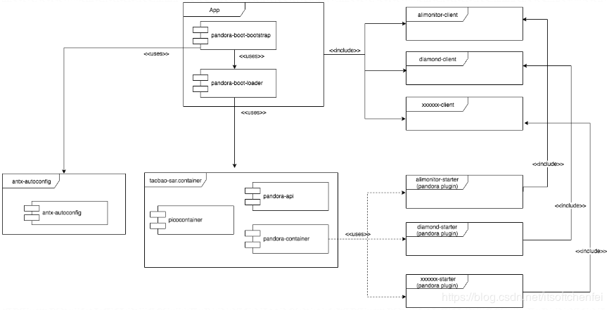
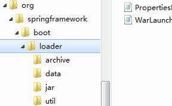
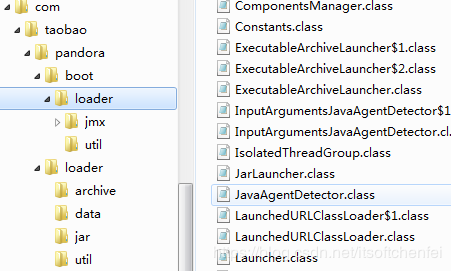

# 前言

阿里的Pandora Boot的核心是Pandora，因此在介绍Pandora Boot之前需要先介绍Pandora。

在阿里集体内部，几乎所有的应用都用到了各式各样的中间件，比如HSF、TDDL、Diamond等等。本身中间件之间可能就有版本依赖的问题，比如你的应用HSF和Diamond分别依赖了同名jar包的不同版本，maven只会引入其中一个版本。同样的中间件和应用之间也存在同样的Jar包依赖的问题，出于要解决这些依赖冲突的问题，阿里就开发了Pandora。

# **Pandora** 概述

Pandora，中文名潘多拉，简单的来说就是一个类隔离容器。对外以taobao-hsf.sar这样的sar包的形式对外呈现。它要解决的问题就是依赖冲突问题，包括单不仅以下几点：

+ **二方包、三方包冲突**

由于版本不一致可能导致应用起不来。

+ **冲突排查浪费大量时间**

应用起不来的时候可能只是应用开发自己折腾半天在排包，但如果是二方包冲突，那么中间件团队可能就要花大量时间在答疑上面，和应用开发一起折腾了。

+ **应用难以保持稳定**

折腾半天应用终于跑起来了，但是更可怕的就是现在能跑，到了某个点某个场景可能就出bug了。

+ **中间件升级困难**

如果要实时升级中间件到推荐版本，但是发现并没有那么容易，应用中引入了十个八个中间件，隔三差五其中一个中间件就有小版本更新，每天盯着中间件的更新情况，那还有时间关心业务的开发了。

------

Pandora 的价值在于让上面的问题都不是问题，具体都实现了什么能力呢？

+ **实现类隔离，提供稳定的运行环境**

Pandora实现了应用与中间件之间隔离、中间件与中间件之间隔离，保证了类的正确加载，而不会让依赖关系与依赖加载出现不一一对应的情况。

+ **中间件平滑升级**

由于应用服务器会优先加载Pandora的类，因此只要升级Pandora中的插件即可，无需对应用中的pom.xml进行修改。只需要在aone上面提交一个“HSF变更”即可。

+ **中间件统一管理**

Pandora会统一管理中间的启动、初始化以及资源回收等一系列操作。

## Pandora 内部组件图

主应用依赖Pandora Bootstrap（启动器），负责将所有插件化中间件的核心类加载并导出。随后在使用到中间件时，将通过这些导出的类进行对象的实例化。

# Pandora Boot

PandoraBoot是在Pandora的基础之上，发展处的更轻量使用集团中间件的方式；它基于Pandora和Fat Jar基础,可以可以在IDE里启动Pandora环境，开发调试等效率大大提高。也就是PandoraBoot是Pandora与Spring Boot结合的产物，可以更方便的享受Spring Boot社区带来的便利。

## PandoraBoot与SpringBoot

**两者联系:**

+ PandoraBoot是运行中在SpringBoot上的，完全兼容。对PandoraBoot来说SpringBoot就像是一个依赖或者简单的Main函数应用。

**两者区别:**

+ Spring Boot 通过 Maven 来管理依赖，是平板化的，最前面提到的二方包、三方包依赖问题，SpringBoot解决不了。

+ Pandora Boot很好的管理了中间件应用，用户可以快速的引入各类中间件，平滑的保持中间件升级。这两者说到底也就是集成了 Pandora 的类隔离技术。

+ Pandora Boot 目前已经很好的集成了 autoconfig，外部也和 AONE2、PSP 等系统进行打通，开发起来更加的方便。

# 启动原理

下图要结合内部组件图进行理解（生成的可运行的jar解压）会发现区别：Main-Class被替换成Pandora Boot的！

下图是spring boot的其实就是maven plugins的spring-boot-loader-tools把spring-boot-loader.jar打进去了。

Pandora Boot原理也是，它复杂点最终呈现的是spring-boot-loader.jar和pandora-boot-loader.jar。

